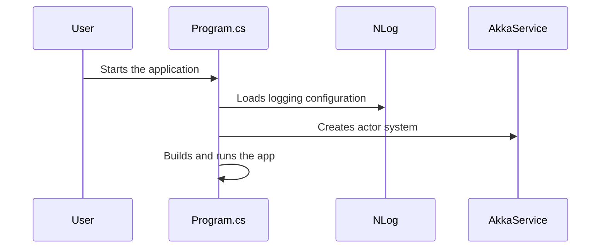

# Chapter 1: Program (Entry Point)

Welcome to the very first chapter of the BlazorVoice tutorial! In this project, the file called **Program.cs** is our grand entrance. It’s like the front door where we welcome all guests, set up the stage, and ensure everyone knows their role before the show (our application) begins.

---

## Why Do We Need an Entry Point?

Imagine you’re organizing a play. Before any actor steps on stage, someone must:
1. Turn on the lights.  
2. Set up the microphones.  
3. Make sure everyone has their scripts.  
4. Start the show when everything is ready.

In software terms, our **Program (Entry Point)**:
- Loads the logger (think: turning on lights to see what’s happening).  
- Configures all essential services (like installing microphones and sound systems).  
- Tells the application to start listening for requests (starting the show).

---

## A Simple Use Case

Suppose you want to create a voice chat application. The first thing you need is a place to:
1. Configure logging so you can see who’s talking and what’s going on behind the scenes.  
2. Add the **SignalR** library so browsers can talk to the server in real-time.  
3. Add the **MudBlazor** library so you can use handy UI components.  
4. Wire up **AkkaService** so you can manage advanced actor-based communications.  

Our **Program** file does all of this in one go, giving you a clean slate to build your voice chat on top of.

---

## Key Concepts in Program (Entry Point)

1. **Logger (NLog)**  
   - Helps us keep track of application events, errors, or special messages.  

2. **Service Registration**  
   - We register external libraries like SignalR and MudBlazor to use their features throughout the app.  

3. **Dependency Injection**  
   - We add classes such as `AkkaService` (see [AkkaService](05_akkaservice_.md)) and `OpenAIService` (see [OpenAIService](07_openaiservice_.md)) so that they can be easily used anywhere in our application.

4. **Application Startup**  
   - Finally, the application is built and **run**, similar to lifting the curtains on stage.

---

## Minimal Example of Program.cs

Below is a simple version of the startup process in `Program.cs`. We’ve trimmed it down to focus on the big ideas (each code block is less than 10 lines).

```csharp
// Step 1: Configure logger (NLog) 
var logger = LogManager.Setup()
    .LoadConfigurationFromAppSettings()
    .GetCurrentClassLogger();

logger.Debug("init main");

var builder = WebApplication.CreateBuilder(args);
```
Here, we grab the logger and set it up. Then we create the `builder` which is like our tool to register services.

```csharp
// Step 2: Clear default logging and apply NLog config 
builder.Logging.ClearProviders();
LogManager.Configuration = new XmlLoggingConfiguration("NLog.config");
builder.Host.UseNLog();

logger.Info("Start BlazorVoice Service API");
```
Now we tell our application to use NLog for logging. We also log a simple informational message.

```csharp
// Step 3: Register services
builder.Services.AddRazorComponents()
    .AddInteractiveServerComponents();

builder.Services.AddMudServices(); // For UI
builder.Services.AddSignalR();     // For real-time communication
builder.Services.AddSingleton<AkkaService>();
```
We add our Blazor interactive components, the MudBlazor UI library, SignalR for real-time features, and `AkkaService` (as a Singleton).

```csharp
// Step 4: Build and run
var app = builder.Build();

// Access AkkaService & create actor system
var akkaService = app.Services.GetRequiredService<AkkaService>();
var actorSystem = akkaService.CreateActorSystem("default");

// Run the application
app.Run();
```
Finally, we build our application (i.e., gather all the stage equipment) and run it (raise the curtains so that the show can start).

---

## What Happens Under the Hood?

Here’s a simple visualization of how everything flows:



1. **User** initiates the application (like clicking "Play" on your computer).  
2. **Program** loads NLog configurations to track events.  
3. **Program** asks **AkkaService** to create the actor system for advanced messaging and concurrency.  
4. **Program** finally builds and runs the app, making it accessible to users.

---

## Deeper Dive into the Files

- [Program.cs]  
  This file assembles your entire application. It’s short but very important. It’s like the main office that decides how everything should be organized before opening up to the public.

- [AkkaService](05_akkaservice_.md)  
  Registered in Program, this service handles actor-based functionality. Program calls it to create actor systems when the app starts.

- [AudioStreamHub](04_audiostreamhub_.md)  
  Also plugged in through Program as a SignalR hub, letting clients stream audio data in real-time.

When you piece these together, your voice chat system has everything it needs to start listening and responding to user inputs.

---

## Conclusion

Our **Program (Entry Point)** file is the central door to this entire application—it sets up logging, registers services, and finally runs the show. This is where you lay out the roadmap for how all other parts of your project will work together.

In the next chapter, we’ll explore how to set up real-time video and audio communication in [WebRTC.razor](02_webrtc_razor_.md). Let’s continue!

---

Generated by [AI Codebase Knowledge Builder](https://github.com/The-Pocket/Tutorial-Codebase-Knowledge)