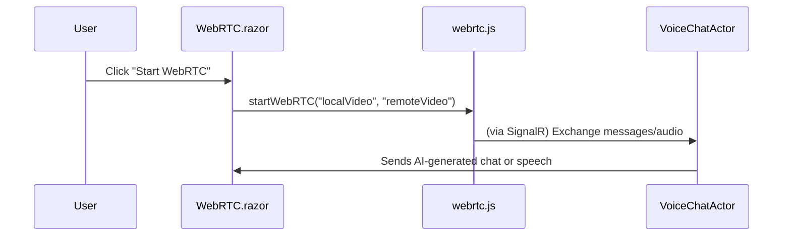

# Chapter 2: WebRTC.razor

Welcome back! In the previous chapter ([Program (Entry Point)](01_program__entry_point__.md)), we learned how our entire BlazorVoice application gets started and how important services (like logging and Akka) are set up. Now we’re stepping onto the “live chat” stage itself. This chapter focuses on the page called **WebRTC.razor**, which brings together live voice and video communication, text chat, and volume controls, all in one place.

---

## Why Do We Need WebRTC.razor?

Imagine you’re running a talk show. You need:
1. Cameras to broadcast the host (local video) and guest (remote video).  
2. A microphone and speaker system to capture and transmit voice.  
3. A backstage team to handle AI-based voice responses.  
4. A chat window for text-based conversations.

In our project, **WebRTC.razor** is the stage for these interactions. This razor page sets up:
- Video feeds for both your local webcam and someone else’s remote feed.  
- A chat area to type and send messages.  
- Volume meters to see how loud we’re speaking.  
- A simple button to start the WebRTC call.  

Under the hood, **WebRTC.razor** calls JavaScript functions (in [webrtc.js](03_webrtc_js_.md)) for browser-level audio/video tasks and also communicates with the Akka-based [VoiceChatActor](06_voicechatactor_.md) for AI-driven text-to-speech or response messages.

---

## High-Level Use Case

Say you want to host a live chat between two people, with an optional AI co-host:
1. One user clicks a “Start WebRTC” button.  
2. The browser asks for permission to use the camera and microphone.  
3. The local video feed and remote video feed appear.  
4. Text messages can be sent and received.  
5. AI speech (from [VoiceChatActor](06_voicechatactor_.md)) can join in, reading out messages or responding with its own.  

**WebRTC.razor** ties all these pieces together.

---

## Key Concepts

1. **Video Elements**  
   The page has two main <video> elements, one for the local camera feed and another for the remote feed.  
2. **Chat Area**  
   A simple chat box to type messages and display conversation history.  
3. **Volume Bars**  
   Shows the current microphone volume level in real time.  
4. **Start Button**  
   Triggers the main JavaScript call to set up the WebRTC connection.  
5. **C# Code-Behind**  
   Defines event handlers (like StartWebRTC or SendChatMessage) that talk to JavaScript and to the [VoiceChatActor](06_voicechatactor_.md).

---

## Minimal Example of the Page

Below are small snippets of code from **WebRTC.razor**. We’ll keep them short and beginner-friendly.

### 1) Basic Razor Setup

```csharp
@page "/web-rtc"
@rendermode InteractiveServer

<PageTitle>WebRTC</PageTitle>

<h1>WebRTC</h1>
```
• `@page "/web-rtc"`: Tells Blazor this is the page for the route “/web-rtc”.  
• `@rendermode InteractiveServer`: Enables server-side interactivity.  
• `<PageTitle>`: Sets the browser tab title.  
• `<h1>`: A heading for the page.

### 2) Start Button + Chat UI

```csharp
<MudButton OnClick="StartWebRTC" Class="mt-4">
    Start WebRTC
</MudButton>

<MudTextField @bind-Value="ChatInput"
              Placeholder="Type a message..." />
<MudButton OnClick="SendChatMessage"
           Class="mt-2">Send</MudButton>
```
• A button to start the WebRTC functionality.  
• A text field (`ChatInput`) for messages and a button to send them.

### 3) Video Elements

```html
<video id="remoteVideo" autoplay
       style="width: 100%; border-radius: 8px;"></video>
<video id="localVideo" autoplay muted
       style="width: 50%; border-radius: 8px;"></video>
```
• `remoteVideo`: Displays the other person’s video.  
• `localVideo`: Shows your webcam feed. “muted” so you don’t hear your own echo.

### 4) Volume Controls

```csharp
<MudProgressLinear Value="@AudioLevel" Class="mt-2" />
<MudSlider @bind-Value="MicrophoneVolume" Min="0"
           Max="100" Step="1" Class="mt-2" />
```
• `MudProgressLinear`: A bar that moves up and down with your audio level.  
• `MudSlider`: Lets you adjust your microphone volume within the browser.

---

## How It Works Under the Hood

When you click “Start WebRTC,” this page calls a JavaScript function in [webrtc.js](03_webrtc_js_.md), which handles camera access and peer connections.

Here’s a simple flow:



1. **User (U)** clicks the button.  
2. **WebRTC.razor (W)** calls a function like `startWebRTC(...)` in **webrtc.js (J)**.  
3. **webrtc.js** sets up the WebRTC streams for local and remote videos, and can also communicate with **VoiceChatActor (VC)** through the server for AI-based features.  
4. **VoiceChatActor (VC)** can respond with text or speech, which eventually shows up in your UI.

---

## Code-Behind: C# Methods

Inside **WebRTC.razor**, you’ll find a `@code` block that looks like this (simplified):

```csharp
@code {
    private string ChatInput { get; set; } = "";

    private async Task StartWebRTC()
    {
        var dotNetRef = DotNetObjectReference.Create(this);
        await JSRuntime.InvokeVoidAsync("startWebRTC", "localVideo", "remoteVideo", dotNetRef);
    }

    private async Task SendChatMessage()
    {
        if (!string.IsNullOrWhiteSpace(ChatInput))
        {
            // Send to Actor for AI or TTS
            // ...
            ChatInput = string.Empty;
        }
    }
}
```
**Explanation**:  
1. `ChatInput` is the text bound to our chat input field.  
2. `StartWebRTC` calls the JavaScript function `startWebRTC` with the IDs of our two video elements.  
3. `SendChatMessage` could forward typed messages to the **VoiceChatActor** for advanced processing or speech.

---

## Tying It All Together

• **WebRTC.razor** = The user’s live chat page (video, audio, chat).  
• **webrtc.js** = The JavaScript side of capturing media devices and creating peer connections. (We’ll explore this next in [webrtc.js](03_webrtc_js_.md).)  
• **VoiceChatActor** = The backstage AI or text-to-speech actor. Also see [VoiceChatActor](06_voicechatactor_.md).

When our page runs, it sets up the UI so that users can see each other and chat. Whenever audio or text is exchanged, we might also loop in the **VoiceChatActor** to do mind-blowing AI tasks, like generating a vocal reply.

---

## Conclusion

In this chapter, we discovered how **WebRTC.razor** is the main stage for all live interactions—video, audio, and texting. We also learned about its links to our browser’s JavaScript functions and the actor-based AI system behind the scenes.  

Ready to see how the JavaScript side handles the nitty-gritty of audio and video streams? Let’s jump into the next chapter: [webrtc.js](03_webrtc_js_.md).

---

Generated by [AI Codebase Knowledge Builder](https://github.com/The-Pocket/Tutorial-Codebase-Knowledge)