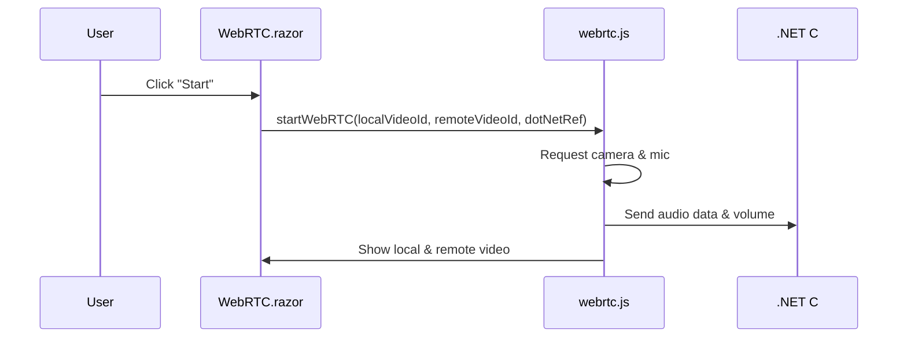

# Chapter 3: webrtc.js

In the [previous chapter](02_webrtc_razor_.md), we saw how our Blazor page (WebRTC.razor) sets the stage for video, audio, and text-based chat. But who’s behind the curtain making sure the browser can record your voice, measure your volume, and stream everything smoothly? That job belongs to **webrtc.js**.

Think of **webrtc.js** as the on-site audio engineer: it controls microphones, headsets, volume levels, and even helps route audio data back and forth to the .NET side through Blazor’s interop.

---

## Why We Need webrtc.js

Imagine hosting a live online show. You want to:
1. Capture your mic audio and see its volume level.  
2. Analyze that audio (e.g., to detect speaking vs. silence).  
3. Stream the video and audio to another user in real-time.  
4. Receive incoming audio and quickly play it in the browser.  

While [WebRTC.razor](02_webrtc_razor_.md) is the “front-end page,” **webrtc.js** handles browser-specific tasks like:
- Asking your device for microphone and camera access.  
- Starting the WebRTC connection and hooking up local/remote video streams.  
- Analyzing mic input volume (or “audio level”).  
- Sending that audio data over to our .NET code so we can do more advanced stuff (like passing it to an AI).  

By separating **webrtc.js**, we let JavaScript do what it does best: direct control over the browser’s media capabilities!

---

## High-Level Use Case

Let’s consider a simple voice chat scenario:
1. You click “Start WebRTC” on [WebRTC.razor](02_webrtc_razor_.md).  
2. **webrtc.js** requests access to your camera and mic.  
3. It starts measuring your mic volume and sends that info to your C# code.  
4. Once connected, it also receives the other user’s video/audio and plays it on your screen.

---

## Key Concepts in webrtc.js

1. **Requesting Media Devices**  
   - We ask the browser for microphone/video permission.  
   - If allowed, the local video is displayed, and audio is captured.

2. **Audio Analysis**  
   - We create an `AudioContext` and an `AnalyserNode` to measure the volume in real time.  
   - This volume data can be sent back to Blazor so you can visually show a meter.

3. **WebRTC Connections**  
   - Use the `RTCPeerConnection` to connect with another peer.  
   - Streams from your camera and mic are added to this connection, and remote streams are played on your screen.

4. **Interop with Blazor**  
   - Through `.NET` interop, we can call C# methods from JavaScript (and vice versa).  
   - This is how we pass audio data or let C# know the mic volume level.

---

## How to Use webrtc.js

Below is a simple sequence describing how the magic flows:



1. **User** clicks “Start.”  
2. **WebRTC.razor** calls the `startWebRTC` function in **webrtc.js**, passing IDs of HTML video elements and a .NET reference.  
3. **webrtc.js** gets permission for your mic and camera, then immediately starts measuring volume.  
4. The volume data is sent to **.NET C#** (so you can show it in a UI).  
5. The remote video is displayed in your “remoteVideo” element, local video in “localVideo.”

---

## Minimal JavaScript Snippets

Let’s look at a few short pieces of code (each under 10 lines). We’ll skip some details to focus on the big picture.

### 1) Asking for Camera & Mic

```javascript
navigator.mediaDevices.getUserMedia({ audio: true, video: true })
  .then(stream => {
    // Show your own camera stream in a <video> element
    localVideo.srcObject = stream;
    localVideo.play();
  })
  .catch(error => console.error("Error:", error));
```
• `navigator.mediaDevices.getUserMedia(...)`: Asks for mic/camera.  
• `stream`: The live media stream.  
• `localVideo.srcObject = stream;`: Displays your own video feed on the page.

### 2) Analyzing Audio Volume

```javascript
const audioContext = new AudioContext();
const analyser = audioContext.createAnalyser();
const source = audioContext.createMediaStreamSource(stream);
source.connect(analyser);
```
• `AudioContext`: Core object for audio processing in the browser.  
• `createAnalyser()`: Lets us measure volume.  
• `createMediaStreamSource(stream)`: Takes your live mic stream and connects it to the analyser.

### 3) Reading Volume and Sending to Blazor

```javascript
function analyzeAudio() {
  analyser.getByteFrequencyData(dataArray);
  const volume = dataArray.reduce((a, b) => a + b, 0) / dataArray.length;
  dotNetRef.invokeMethodAsync("ReceiveVolumeInfo", volume);
  requestAnimationFrame(analyzeAudio);
}
analyzeAudio();
```
• `getByteFrequencyData(dataArray)`: Fills `dataArray` with frequency data.  
• `reduce(...)`: Gets an average volume.  
• `dotNetRef.invokeMethodAsync(...)`: Calls a C# method named `ReceiveVolumeInfo`, sending the volume.  
• `requestAnimationFrame(...)`: Repeats this process smoothly in the background.

### 4) Playing Incoming Audio

```javascript
function playAudioBytes(audioBytes) {
  const floatArr = new Float32Array(audioBytes);
  const audioBuffer = audioContext.createBuffer(1, floatArr.length, audioContext.sampleRate);
  audioBuffer.copyToChannel(floatArr, 0);
  const source = audioContext.createBufferSource();
  source.buffer = audioBuffer;
  source.connect(audioContext.destination);
  source.start();
}
```
• We convert `audioBytes` to a `Float32Array`.  
• We create an `AudioBuffer` and then play it through the `AudioContext`.  
• This is how we “render” remote audio that arrives as raw data.

---

## Internal Implementation Overview

When you call `startWebRTC(localVideoId, remoteVideoId, dotNetRef)` from Blazor, **webrtc.js**:

1. Requests camera and mic (`getUserMedia`).  
2. Displays local video feed in the `<video id="localVideo">`.  
3. Creates an audio context and analyser to measure volume.  
4. Uses a `RTCPeerConnection` to establish a connection for sending/receiving streams.  
5. If data arrives (e.g., from a remote user), it attaches that stream to the `<video id="remoteVideo">`.  
6. Simultaneously, it sends volume or audio data to .NET via `dotNetRef.invokeMethodAsync`.

You can see all these details in the real code file (`wwwroot/js/webrtc.js`), but this summary architecture should help you get started without drowning in detail.

---

## Conclusion

**webrtc.js** is the JavaScript hero behind the scenes, handling real-time audio/video capturing, playback, and analysis. By tapping into browser APIs, it keeps your Blazor app interactive and alive with voice data. Next, we’ll see how the server side processes and broadcasts that audio data in [AudioStreamHub](04_audiostreamhub_.md). Let’s continue our journey!

---

Generated by [AI Codebase Knowledge Builder](https://github.com/The-Pocket/Tutorial-Codebase-Knowledge)