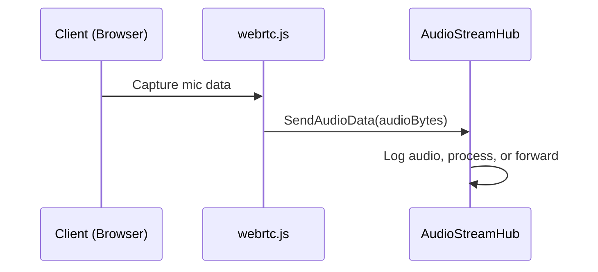

# Chapter 4: AudioStreamHub

In [Chapter 3: webrtc.js](03_webrtc_js_.md), we learned how to capture audio in the browser and send it around for a live chat. Now let’s discover how the server side receives, processes, and distributes that audio. This job belongs to “AudioStreamHub,” our SignalR-based hub that’s like a sound technician’s booth ensuring your audio goes where it needs to go.

---

## Why Do We Need AudioStreamHub?

Imagine you’re broadcasting a live radio show:
1. The host (client) speaks into the microphone.  
2. Audio signals travel to the sound technician (the hub).  
3. The technician logs or monitors the incoming audio, maybe cleans it up, and then sends it to listeners or archives it.

Our **AudioStreamHub** is that “sound technician’s booth” for your voice chat application. It uses SignalR to receive audio data from clients (like webrtc.js) and can distribute it to others in real time—or store it for later use.

---

## High-Level Use Case

Let’s say two people want to talk to each other, and optionally record the conversation:
1. Each person’s browser captures audio using [webrtc.js](03_webrtc_js_.md).  
2. The audio is sent to the **AudioStreamHub** on the server.  
3. The hub logs or processes it, and can send the audio to other participants or to an AI-based service.  

By routing everything through AudioStreamHub, we keep our audio flow consistent and centralized.

---

## Key Concepts

1. **SignalR Hub**  
   “AudioStreamHub” extends `Hub`, a class from SignalR that makes real-time communication between clients and server super easy.  
2. **Receive Audio**  
   The hub has a method (e.g., `SendAudioData`) that clients call when they want to send audio.  
3. **Logging / Processing**  
   Inside that method, you can do anything you want with the audio (log it, forward it, store it).  
4. **Broadcasting**  
   You can also broadcast the audio to other connected clients (for group calls) or keep it private if you want a one-on-one connection.

---

## How to Use AudioStreamHub

Below is a simple sequence of how **AudioStreamHub** interacts with your clients:



1. **Client** records audio in the browser.  
2. **webrtc.js** sends the raw audio bytes to `SendAudioData` in **AudioStreamHub**.  
3. **AudioStreamHub** can log or process these bytes and decide how to handle them next.

---

## Minimal Example: Calling the Hub from Client Side (C# or JS)

From your Blazor or JavaScript code, you can quickly call the server’s hub method:

```csharp
// Suppose 'hubConnection' is a SignalR HubConnection already started
byte[] someAudioBytes = ...; // your captured data
await hubConnection.SendAsync("SendAudioData", someAudioBytes);
```

Explanation:
- `hubConnection.SendAsync(...)` calls the “SendAudioData” method on the server, passing `someAudioBytes`.  
- This audio data then arrives in **AudioStreamHub**.

---

## Internal Implementation (Under the Hood)

Internally, our **AudioStreamHub** class (in `Services/AudioStreamHub.cs`) is a standard SignalR hub:

```csharp
using Microsoft.AspNetCore.SignalR;

namespace BlazorVoice.Services
{
    public class AudioStreamHub : Hub
    {
        public async Task SendAudioData(byte[] audioData)
        {
            Console.WriteLine($"Received audio data of size: {audioData.Length} bytes");
            // Potentially forward this audio or handle it here
        }
    }
}
```

Explanation (each line):
1. `public class AudioStreamHub : Hub` tells SignalR we’re making a real-time communication hub.  
2. `SendAudioData` is the method browsers call via `hubConnection.SendAsync("SendAudioData", data)`.  
3. We print the size of the audio to the console for debugging.  
4. You could store it, broadcast it to other users, or feed it into an AI service.

---

## Step-by-Step Walkthrough

When a browser sends audio data:
1. The **client** reads the microphone data (often via [webrtc.js](03_webrtc_js_.md)).  
2. It calls `hubConnection.SendAsync("SendAudioData", audioData)`.  
3. **SendAudioData** is called on your **AudioStreamHub**.  
4. You can log, filter, or transform the data. If needed, use `Clients.All` or `Clients.Others` to broadcast these bytes to other connected users.  

Because SignalR handles the real-time flow, you can keep your logic super simple in the hub—just decide who gets what audio.

---

## Conclusion

**AudioStreamHub** is the central relay for all audio traveling into your application. It’s the perfect place to see incoming data, log it, or share it with other clients. Now that we have a clear pipeline—client captures audio, sends to hub, and potentially redistributes it—our next step is to see how we can do more advanced processing or routing under the hood with actor-based services.

Let’s proceed to [AkkaService](05_akkaservice_.md) and see how we can integrate robust actor systems into our audio workflow!

---

Generated by [AI Codebase Knowledge Builder](https://github.com/The-Pocket/Tutorial-Codebase-Knowledge)