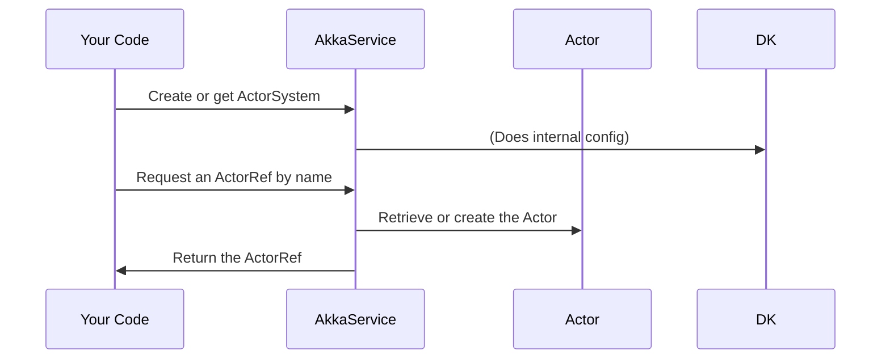
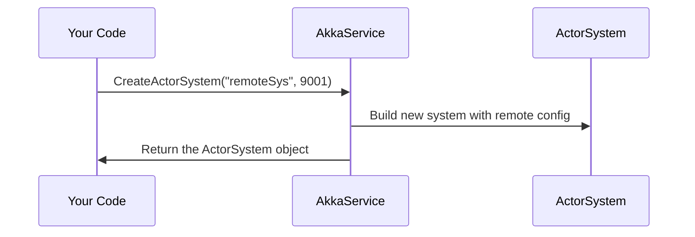

# Chapter 5: AkkaService

In the [previous chapter (AudioStreamHub)](04_audiostreamhub_.md), we learned how our server receives and distributes audio in real time. Now, let’s step behind the scenes to discover the “stage crew boss” of our BlazorVoice app—the one who coordinates all the moving parts known as “actors.” That’s exactly what the AkkaService does!

---

## Why Do We Need AkkaService?

Imagine you have a theater full of performers: some actors handle voice chatting, others handle AI tasks, and more might manage remote interactions. You need a “stage crew boss” to:

1. Organize all actors under one (or more) “systems” so they can perform together.  
2. Quickly create new characters (actors) when needed.  
3. Easily find and reuse existing actors for ongoing tasks.  
4. Decide if the production runs entirely on a single stage (local) or across multiple stages (remote machines).

This “stage crew boss” in our application is called “AkkaService.” It uses libraries from the Akka.NET ecosystem to manage actors. Whether you want a big local show or a distributed performance across machines, AkkaService is your go-to.

---

## High-Level Use Case

Let’s imagine you’re building a voice chat system that also has AI-driven features, like transcription or ChatGPT integration. You might need:

1. A local actor to handle user text messages.  
2. A remote actor to process advanced AI tasks on another server.  
3. A lookup table so you can ask, “Who handles text-to-speech?” or “Which actor does voice transcription?”

AkkaService creates and keeps track of these actors in different ActorSystems. So whenever you need something new (e.g., an AI transcription actor), you “ask” AkkaService to spin it up or retrieve it by name.

---

## Key Concepts

Here are the main ideas you need to understand:

1. **ActorSystem**  
   - Think of an ActorSystem as the entire stage where actors perform. One application can have multiple stages if needed.

2. **Default ActorSystem**  
   - AkkaService can start a “default” system when you don’t need anything fancy. All local actors can live here.

3. **Remote ActorSystems**  
   - If you want to run actors on different machines, AkkaService sets up a special ActorSystem with network configurations (a “distributed stage”).

4. **Actors**  
   - These are the individual performers. They each handle a small, focused job (like a dedicated chat actor).

5. **Actor References**  
   - Every actor has a reference (like a phone number) that AkkaService stores. So when you want to talk to an actor, you ask AkkaService for its reference.

---

## How to Use AkkaService

Let’s see a very minimal flow of how you might use this service in your code:



### Step-by-Step

1. **Get an ActorSystem**  
   You first ask AkkaService for a system to place your actors in.  
2. **Add or Get an Actor**  
   Next, you create (or retrieve) the actor you need by name.  
3. **Use the Actor**  
   You send or receive messages with that actor to do your bidding (like AI tasks or chat coordination).

---

## Minimal Code Snippets

Below are a few short, friendly examples showing how to use AkkaService in practice. Each snippet has fewer than 10 lines and is purely illustrative.

### 1) Creating a Default ActorSystem

```csharp
// Ask AkkaService to create a default actor system
var akkaService = new AkkaService();
var defaultSystem = akkaService.CreateActorSystem("default");
// Now 'defaultSystem' can host local actors
```

Explanation:  
• We call `CreateActorSystem("default")`.  
• If it doesn’t exist yet, a new “default” stage is built.  
• We store this system in `defaultSystem` for local usage.

### 2) Creating a Remote ActorSystem

```csharp
// Create a remote ActorSystem running on port 9001
var remoteSystem = akkaService.CreateActorSystem("remoteSys", 9001);
// This system is configured for networked, distributed scenarios
```

Explanation:  
• By specifying a port (e.g., 9001), we’re setting up a “remote” stage.  
• This allows multiple machines to communicate and share actors across the network.

### 3) Adding and Retrieving an Actor

```csharp
// Create an actor within "default" system
var myActor = defaultSystem.ActorOf(Props.Empty, "myActor");

// Store it in AkkaService for quick retrieval
akkaService.AddActor("myActor", myActor);

// Later, anywhere in the code:
var fetchedActor = akkaService.GetActor("myActor");
```

Explanation:  
• We build a new actor in the “default” system.  
• Then we tell AkkaService, “Remember ‘myActor’ by that name.”  
• Next time we need it, we call `GetActor("myActor")` to retrieve the same one.

---

## Internal Implementation Walkthrough

When you call `akkaService.CreateActorSystem(...)`, here’s what happens:

1. **AkkaService** checks if it already has an ActorSystem with that name.  
2. If not, it builds a new ActorSystem with Akka.NET libraries (possibly reading config for remote usage).  
3. This newly created system is stored so you can retrieve it later.  
4. Once the system is ready, you can create actors in it or get existing ones.

Below is a simplified diagram:



---

## Behind the Scenes: A Peek at the Code

Inside AkkaService’s file (for example, “AkkaService.cs”), the core logic looks like this. We’ve broken it into smaller chunks:

```csharp
private Dictionary<string, ActorSystem> actorSystems 
    = new Dictionary<string, ActorSystem>();

public ActorSystem CreateActorSystem(string name, int port = 0)
{
    if (!actorSystems.ContainsKey(name))
    {
        // Step 1: Build a locally or remotely configured ActorSystem
        // ...
        actorSystems[name] = ActorSystem.Create(name);
    }
    // ...
    return actorSystems[name];
}
```
Explanation:  
- `actorSystems` is a dictionary that stores all the created ActorSystems by name.  
- `CreateActorSystem` checks if the name is new; if so, it creates the system and saves it in the dictionary.

```csharp
private Dictionary<string, IActorRef> actors 
    = new Dictionary<string, IActorRef>();

public void AddActor(string name, IActorRef actor)
{
    if (!actors.ContainsKey(name))
    {
        actors[name] = actor;
    }
}

public IActorRef GetActor(string name)
{
    if (actors.ContainsKey(name))
        return actors[name];
    return null;
}
```
Explanation:  
- There’s another dictionary (`actors`) to store and look up references to specific actors by name.  
- `AddActor` and `GetActor` handle storing or retrieving these under friendly names.

---

## Conclusion

You’ve now met the “stage crew boss” of our application, the AkkaService. It manages:

• Where and how your actors perform (creating local or remote ActorSystems).  
• Which actors exist in your show.  
• How to quickly look them up by name.  

In the next chapter, we’ll introduce one of these special actors we keep talking about: the [VoiceChatActor](06_voicechatactor_.md). It’s where the real-time AI voice magic happens!  

Let’s keep the show rolling!

---

Generated by [AI Codebase Knowledge Builder](https://github.com/The-Pocket/Tutorial-Codebase-Knowledge)