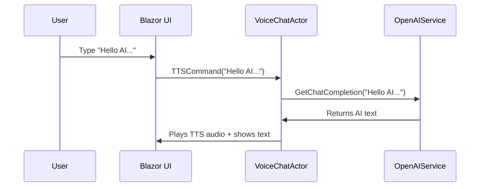

# Chapter 6: VoiceChatActor

In our previous chapter ([AkkaService](05_akkaservice_.md)), we learned how to create, manage, and organize different “actors” in an Akka-based system. Now we’ll introduce a very special actor who’s in charge of AI chatting and speaking your lines: the “VoiceChatActor.”

---

## Why Do We Need a VoiceChatActor?

Imagine you’re running a grand theater production. You have an actor who’s not only great at reciting lines but can also improvise brilliant scripts on the fly. That’s exactly what our VoiceChatActor does in the BlazorVoice application!

• It keeps track of past conversations (so it remembers what was said).  
• It calls out to OpenAI services for creative or informative responses.  
• It uses text-to-speech (TTS) to speak those responses out loud.  
• It even schedules automatic tasks (like content refresh) behind the scenes.

---

## A Simple Use Case

Think of a user typing a message: “Hello AI, how are you?” The VoiceChatActor will:  
1. Store that line in a conversation list.  
2. Ask OpenAI for a clever reply.  
3. Return text back to the user.  
4. Convert that text to speech and play it aloud.  

So from a user’s perspective, it’s like chatting with a talking AI buddy—no separate steps for text and speech. The VoiceChatActor orchestrates it all in one neat place.

---

## Key Concepts

1. Conversation History  
   • The actor keeps a running list of messages (e.g., “User: Hello” and “AI: Hi there!”).  
   • This helps the AI maintain context.

2. Chat Integration  
   • When you send an input message, the actor calls the [OpenAIService](07_openaiservice_.md) to get a response.  

3. Text-to-Speech (TTS)  
   • It takes AI-generated text, passes it to a TTS engine, and plays the audio.  

4. Scheduled Events  
   • It uses an internal timer to trigger updates (e.g., refresh content or send news) at set intervals, without waiting for user input.

---

## How to Use VoiceChatActor

Below is a typical way you might interact with the VoiceChatActor once it’s created through the [AkkaService](05_akkaservice_.md).

1. Grab the actor reference:  
   - Ask AkkaService for the “VoiceChatActor.”  
2. Send a command (e.g., TTSCommand) with your text.  
3. The actor responds with AI text and TTS audio in the Blazor UI.

### Minimal Example: Sending a TTS Command

Here’s some very trimmed-down C# code that could be in a Blazor component or service:

```csharp
var voiceChatRef = akkaService.GetActor("voiceChatActor");
if (voiceChatRef != null)
{
    await voiceChatRef.Ask<object>(new TTSCommand
    {
        From = "Your",
        Text = "Hello AI, how can you help me today?"
    });
}
```

Explanation:  
1. We get the actor reference by its name (“voiceChatActor”).  
2. We send a TTSCommand.  
3. Inside that command, we specify the text we want spoken.  
4. The actor will generate a response, call AI, and speak.  

---

## Under the Hood: Step-by-Step Flow

When you send a TTSCommand to the VoiceChatActor, here’s a simplified sequence:



1. The user types a message in the Blazor UI.  
2. The UI sends a “TTSCommand” to VoiceChatActor.  
3. The actor calls OpenAI to figure out a reply.  
4. OpenAI responds with text.  
5. The actor plays TTS audio and updates the UI with the text.

---

## VoiceChatActor: Internal Implementation

VoiceChatActor is a class that inherits from Akka’s “ReceiveActor.” It defines how to handle various commands (like TTSCommand or ContentAutoUpdateCommand).

### Constructor (Truncated)

```csharp
public VoiceChatActor(IServiceProvider serviceProvider)
{
    // 1) Log that the actor is being constructed
    logger.Info($"VoiceChatActor: Constructor - {Self.Path}");

    // 2) Create an OpenAIService instance
    _openAIService = new OpenAIService();

    // 3) Start a periodic timer for auto-updates
    Timers.StartPeriodicTimer(
        TimerKey.Instance,
        new ContentAutoUpdateCommand(),
        TimeSpan.FromSeconds(10),
        TimeSpan.FromSeconds(RefreshTimeSecForContentAutoUpdate)
    );

    // 4) Listen for commands
    Receive<ContentAutoUpdateCommand>(cmd => { /* handle update... */ });
    Receive<TTSCommand>(cmd => { /* handle TTS... */ });

    _serviceProvider = serviceProvider;
}
```

Explanation:  
• Sets up a logger.  
• Creates an OpenAIService instance for chat responses.  
• Starts a periodic timer (like a backstage alarm) to do automatic updates.  
• Receives different command types (e.g., TTS commands).

### Handling TTS Commands

```csharp
Receive<TTSCommand>(command =>
{
    if (command.From == "Your")
    {
        // 1) Convert user's text to voice
        var voiceBytes = _openAIService.ConvertTextToVoiceAsync(command.Text, command.Voice).Result;
        // 2) Ask AI for a follow-up response
        _ = Task.Run(() => GetChatCompletion(command.Text));
        // 3) Callback to Blazor UI
        _blazorCallback?.Invoke("AddMessage", new object[] { command.From, command.Text });
        _blazorCallback?.Invoke("PlayAudioBytes", new object[] { voiceBytes, 0.5f, 1 });
    }
});
```

Explanation:  
1. If the “From” field is “Your,” we treat it as user text.  
2. Convert that text to speech (voiceBytes).  
3. Kick off an AI chat completion in the background.  
4. Invoke callbacks that update the Blazor UI (like adding a message to the chat window and playing audio).

### Getting AI Chat Completion

```csharp
public async Task<string> GetChatCompletion(string message)
{
    _conversationHistory.Add($"User:{message}");
    var aiResponse = await _openAIService.GetChatCompletion(message, _conversationHistory);
    _conversationHistory.Add($"AI:{aiResponse}");
    lastAiMessage = aiResponse;
    return aiResponse;
}
```

Explanation:  
• Adds the user’s message to conversationHistory.  
• Calls `_openAIService.GetChatCompletion(...)` for a response.  
• Stores the AI’s reply in conversationHistory as well.  
• Returns the AI’s text if you need it elsewhere.

---

## Conclusion

Our VoiceChatActor is the star performer for AI interactions in BlazorVoice. It juggles user messages, calls OpenAI for witty replies, and even speaks those lines out loud via TTS.

In the next chapter, we’ll zoom in on the [OpenAIService](07_openaiservice_.md) itself to see how these AI calls actually work and how you can customize them to your needs. Let’s keep the show rolling!

---

Generated by [AI Codebase Knowledge Builder](https://github.com/The-Pocket/Tutorial-Codebase-Knowledge)