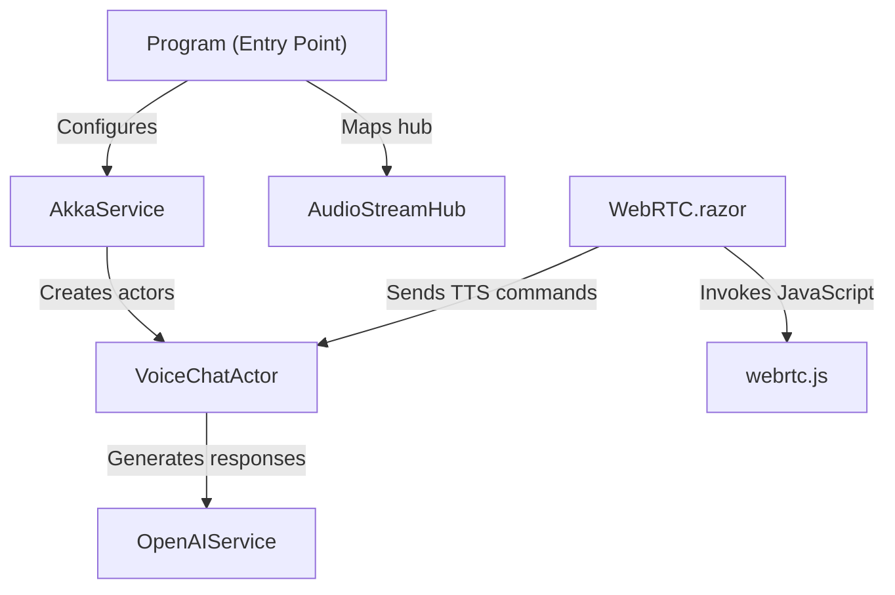

# Tutorial: BlazorVoice

**BlazorVoice** is a *web-based voice chat application* that integrates *WebRTC*, *SignalR*, and *OpenAI* to provide real-time voice and text interactions.
It configures an **Akka** actor system to manage specialized voice actors, uses **OpenAI** for chat and text-to-speech, and employs JavaScript bridging for capturing and playing audio streams.

**Source Repository:** [None](None)

## Chapters

1. [Program (Entry Point)
](01_program__entry_point__.md)
2. [WebRTC.razor
](02_webrtc_razor_.md)
3. [webrtc.js
](03_webrtc_js_.md)
4. [AudioStreamHub
](04_audiostreamhub_.md)
5. [AkkaService
](05_akkaservice_.md)
6. [VoiceChatActor
](06_voicechatactor_.md)
7. [OpenAIService
](07_openaiservice_.md)

---

Generated by [AI Codebase Knowledge Builder](https://github.com/The-Pocket/Tutorial-Codebase-Knowledge)