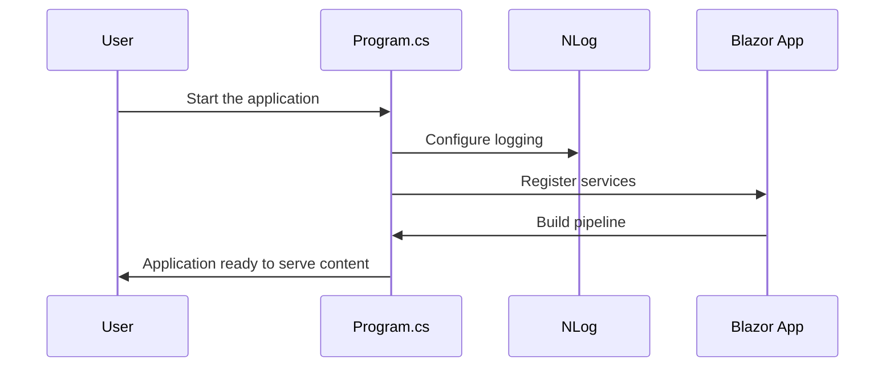

# Chapter 1: Blazor Startup & Main Program

Imagine you’re about to watch a big stage production: before the curtains open, there’s someone who sets up the stage, arranges the lights, and makes sure all actors know their cues. In BlazorVoice, that “stage manager” is our **Startup & Main Program** code. It runs before our Blazor application “goes live,” configuring services, setting up logging, and preparing everything for a smooth show.

---

## Why Do We Need a “Startup & Main Program”?

Let’s say you want to build a web application that has:
- A friendly user interface (with **MudBlazor**​).
- Real-time communication features (with **SignalR**).
- Voice chat capabilities (using [webrtc.js](04_webrtc_js_.md) and [AudioStreamHub](05_audiostreamhub_.md)).
- AI functionality (using [OpenAIService](08_openaiservice_.md)).

You need a place where all these services get properly registered, configured, and connected. Without it, your app wouldn’t know how to handle requests or enable communication among its parts. Just like a stage manager ensures everyone plays their part, our **Program.cs** ensures everything is in place.

---

## Key Concepts

1. **Creating the Blazor Server Builder**  
   Dotnet creates a “builder” that holds all configurations for our Blazor server app. This is where we say “Hey, app, use logging with NLog,” or “Register MudBlazor services, please!”

2. **Configuring Logging (NLog)**  
   NLog is our “scribe” that records important events. If something goes wrong, NLog helps us see error messages. If something goes right, it logs that too.

3. **Registering Services**  
   Our app depends on many services (like [AkkaService](06_akka_service_.md) for actor systems or [OpenAIService](08_openaiservice_.md) for AI). We say, “Hey builder, here’s a service. Remember to create or manage it for us.”

4. **Building and Running the App**  
   Finally, we “build” the entire configuration and run it. This is like opening the curtains—our setup is complete, and the audience can now interact with the show.

---

## How to Use Startup & Main Program

Below is a simplified look at parts of `Program.cs`. We’ll break it down into smaller code snippets (each under 10 lines) with friendly explanations.

### 1) Start Logging Setup

```csharp
using NLog;
using NLog.Config;
using NLog.Web;

var logger = LogManager.Setup()
    .LoadConfigurationFromAppSettings()
    .GetCurrentClassLogger();
logger.Debug("init main");
```

- We tell NLog to grab a logger and load a configuration from **appsettings** (like a stage script).  
- `logger.Debug("init main");` is our first log statement, confirming we’ve begun.

### 2) Create the Builder and Configure NLog

```csharp
var builder = WebApplication.CreateBuilder(args);
var env = builder.Environment.EnvironmentName;

var nlogConfigFile = env switch
{
    "Development" => "NLog.Development.config",
    "Local" => "NLog.Local.config",
    _ => "NLog.config"
};
```

- `WebApplication.CreateBuilder(args)` is where we gather “all the tools” we need.  
- We then pick which NLog config file to use based on the environment (Development vs. Production). This is like choosing the right script for each stage performance (development or production).

### 3) Register Services (MudBlazor, SignalR, Akka, etc.)

```csharp
builder.Services.AddRazorComponents()
    .AddInteractiveServerComponents();

builder.Services.AddMudServices(); 
builder.Services.AddSignalR();
```

- `AddRazorComponents()` sets up support for Razor (the Blazor pages).  
- `AddMudServices()` ensures we can use **MudBlazor** for UI styling.  
- `AddSignalR()` picks up real-time web communication.

```csharp
// Provide actor system (AkkaService) as a singleton
builder.Services.AddSingleton<AkkaService>();

// Provide OpenAIService so each user has their own scope
builder.Services.AddScoped<OpenAIService>();
```

- The [AkkaService](06_akka_service_.md) helps us manage “actors” in the system, which is special logic for handling chat or voice.  
- The [OpenAIService](08_openaiservice_.md) sets up AI functionalities.  

### 4) Build and Run the App

```csharp
var app = builder.Build();
var akkaService = app.Services.GetRequiredService<AkkaService>();
var actorSystem = akkaService.CreateActorSystem("default");

app.UseStaticFiles();
app.MapRazorComponents<App>()
    .AddInteractiveServerRenderMode();
```

- We “build” everything into a final package.  
- Then we retrieve the `AkkaService` and start an actor system.  
- `app.UseStaticFiles()` is like telling the stage manager to open the curtains on the static props.  
- Finally, mapping `RazorComponents<App>()` means we hook up our Blazor pages so they can be served.

```csharp
app.MapHub<AudioStreamHub>("/audiostream");
app.Run();
```

- We map our [AudioStreamHub](05_audiostreamhub_.md) at `/audiostream`. This is the route for real-time audio streaming (perfect for the voice chat).  
- `app.Run()` starts everything. Cue the lights!

---

## Under the Hood (Sequence Diagram)

When you run the application, here’s a tiny “behind the scenes” storyline:



1. **User** starts the application.  
2. **Program** sets up logging with NLog.  
3. **Program** registers all app services.  
4. **App** is built and configured.  
5. **Program** announces the app is ready.

---

## Internal Implementation Up Close

At a high level:

1. **CreateBuilder**: Grabs command-line arguments, environment info, and sets up the web host.  
2. **Add Services**: Each service (e.g., [OpenAIService](08_openaiservice_.md)) is introduced to the host so it’s available wherever needed.  
3. **Build**: We finalize all configurations.  
4. **Run**: The server starts listening for browser requests on your machine.

In the actual `Program.cs`, everything sits neatly in a single file. It might look longer, but it follows this simple flow. By dividing it into sections, it’s easier to read and maintain.

---

## Conclusion

You’ve now met your “stage manager,” the **Blazor Startup & Main Program** that sets up the entire BlazorVoice application. It configures essential services, logging, and the request handling pipeline, so everything’s ready for curtain call.

In the next chapter, we’ll explore how to make our app look good and feel user-friendly using [MudBlazor Layout (MainLayout & MyNavMenu)](02_mudblazor_layout__mainlayout___mynavmenu__.md). Let’s dress up the stage with some stylish scenery!

[Next Chapter: MudBlazor Layout (MainLayout & MyNavMenu)](02_mudblazor_layout__mainlayout___mynavmenu__.md)

---

Generated by [AI Codebase Knowledge Builder](https://github.com/The-Pocket/Tutorial-Codebase-Knowledge)