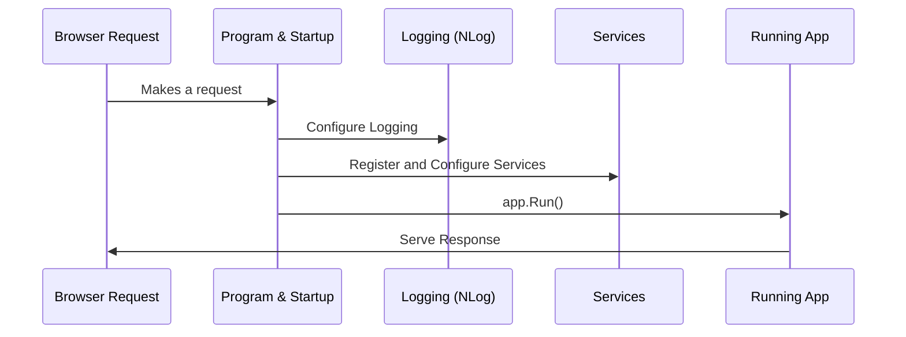

# Chapter 1: Program & Startup

Welcome to the very first step in exploring how BlazorVoice comes to life! In this chapter, we’ll look at “Program & Startup,” which is essentially the entry gate and master organizer of the entire application. Think of it like the main conductor of a big concert—without it, no performer would know when to play, where to stand, or even how to access their microphones!

## Why Do We Need a “Program & Startup”?

Imagine you’re hosting an online concert. You need to:
• Schedule when everything happens (server start).  
• Set up your logging system so you can keep track of the performance (NLog).  
• Ensure that all your instruments (services) are ready to play.  
• Provide an environment so the performers (code components) can run without clashing.  

All of this is done in BlazorVoice’s “Program & Startup.” Once everything is ready, you say “Go!” (app.Run()), and the show begins.

## Key Concepts in Program & Startup

1. **Logging**: We use NLog to track what our app is doing. This helps you see if something goes wrong or if everything is running smoothly.  
2. **Configuration**: We attach environment-specific settings. For example, “Development” might have more detailed logs, while “Production” is more streamlined.  
3. **Services Registration**: Here, you add or build the services you need. For instance, you might add a SignalR hub for real-time messaging or a custom chat AI service.  
4. **Hosting Pipeline**: This is the crucial part that tells the app how to handle incoming requests (like returning a webpage or passing off a request to a hub for audio streaming).

## How to Use Program & Startup

Let’s break down the essential steps. Each code snippet below shows a small piece of the larger [Program.cs](#) file to keep things simple. (Note: the “...” means we’re skipping lines not critical for the beginner’s view.)

### 1. Setting Up Logging

```csharp
using NLog;
using NLog.Config;
using NLog.Web;

// Create and configure logger
var logger = LogManager.Setup()
    .LoadConfigurationFromAppSettings()
    .GetCurrentClassLogger();
logger.Debug("init main");
```

• We import `NLog` libraries.  
• `LogManager.Setup()` reads logging settings (like file paths to save logs).  
• `LoadConfigurationFromAppSettings()` picks up environment-based settings, such as “Development” or “Local.”  

### 2. Building the Web Host

```csharp
var builder = WebApplication.CreateBuilder(args);

builder.Logging.ClearProviders();
LogManager.Configuration = new XmlLoggingConfiguration("NLog.config");
builder.Host.UseNLog();

logger.Info("Start BlazorVoice Service API");
```

• `CreateBuilder` sets up the default hosting environment.  
• `ClearProviders()` removes other logging systems so we only keep NLog.  
• We then load an NLog configuration file depending on the environment.  
• Finally, we say “UseNLog” to finalize the logging pipeline.

### 3. Adding Services

```csharp
// Add services to the container
builder.Services.AddRazorComponents()
    .AddInteractiveServerComponents();

builder.Services.AddSignalR(options =>
{
    options.MaximumReceiveMessageSize = 1024 * 1024; // 1MB
});
```

• Here we plug in the parts of Blazor that let us render user interfaces and handle interactive components in real-time.  
• The `AddSignalR` method configures real-time communication with a maximum message size (so your audio streams don’t break).

### 4. Building and Running the App

```csharp
var app = builder.Build();

if (!app.Environment.IsDevelopment())
{
    app.UseExceptionHandler("/Error", createScopeForErrors: true);
}

app.UseStaticFiles();

// This line sets up the main interactive pages
app.MapRazorComponents<App>().AddInteractiveServerRenderMode();

// Map the SignalR hub (more on this in [AudioStreamHub (SignalR)](05_audiostreamhub__signalr__.md))
app.MapHub<AudioStreamHub>("/audiostream");

// Launch the show!
app.Run();
```

• `Build()` finalizes all configurations.  
• If we’re not in development mode, we use a custom error page.  
• `UseStaticFiles` makes your images, scripts, and other assets accessible.  
• `MapRazorComponents<App>()` sets up the root of your Blazor app, letting it render UI.  
• `MapHub<AudioStreamHub>` registers your real-time audio streaming endpoint.

## How Does It All Work Internally?

Let’s visualize the overall flow with a simple diagram:



1. **U (Browser)** sends a request.  
2. **P (Program & Startup)** sets up everything (logging, services).  
3. **L (Logging)** is informed about how to handle logging messages.  
4. **S (Services)** are readied (like the [OpenAIService](08_openaiservice_.md) or database services).  
5. **R (Running App)** listens and replies to the browser request.

### Behind the Scenes with Program.cs

Internally, `Program.cs`:

1. Reads your environment (Development, Production, etc.).  
2. Loads NLog config to handle logs differently based on the environment.  
3. Registers any services you want, such as [AkkaService](06_akkaservice_.md) for actor-based chat or [OpenAIService](08_openaiservice_.md) for AI tasks.  
4. Opens the door to all incoming requests via `app.Run()`.

## Conclusion and Next Steps

Congratulations! You’ve just peeked behind the curtain of how BlazorVoice starts up and runs. The “Program & Startup” concept is your application’s director—setting the stage for everything else. Next, we’ll dive into structuring the user interface and moving between pages in [Layout & Navigation](02_layout___navigation_.md). See you there!

---

Generated by [AI Codebase Knowledge Builder](https://github.com/The-Pocket/Tutorial-Codebase-Knowledge)