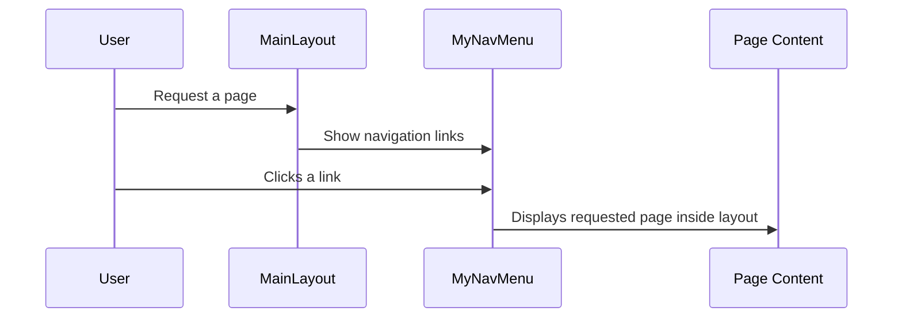

# Chapter 2: Layout & Navigation

In the [Program & Startup](01_program___startup_.md) chapter, we saw how the entire BlazorVoice application is launched and prepared. Now, let’s step inside our “house” and see how its blueprint (layout) and hallways (navigation) are arranged. This chapter introduces “Layout & Navigation,” focusing on two key files:

• MainLayout.razor  
• MyNavMenu.razor  

Together, these files keep our site looking consistent and help users move around easily.

---

## Why Do We Need a Layout and Navigation?

Imagine your app is a building. The “MainLayout” is like a sturdy skeleton that defines the floors, walls, and roof. Inside that building, the “MyNavMenu” is like a central hallway with labeled doors leading to different rooms (pages).

• With a layout, you ensure that your header, side menu (or top menu), and content area stay the same across your entire website.  
• Navigation links let users jump around without getting lost.

---

## Key Concepts

### 1. MainLayout.razor
• Wraps the site with a header (app bar), side drawer (navigation panel), and a content section where each page is displayed.  
• Provides consistent elements (like a logo or a “Menu” button) at the top.  
• Think of it like the overall “shell” of your app.

### 2. MyNavMenu.razor
• Houses the list of links or “doors” that lead to different pages.  
• You can group related links under headings, so everything stays organized.  
• This is the “hallway” that helps visitors find their way.

---

## Using MainLayout.razor

Before you can see your layout in action, you’ll typically place it in the “Components\Layout” folder. A very simplified example might look like this:

```csharp
@inherits LayoutComponentBase

<MudThemeProvider />
<MudPopoverProvider />
<MudDialogProvider />
<MudSnackbarProvider />
```

• @inherits LayoutComponentBase: Makes sure your layout follows Blazor’s layout rules.  
• MudThemeProvider, MudPopoverProvider, etc.: These are extra providers for UI theming and pop-ups (typical when using MudBlazor libraries).

Below that, you usually define your layout structure:

```csharp
<MudLayout>
    <MudAppBar>
        <MudIconButton Icon="@Icons.Material.Filled.Menu"
                       OnClick="DrawerToggle" />
        My Application
    </MudAppBar>

    <MudDrawer @bind-Open="@_drawerOpen">
        <MyNavMenu />
    </MudDrawer>

    <MudMainContent>
        @Body
    </MudMainContent>
</MudLayout>
```

• <MudAppBar> and <MudDrawer> create a top menu and a side drawer.  
• <MyNavMenu /> is placed inside the drawer.  
• @Body is where each page’s unique content gets shown.  
• _drawerOpen is a simple boolean to toggle the drawer open or closed.

Inside the same file, you might have a bit of C# code to handle toggling:

```csharp
@code {
    private bool _drawerOpen = true;

    private void DrawerToggle(MouseEventArgs e)
    {
        _drawerOpen = !_drawerOpen;
    }
}
```

• When a user clicks the menu button, we switch _drawerOpen to the opposite value, showing or hiding the side drawer.

---

## Using MyNavMenu.razor

Now, let’s see how links are organized. You can also find this file under “Components\Layout.” A simple snippet:

```csharp
<MudNavMenu>
    <MudNavLink Href="/" Match="NavLinkMatch.All">
        Dashboard
    </MudNavLink>
</MudNavMenu>
```

• <MudNavLink> is a clickable link. “Href="/"” tells Blazor to navigate to the home page.  
• Match="NavLinkMatch.All" means it only highlights the link when you’re exactly on “/”.

You can group links with headings:

```csharp
<MudNavGroup Title="TechDemo">
    <MudNavLink Href="/web-rtc">Voice LLM</MudNavLink>
</MudNavGroup>
```

• <MudNavGroup> organizes related links like “Voice LLM” under a parent title (“TechDemo”).  
• Users see an expandable/collapsible menu for easy organizing.

---

## How It Works Under the Hood

Let’s imagine a user visits your site. Here’s a high-level flow:



1. The User arrives, and MainLayout loads.  
2. MainLayout shows the sidebar with MyNavMenu.  
3. The User clicks a link in MyNavMenu.  
4. The requested page (P) is shown in the @Body section of MainLayout.

---

## Internal Code Structure

In Blazor, layouts are special Razor components that specify a “@Body” placeholder to display the content of each page. That’s why in our MainLayout we see “@Body.” MyNavMenu is simply another Razor component with navigation links:

• Both are registered automatically once placed in the right folder (e.g., Pages or Components).  
• Blazor knows to use MainLayout as the default layout if you set it in your _Imports.razor or in each page.  

### Example Page Layout Usage

Inside a typical Razor page (like Index.razor), you could specify:

```csharp
@page "/"
@layout MainLayout

<h1>Hello from the Dashboard!</h1>
```

When the user navigates to “/,” the content “Hello from the Dashboard!” will appear inside the MainLayout’s @Body area. Meanwhile, MyNavMenu stays visible on the side.

---

## Conclusion and Next Steps

By setting up a consistent layout in MainLayout.razor and grouping pages neatly in MyNavMenu.razor, you create a user-friendly structure where everything looks uniform. You now have a “house” with a solid framework and an easy-to-use hallway.  

Next, we’ll explore how to add real-time voice features using WebRTC. Turn the page to learn more in [WebRTC.razor (AIVoiceChat)](03_webrtc_razor__aivoicechat__.md). Have fun navigating!

---

Generated by [AI Codebase Knowledge Builder](https://github.com/The-Pocket/Tutorial-Codebase-Knowledge)