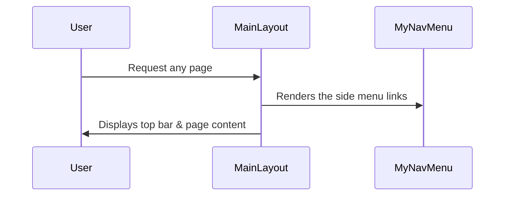

# Chapter 2: MudBlazor Layout (MainLayout & MyNavMenu)

In the [previous chapter](01_blazor_startup___main_program_.md), we saw how our “stage manager” (the Startup & Main Program) sets up the BlazorVoice application before the curtains rise. Now, let’s get our stage looking great and easy to navigate with MudBlazor’s layout components. Think of these layouts like the set designers and navigators: they create a consistent “look and feel” for every page, and they guide visitors across different parts of the site.

---

## Why Do We Need a Layout & Nav Menu?

Imagine our web app as a theater stage:
- We need an app **layout** that frames each scene with a top bar, a sidebar drawer, and a main content area.  
- We also need a **navigation menu** so users can move smoothly from “Dashboard” to “TechDemo” (and beyond).

MudBlazor’s **MainLayout** and **MyNavMenu** come to the rescue, ensuring each page has the same theme, spacing, and quick access to important links. This consistency helps users feel at home, no matter which page they visit.

---

## Key Concepts

1. **MainLayout**  
   - Defines the overall page structure: top navigation bar, collapsible drawer, and main content area.  
   - Uses MudBlazor components like `<MudAppBar>`, `<MudDrawer>`, and `<MudMainContent>` to create a polished UI.  

2. **MyNavMenu**  
   - Lives inside the drawer. Shows clickable navigation links to different sections.  
   - Uses `<MudNavLink>` and `<MudNavGroup>` so sections can expand, group pages, and keep the app well-organized.

3. **MudBlazor Providers**  
   - `<MudThemeProvider>` applies consistent styling across pages.  
   - `<MudPopoverProvider>`, `<MudDialogProvider>`, and `<MudSnackbarProvider>` support popovers, dialogs, and snackbars when needed.

Put simply, **MainLayout** is our stage design, and **MyNavMenu** is the corridor with signs directing visitors where to go.

---

## How to Use MainLayout & MyNavMenu

The simplest use case is: “I want every page to share a top bar and a side menu.” You assign **MainLayout** as the default layout in your Blazor pages, and inside MainLayout, you include **MyNavMenu**. Then any new page you create automatically appears within the same structure.

### MainLayout.razor (Overview)

Below is a simplified example of `MainLayout.razor` (found in `Components/Layout/MainLayout.razor`). We’ll break it down into smaller code snippets.

```csharp
@inherits LayoutComponentBase

<MudThemeProvider />
<MudPopoverProvider />
<MudDialogProvider />
<MudSnackbarProvider />
```
In the snippet above:  
- `<MudThemeProvider>` sets a shared theme style for all child components.  
- `<MudPopoverProvider>`, `<MudDialogProvider>`, `<MudSnackbarProvider>` handle popovers, dialogs, and snackbars.

---

```csharp
<MudLayout>
    <MudAppBar>
        <MudIconButton Icon="@Icons.Material.Filled.Menu" Edge="Edge.Start" 
                       OnClick="DrawerToggle" />
        My Application
    </MudAppBar>
    
    <MudDrawer @bind-Open="@_drawerOpen">
        <MyNavMenu />
    </MudDrawer>

    <MudMainContent>
        @Body
    </MudMainContent>
</MudLayout>
```
What’s happening here:  
- `<MudAppBar>` is our top navigation bar. We place a button to toggle (`DrawerToggle`) the drawer.  
- `<MudDrawer @bind-Open="@_drawerOpen">` contains our side menu (`<MyNavMenu />`). Users can hide or show it.  
- `<MudMainContent>` hosts `@Body`, which is replaced by the “current page” content when users navigate.

---

```csharp
@code {
    private bool _drawerOpen = true;

    private void DrawerToggle(MouseEventArgs e)
    {
        _drawerOpen = !_drawerOpen;
    }
}
```
- `_drawerOpen` is a boolean that controls the drawer’s visibility.  
- `DrawerToggle` flips `_drawerOpen` whenever the user clicks the menu button.

---

### MyNavMenu.razor (Overview)

Now, let’s see `MyNavMenu.razor` (in `Components/Layout/MyNavMenu.razor`), which displays the links:

```csharp
<MudNavMenu>    
    <MudNavLink Href="/" Match="NavLinkMatch.All">
        Dashboard
    </MudNavLink>
    
    <MudNavGroup Title="TechDemo">
        <MudNavLink Href="/web-rtc">
            Voice LLM
        </MudNavLink>        
    </MudNavGroup>
</MudNavMenu>
```
- `<MudNavLink>` points to a specific page (e.g., “/” for Dashboard).  
- `<MudNavGroup>` groups links under a caption (like “TechDemo”). You can expand or collapse it.

You can add more links or groups (like “TEST-UI” for counters or weather) as your app grows. These will all appear in the side drawer, thanks to MudDrawer in **MainLayout**.

---

## Under the Hood (What Actually Happens)

When a user visits a page, Blazor automatically wraps that page with **MainLayout**, hooking in the top bar and drawer. The **MyNavMenu** sits in the drawer, so users see it on every page. Here’s a tiny sequence:



1. The **User** requests a page (like “Dashboard”).  
2. **MainLayout** frames that page with an app bar and the drawer.  
3. **MyNavMenu** provides clicks to other sections.  
4. The user sees everything nicely styled and consistent on every page.

---

## Internal Implementation Details

In Blazor, a layout is just a special component that sets `@inherits LayoutComponentBase`. The `<MudLayout>` and `<MudDrawer>` tags come from MudBlazor, which uses Material Design principles. The `@Body` placeholder is where Blazor drops the “active page.”

### Step-by-Step

1. **User navigates** to a route (e.g., `/web-rtc`).  
2. Blazor sees this route uses `MainLayout` as its layout component.  
3. **MainLayout** loads, then it calls `<MyNavMenu>` to show the sidebar links.  
4. The content for `/web-rtc` is displayed in `@Body` (the main content area).  
5. The user sees the top app bar, the side menu, and the `WebRTC` page content in the center.

By default, `MainLayout.razor` is assigned as the app’s layout in the file `_Imports.razor` or at the top of each page. If you don’t specify a layout, Blazor uses the one marked as default.

---

## Conclusion

With **MainLayout** and **MyNavMenu**, your BlazorVoice application has a polished stage design and an easy-to-use navigation menu. Every page now looks consistent, letting users focus on the content rather than figuring out how to get around.

In the next chapter, we’ll explore how to integrate real-time voice chat and AI by creating the [WebRTC Page (AIVoiceChat)](03_webrtc_page__aivoicechat__.md). Let’s see how our newly styled stage can handle the spotlight of interactive voice features!

---

Generated by [AI Codebase Knowledge Builder](https://github.com/The-Pocket/Tutorial-Codebase-Knowledge)