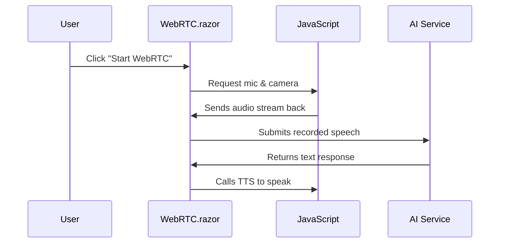

# Chapter 3: WebRTC.razor (AIVoiceChat)

In the [Layout & Navigation](02_layout___navigation_.md) chapter, we put together a user-friendly structure so that anyone visiting our app can easily move around. Now it’s time to make those pages come alive with real-time voice communication! This chapter introduces “WebRTC.razor (AIVoiceChat),” the place where you can have a live, interactive voice session with an AI co-host.

---

## Why an AI Voice Chat Page?

Imagine you want to host a podcast or run a virtual talk show with an AI that can respond to users in real time. You might say, “I want to speak, see my mic volume, record my speech, and let an AI step in with its own voice messages!” That’s exactly what the “WebRTC.razor (AIVoiceChat)” page aims to do. Think of it like a virtual chatroom where you can:

• See and control your local camera feed.  
• Chat via text or voice, with an AI that can talk back.  
• Watch a colorful volume bar that moves with your voice.  

---

## Key Concepts

Let’s break down the important bits that make “WebRTC.razor (AIVoiceChat)” work:

1. **Local Video**  
   - Displays your camera feed so you can confirm that others (and the AI) can “see” you if video is needed.

2. **Voice Input (Microphone Data)**  
   - Captures audio from your mic, processes it, and sends relevant parts to your AI for analysis or transcription.

3. **AI Interaction**  
   - After you speak, the AI can process your words, generate a response, and even play it back using text-to-speech.

4. **Chat Messages**  
   - Lets you send typed messages alongside voice. Perfect for users who prefer typing or need to clarify something in text.

5. **Real-Time Features (WebRTC)**  
   - Uses browser-based technology for low-latency streaming of audio and video.

6. **Unique Session Tracking**  
   - Each user gets an ID to keep track of “who said what.” The “AI co-host” can respond specifically to you based on that ID.

---

## Using WebRTC.razor (AIVoiceChat)

Below is a minimal approach to show how you might set up a single button to start your WebRTC session. When someone clicks the button, your microphone and camera begin streaming in real time.

```csharp
@page "/my-voice-room"

<h2>AIVoiceChat Demo</h2>

<button @onclick="StartSession">Start WebRTC</button>

@code {
    private async Task StartSession()
    {
        // This calls JavaScript to start capturing mic & camera
        await JSRuntime.InvokeVoidAsync("startWebRTC");
    }
}
```
Explanation:  
• @page "/my-voice-room" defines the route.  
• StartSession() calls a JavaScript method "startWebRTC" that begins capturing audio & video.  

---

### Handling Chat

We also want a tiny text chat box for quick messages:

```csharp
<textarea @bind="UserMessage"></textarea>
<button @onclick="SendMessage">Send</button>

@code {
    private string UserMessage = "";

    private void SendMessage()
    {
        // In real usage, you'd forward UserMessage to your AI or server
        Console.WriteLine($"User typed: {UserMessage}");
        UserMessage = "";
    }
}
```
Explanation:  
• textarea captures the user’s typed message.  
• SendMessage() logs or sends it somewhere (e.g., [AudioStreamHub (SignalR)](05_audiostreamhub__signalr__.md)).  

---

### Triggering AI Responses

Once you record something or receive a text, you might want your AI to speak back. A simple approach:

```csharp
private async Task HandleAIResponse(string textToSpeak)
{
    // Using JS to do text-to-speech in the browser
    await JSRuntime.InvokeVoidAsync("speakText", textToSpeak);
}
```
Explanation:  
• speakText is a JavaScript function that uses the Web Speech API to play audio on the user’s device.  
• textToSpeak is the response the AI generated.  

---

## What Happens Under the Hood?

When you click “Start WebRTC,” the page sets up audio/video streams and prepares to capture your voice. Once you stop talking or click a button to “end recording,” the app can analyze the sound or send it to the AI. Finally, the AI’s response is returned and converted to speech.

Below is a simple sequence diagram that shows how a short voice interaction could work:



1. User clicks a button to start.  
2. WebRTC.razor triggers JavaScript to capture mic & camera.  
3. JavaScript returns the raw audio data.  
4. WebRTC.razor calls the AI with the speech data.  
5. AI returns a response (e.g., text).  
6. WebRTC.razor calls JavaScript to perform text-to-speech playback.

---

## A Peek Into The Internal Code

The actual “WebRTC.razor” file (found at “Components\Pages\WebRTC.razor”) can involve more logic, such as:

1. **Initializing WebRTC**  
   - JavaScript sets up peer connections, video tags, and audio analysis.  
2. **Volume Detection**  
   - A small portion of code updates a volume bar based on mic input.  
3. **Session-based Actors**  
   - Each user might get their own [VoiceChatActor](07_voicechatactor_.md) instance (from [AkkaService](06_akkaservice_.md)) to handle logic.  
4. **SignalR Hub**  
   - Sometimes you send audio data to [AudioStreamHub (SignalR)](05_audiostreamhub__signalr__.md) to broadcast or store it.  

Example snippet showing how you might call an Actor to do TTS (simplified to under 10 lines):

```csharp
@code {
    private IActorRef VoiceActor;

    private void SendTTS(string message)
    {
        VoiceActor.Tell(new TTSCommand()
        {
            Text = message,
            Voice = "alloy"
        });
    }
}
```
Explanation:  
• VoiceActor is an Actor from [AkkaService](06_akkaservice_.md).  
• TTSCommand carries the text and the voice style.  

---

## Conclusion

With “WebRTC.razor (AIVoiceChat),” you can build a live broadcasting booth right in your browser, complete with microphone capture, AI co-host replies, and text chat. This page is crucial for linking the user’s real-time voice to your AI service and delivering responses that feel immediate.

Next, we’ll see how the behind-the-scenes JavaScript magic works in [webrtc.js](04_webrtc_js_.md). This will let us dive deeper into the actual client-side code that routes audio/video data and orchestrates all those fancy real-time features. Enjoy your voice chats!

---

Generated by [AI Codebase Knowledge Builder](https://github.com/The-Pocket/Tutorial-Codebase-Knowledge)