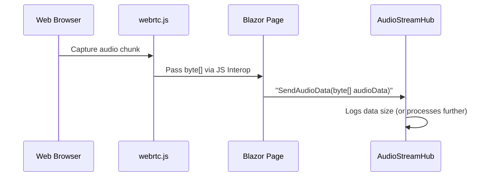

# Chapter 5: AudioStreamHub

In the [previous chapter](04_webrtc_js_.md), we explored how to capture and process audio directly in the browser using webrtc.js. Now it’s time to see how that audio gets handled on the server side with the help of SignalR and our “sound booth operator” — the AudioStreamHub.

---

## Why Do We Need AudioStreamHub?

Think of a **sound booth operator** at a live concert. People on stage sing into microphones, and the operator receives all that audio. Sometimes they’ll just monitor it, other times they’ll broadcast it to speakers or record it. Similarly, **AudioStreamHub**:

• Listens for incoming audio from clients (via SignalR).  
• Logs or relays that audio to the next part of your app.  
• Prepares for more advanced audio routing (like sending multiple streams to different listeners or mixing audio channels).

Currently, our AudioStreamHub only logs the fact that audio arrived. But the framework is set up so you can grow it into something larger — for instance, orchestrating a multi-user voice chat or layering in real-time AI processing.

---

## Key Concepts

1. **SignalR Hub**  
   - SignalR allows real-time communication between clients (browsers) and the server.  
   - The AudioStreamHub extends `Hub`, giving us methods that clients can call (like `SendAudioData`) to push audio up to the server.

2. **Lightweight Design**  
   - Out of the box, AudioStreamHub doesn’t transform or store audio. It simply logs the size of incoming data.  
   - This makes it a minimal foundation: you can easily add steps later (like saving audio to disk or forwarding it to an [Akka Service](06_akka_service_.md)).

3. **One-to-Many Potential**  
   - Hubs can broadcast messages to all connected clients, or a subset of them.  
   - If you want each new audio snippet to be heard by multiple listeners, you could add a method like `BroadcastAudioData` to forward the audio in real time.

---

## How to Use AudioStreamHub

Imagine you have a simple scenario:  
• A user’s browser captures audio (via [webrtc.js](04_webrtc_js_.md)) and wants to send it to the server.  
• The server logs the data size.  
• (Optionally) The server might pass it to an AI or store it.

### 1) Mapping the Hub in Program.cs

In your `Program.cs` (discussed in [Chapter 1](01_blazor_startup___main_program_.md)), you map a route for the hub:

```csharp
app.MapHub<AudioStreamHub>("/audiostream");
app.Run();
```

- When a client calls `/audiostream`, it’s talking to `AudioStreamHub`.  
- Real-time communication is now possible on that endpoint.

### 2) The Hub’s Minimal Implementation

Below is the simplified code for `AudioStreamHub`:

```csharp
using Microsoft.AspNetCore.SignalR;

public class AudioStreamHub : Hub
{
    public async Task SendAudioData(byte[] audioData)
    {
        Console.WriteLine($"Received audio data of size: {audioData.Length} bytes");
    }
}
```

Explanation:  
• `SendAudioData` is a method clients can call from JavaScript or C#.  
• For now, it just uses `Console.WriteLine` to show how big the audio chunk was.  
• If something fails, you could log errors or handle them differently (e.g., store to a database).

### 3) Calling the Hub from the Client

Below is a minimal client-side C# snippet (for example, in a Blazor component):

```csharp
@inject NavigationManager NavManager
@inject IHubContext<AudioStreamHub> HubContext

@code {
    private async Task SendAudio(byte[] audioBytes)
    {
        await HubContext.Clients.All.SendAsync("SendAudioData", audioBytes);
    }
}
```

Explanation:  
• `IHubContext<AudioStreamHub>` allows server-side code to call the hub.  
• You could call this method whenever you receive audio via your JS interop.  
• The hub logs the data size or forwards it if you extend its functionality.

---

## Under the Hood (Sequence Diagram)

Below is a simplified view of how audio travels from a user’s mic all the way to AudioStreamHub:



1. The **Browser** (via [webrtc.js](04_webrtc_js_.md)) captures a chunk of audio.  
2. **JS** sends it to Blazor using `DotNet.invokeMethodAsync` (or a `[JSInvokable]` call).  
3. **Blazor** calls the **AudioStreamHub** (SignalR) with that byte array.  
4. **AudioStreamHub** logs the size and can do more with it if needed.

---

## Internal Implementation Details

A small piece of the puzzle is how the hub is recognized by the server and the client:

1. **Startup**: As soon as `app.MapHub<AudioStreamHub>("/audiostream")` runs, the server knows that any SignalR calls to "/audiostream" should route to `AudioStreamHub`.  
2. **Connection**: A JavaScript or Blazor client typically initializes a SignalR `HubConnection` pointing to `"/audiostream"`.  
3. **Method Calls**: When the client calls `SendAudioData`, SignalR invokes that method on the server.  
4. **Logging & Expansion**: You can add authentication checks, broadcast to other clients, or store data in a database. The internal code could become more advanced (like sending the audio to [Akka Service](06_akka_service_.md)).

### Example Hub Expansion

Below is a small snippet that demonstrates how you might broadcast the audio to all clients for real-time playback:

```csharp
public class AudioStreamHub : Hub
{
    public async Task SendAudioData(byte[] audioData)
    {
        await Clients.Others.SendAsync("ReceiveAudioData", audioData);
        Console.WriteLine($"Broadcast audio - size: {audioData.Length} bytes");
    }
}
```

- Instead of just logging, this method calls `Clients.Others.SendAsync(...)`, sending the same audio to all connected clients (except the sender).  
- On the client side, you'd handle a `"ReceiveAudioData"` callback to play that audio.

---

## Conclusion

AudioStreamHub is the “sound booth operator” in BlazorVoice. It gives your app a central point to receive audio from the browser (or multiple browsers) via SignalR. Right now, it’s quite simple — just logs the data size. But it’s designed to grow as your audio needs become more complex, whether you’re directing audio to multiple listeners or incorporating real-time AI mixing.

Next, we’ll explore how [Akka Service](06_akka_service_.md) can step in behind the scenes to coordinate data flows (or even advanced AI tasks) using actor-based patterns.

[Next Chapter: Akka Service](06_akka_service_.md)

---

Generated by [AI Codebase Knowledge Builder](https://github.com/The-Pocket/Tutorial-Codebase-Knowledge)