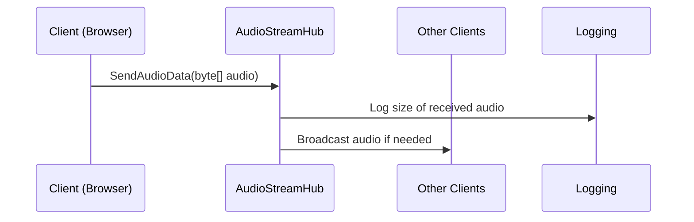

# Chapter 5: AudioStreamHub (SignalR)

In the [webrtc.js](04_webrtc_js_.md) chapter, we explored how to capture audio and video in the browser. But how do we share that captured audio data so other users or backend components can hear it? That’s where the “AudioStreamHub (SignalR)” comes in. It’s like a central “dispatcher” for sending and receiving audio streams in real time, letting people communicate live—just like walkie-talkies in a group conversation!

---

## Why AudioStreamHub?

Picture this scenario: You have a live voice chat feature, and multiple people (or an AI co-host) need to hear (or process) any audio that’s sent from a user. The AudioStreamHub acts like a control tower:

• When someone sends a voice snippet, the tower receives it.  
• The tower logs that snippet.  
• The tower can forward (broadcast) it to others who want to listen.

This setup is crucial for multi-user voice chats or real-time AI audio processing.  

---

## Key Concepts

1. **Real-Time Broadcasting**  
   - AudioStreamHub can receive audio data from any client and share it in real time.  
   - Perfect for group conversations or voice chats where everyone hears each other.

2. **The “Hub” and Connected Clients**  
   - The “Hub” is a SignalR concept that helps manage connections between the server and multiple clients.  
   - Each user “latches on” to the hub, like a channel in a walkie-talkie system.  

3. **Sending Audio as Bytes**  
   - Audio data typically travels in byte arrays.  
   - The hub knows how to accept these and do something with them (log, broadcast, etc.).

4. **Logging**  
   - For troubleshooting or analytics, the hub logs whenever it receives data.  
   - This helps you see if audio is actually flowing.

---

## Using the AudioStreamHub

Let’s say you have audio data you want to send when you finish recording on the client side. Using a SignalR client in Blazor, you can do something like:

```csharp
private async Task SendAudioToHub(byte[] audioBytes)
{
    // 'hubConnection' is your SignalR connection
    await hubConnection.SendAsync("SendAudioData", audioBytes);
}
```

Explanation:  
1. “hubConnection” refers to a SignalR connection object you set up elsewhere.  
2. “SendAudioData” is the name of the server method in our hub.  

---

### Hub Code (Server Side)

On the server, our “AudioStreamHub” in the “Services” folder might look like this (simplified to under 10 lines):

```csharp
public class AudioStreamHub : Hub
{
    public async Task SendAudioData(byte[] audioData)
    {
        Console.WriteLine($"Received audio data: {audioData.Length} bytes");
        // ... broadcast or process
    }
}
```

Explanation:  
1. Inherits from “Hub,” a SignalR class.  
2. “SendAudioData” is the method that receives the audio bytes from clients.  
3. It logs how many bytes were received.  
4. You can broadcast the audio to other connected clients or pass it to another service for AI processing.

---

## Under the Hood: Step by Step

When a user on the browser sends audio data to the hub, here’s a simple flow:



1. Client captures and sends audio data to AudioStreamHub.  
2. The hub logs the data size.  
3. The hub (optionally) broadcasts the audio to other connected clients.

---

## Deeper Look at the Internal Implementation

Inside the file “Services/AudioStreamHub.cs,” the code might contain extra logic, such as:

```csharp
public class AudioStreamHub : Hub
{
    public async Task SendAudioData(byte[] audioData)
    {
        // Logging
        Console.WriteLine($"Received audio data of size: {audioData.Length} bytes");

        // Example: Potential broadcast
        await Clients.Others.SendAsync("ReceiveAudioData", audioData);
    }
}
```

Explanation:  
- “Clients.Others.SendAsync(...)” broadcasts the byte array to everyone except the sender.  
- “ReceiveAudioData” would be a method name that your client can handle, popping up a “Play” button or automatically streaming it.  

Remember, the logic after receiving audio is up to you—maybe you store it in a database, or pass it to an AI service for transcription, or simply forward it to other users.

---

## Conclusion and Next Steps

By linking your captured audio from [webrtc.js](04_webrtc_js_.md) to the AudioStreamHub, you have a powerful, real-time voice pipeline. The AudioStreamHub logs incoming data and can immediately pass it along to others, forming the backbone of a multi-user voice chat or audio processing system.

In the next chapter, we’ll explore how [AkkaService](06_akkaservice_.md) ties in with this pipeline for advanced actor-based messaging and orchestration. Let’s head there to see how your audio interactions can become even more robust!

---

Generated by [AI Codebase Knowledge Builder](https://github.com/The-Pocket/Tutorial-Codebase-Knowledge)