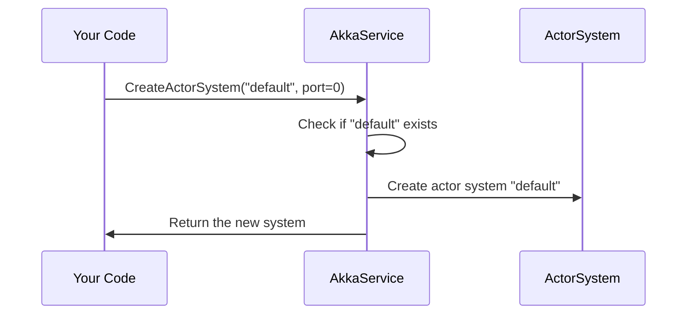

# Chapter 6: Akka Service

In the [previous chapter](05_audiostreamhub_.md), we saw how AudioStreamHub handles audio data in real-time with SignalR. Now, let’s meet the “director” of our entire actor-based system: **Akka Service**. Just like a theater director oversees different stages and actors, **AkkaService** manages multiple “ActorSystems” under one roof. It ensures you never accidentally create two stages with the same name, and it keeps track of the actors performing on each stage.

---

## Why Do We Need an “Akka Service”?

Imagine you have different theaters or “ActorSystems” where actors can do specialized work:
• One actor system might handle chat interactions (like [VoiceChatActor](07_voicechatactor_.md)).  
• Another could handle AI queries.  
• Others might be remote, running on separate machines in a distributed setup.

We need a single manager that:
1. Creates each actor system if it doesn’t already exist.  
2. Prevents duplicate systems from popping up with the same name.  
3. Keeps references to individual actors so we can look them up easily from anywhere.  

This is crucial if you plan to have many different “shows” running at the same time — for instance, voice chats, AI expansions, or even separate features sharing the same codebase.

---

## Key Concepts

1. **ActorSystem**  
   - A “stage” where one or more actors perform tasks. Think of it as a self-contained environment with its own rules and runtime.  
   - You can have multiple ActorSystems, each possibly on a different port or even on a different machine.

2. **Actor Reference Tracking**  
   - Once an actor is created, you store it in a dictionary by name.  
   - You can ask AkkaService for that actor reference later, so you don’t have to recreate the same actor each time you need it.

3. **Singleton Service**  
   - AkkaService is typically registered in Blazor’s dependency injection as a “singleton.” That means only one AkkaService instance exists for the entire application.  
   - This ensures we only create each ActorSystem once.

4. **Local and Remote**  
   - By default, you might create an ActorSystem without special network settings (local).  
   - You can optionally specify a port, enabling remote capabilities. This is perfect for scaling across servers.

---

## How to Use AkkaService

The simplest way to use AkkaService is:
1. Inject it into your code (like in [Program.cs](01_blazor_startup___main_program_.md)).  
2. Create an ActorSystem with a unique name.  
3. Add (and retrieve) actors from it whenever you need.

Example scenario: “I want a single ActorSystem named ‘default,’ and I’ll place my [VoiceChatActor](07_voicechatactor_.md) inside it.”

### Step-by-Step Usage

1) In [Program.cs](01_blazor_startup___main_program_.md):  
   - Register AkkaService as a singleton.  
   - Build the app and retrieve AkkaService to create a default ActorSystem.

   ```csharp
   // In Program.cs (simplified)
   builder.Services.AddSingleton<AkkaService>();
   
   var app = builder.Build();
   var akkaService = app.Services.GetRequiredService<AkkaService>();
   akkaService.CreateActorSystem("default");
   app.Run();
   ```
   Explanation:  
   - We say, “Hey builder, keep one instance of AkkaService around for the entire app.”  
   - After building, we grab that instance (`akkaService`) and tell it: “Create an ActorSystem called ‘default.’”

2) In your Blazor Page or elsewhere:  
   - Ask AkkaService for the default ActorSystem.  
   - Create or fetch the actor reference you need (e.g., the [VoiceChatActor](07_voicechatactor_.md)).  

   ```csharp
   // Some Blazor component code
   [Inject] private AkkaService AkkaService { get; set; }

   protected override void OnInitialized()
   {
       var system = AkkaService.GetActorSystem("default");
       // Use 'system' to create or retrieve your actor...
   }
   ```
   Explanation:  
   - You inject AkkaService into your component.  
   - `GetActorSystem("default")` returns the ActorSystem named “default” if it exists (or creates it if needed).

---

## Under the Hood (What Happens When You “CreateActorSystem”?)

Here’s a minimal sequence diagram illustrating how AkkaService coordinates:



1. Your code requests a system named “default.”  
2. AkkaService checks an internal dictionary to see if it’s already created.  
3. If not, it spins up a new ActorSystem.  
4. It stores that reference in the dictionary and returns it.

---

## Internal Implementation Details

Let’s peek inside `AkkaService.cs`. The entire file is a bit long, so we’ll break it into small pieces (below 10 lines each) and explain them.

### 1) Dictionary of ActorSystems

```csharp
private Dictionary<string, ActorSystem> actorSystems 
    = new Dictionary<string, ActorSystem>();

private Dictionary<string, IActorRef> actors 
    = new Dictionary<string, IActorRef>();
```
Explanation:  
- `actorSystems` keeps track of all the named stages (ActorSystems).  
- `actors` keeps track of specific named actors so we can find them quickly.

---

### 2) CreateActorSystem Method

```csharp
public ActorSystem CreateActorSystem(string name, int port = 0)
{
    if (!actorSystems.ContainsKey(name))
    {
        return CreateSystemForPort(name, port);
    }
    else
    {
        throw new Exception($"{name} actorsystem has already been created.");
    }
}
```
Explanation:  
- Checks if we already have a system with that name.  
- If not, calls `CreateSystemForPort` (shown next).  
- If yes, we throw an exception because we don’t want duplicates.

---

### 3) CreateSystemForPort Helper

```csharp
private ActorSystem CreateSystemForPort(string name, int port)
{
    if (port == 0)
    {
        return CreateLocalSystem(name);
    }
    else
    {
        return CreateRemoteSystem(name, port);
    }
}
```
Explanation:  
- If `port == 0`, it’s a local system. Otherwise, it’s a remote system with special configuration.

---

### 4) CreateLocalSystem

```csharp
private ActorSystem CreateLocalSystem(string systemName)
{
    var system = ActorSystem.Create(systemName);
    actorSystems[systemName] = system;
    system.Log.Info($"ActorSystem Started [{systemName}]");
    return system;
}
```
Explanation:  
- Creates a simple `ActorSystem` using default configuration.  
- Saves it in `actorSystems` and logs a message.

---

### 5) CreateRemoteSystem

```csharp
private ActorSystem CreateRemoteSystem(string systemName, int port)
{
    // (Simplified remote config)
    string configString = $@"
    akka {{
       actor {{
         provider = remote
       }}
       remote.dot-netty.tcp {{
         port = {port}
         hostname = ""127.0.0.1""
       }}
    }}";

    var config = ConfigurationFactory.ParseString(configString);
    var system = ActorSystem.Create(systemName, config);
    actorSystems[systemName] = system;
    system.Log.Info($"Remote ActorSystem Started [{systemName}] on port {port}");
    return system;
}
```
Explanation:  
- Builds a small Akka.NET configuration string enabling remote capabilities on the given port.  
- Creates an ActorSystem with that config and logs a message.  
- Perfect for distributing your application across servers.

---

### 6) Adding and Retrieving Actors

```csharp
public void AddActor(string name, IActorRef actor)
{
    if (!actors.ContainsKey(name))
    {
        actors[name] = actor;
    }
}

public IActorRef GetActor(string name)
{
    return actors.ContainsKey(name) ? actors[name] : null;
}
```
Explanation:  
- `AddActor` stores an actor under a unique string name.  
- `GetActor` returns that actor, or null if not found.  
- Great for quickly grabbing a reference like “voiceChatActor” from anywhere in your code.

---

## Conclusion

You’ve now met **AkkaService**, the “director” that creates and coordinates multiple ActorSystems while also managing your key actors in a straightforward dictionary. This is especially handy when your application grows beyond a single stage — you can have local or remote actor systems, all orchestrated by one central manager.

In the next chapter, we’ll look at a specific actor, [VoiceChatActor](07_voicechatactor_.md), which uses these ActorSystems to handle speech-related tasks. Let’s see how an individual “actor” performs its role on stage!

[Next Chapter: VoiceChatActor](07_voicechatactor_.md)

---

Generated by [AI Codebase Knowledge Builder](https://github.com/The-Pocket/Tutorial-Codebase-Knowledge)