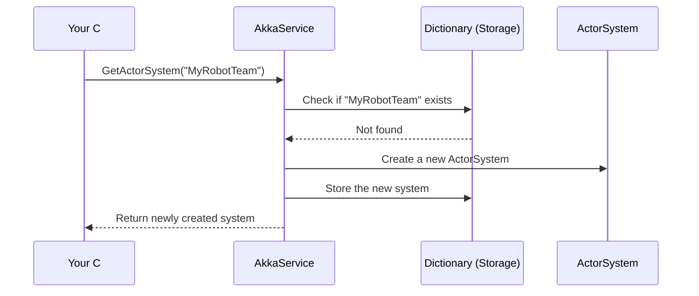

# Chapter 6: AkkaService

In the [AudioStreamHub (SignalR)](05_audiostreamhub__signalr__.md) chapter, we saw how audio data flows in real time between users. Now let’s discover how BlazorVoice organizes and manages all the “brainy” parts behind the scenes. Introducing the AkkaService—a “control center” that creates, stores, and dispatches multiple specialized worker groups (actor systems). Think of it as a futuristic robotics factory that can spin up new robot teams whenever you have a new big task!

---

## Why We Need a “Robot Factory”

Imagine you’re running a big robotics competition. Some robots do heavy lifting, others do precision tasks, and others perform choreography. You need:
• A factory to assemble new teams of specialized robots (actor systems).  
• A place to store all the instructions about which robot does what (actors).  
• A consistent way to retrieve an existing team if it’s already built (so you don’t have to build it again).  

That’s exactly what AkkaService does for BlazorVoice. Each “robot team” is called an “ActorSystem,” inside which individual “actors” perform all sorts of tasks, like voice processing or AI conversation.

---

## Key Concepts

### 1. Actor Systems  
• Think of an ActorSystem as an entire robotics team with its own workspace.  
• Each team can operate independently without interfering with other teams.  

### 2. Actors  
• Inside each team, you have multiple specialized “actors,” each doing a specific job.  
• For instance, you might have a [VoiceChatActor](07_voicechatactor_.md) that handles real-time chat tasks.  

### 3. Creating or Reusing Teams  
• You can ask the AkkaService to create a new ActorSystem (a new robot team).  
• Or if a suitable one already exists, it simply gives you the existing team.  

### 4. Optional Remote Configuration  
• Sometimes you need a remote-enabled ActorSystem (like sending tasks to external machines).  
• AkkaService can add network configurations if you tell it a port number.  

---

## Using AkkaService

Below is a super-simple way to create (or retrieve) an ActorSystem using the AkkaService. This code might appear in your Blazor component’s @code block:

```csharp
@inject BlazorVoice.Akka.AkkaService MyAkkaService

<button @onclick="SetupActors">Create My System</button>

@code {
    private void SetupActors()
    {
        var system = MyAkkaService.GetActorSystem("MyRobotTeam");
        // system is now ready to host actors
    }
}
```

Explanation:  
• We inject AkkaService as “MyAkkaService.”  
• `GetActorSystem("MyRobotTeam")` either creates or returns an existing system named “MyRobotTeam.”  

---

### Adding an Actor to Your Newly Created Team

Once you have your actor system, you can spawn an actor for a specific task. For example:

```csharp
@code {
    private void CreateMyActor()
    {
        var system = MyAkkaService.GetActorSystem("MyRobotTeam");
        var myActor = system.ActorOf(Props.Create<VoiceChatActor>(), "VoiceActor1");
    }
}
```

Explanation:  
• `system.ActorOf(...)` creates a new actor named “VoiceActor1” inside “MyRobotTeam.”  
• [VoiceChatActor](07_voicechatactor_.md) is a specialized actor we’ll learn more about soon.  

---

## What Happens Under the Hood?

Here’s a small sequence diagram showing how AkkaService responds when you request an ActorSystem:



1. Your code asks AkkaService for an ActorSystem called “MyRobotTeam.”  
2. AkkaService looks in its dictionary to see if it already has that name.  
3. If not found, it creates a new ActorSystem.  
4. It then adds the new system to the dictionary.  
5. Finally, it returns the system to your code.

---

## Under the Hood: Internal Implementation

The core logic for creating and storing these “robot teams” lives in “Akka\AkkaService.cs.” Let’s break down a few simplified pieces.

### 1. Storage Dictionaries

```csharp
private Dictionary<string, ActorSystem> actorSystems = new Dictionary<string, ActorSystem>();
private Dictionary<string, IActorRef> actors = new Dictionary<string, IActorRef>();
```

Explanation:  
• `actorSystems` holds references to each ActorSystem by name.  
• `actors` holds references to individual actors you might want to reuse from anywhere.

### 2. Creating a New ActorSystem

```csharp
public ActorSystem CreateActorSystem(string name, int port = 0)
{
    if (!actorSystems.ContainsKey(name))
    {
        // If port is 0, create a local system
        actorSystems[name] = ActorSystem.Create(name);
    }
    else
    {
        throw new Exception($"{name} actorsystem has already been created.");
    }

    return actorSystems[name];
}
```

Explanation:  
• If the system name isn’t in `actorSystems`, we create it.  
• If it already exists, we throw an exception (so we don’t accidentally build a duplicate).  

### 3. Retrieving or Creating

```csharp
public ActorSystem GetActorSystem(string name = "default")
{
    if (!actorSystems.ContainsKey(name))
    {
        return CreateActorSystem(name);
    }
    return actorSystems[name];
}
```

Explanation:  
• Checks if the given name is missing.  
• If missing, calls `CreateActorSystem(...)`.  
• Otherwise, returns the existing system.  

---

## Summary and What’s Next

AkkaService is your behind-the-scenes “robot factory,” making sure each new ActorSystem (team) is created only once and reused as needed. This keeps your app organized and efficient—even if you have many specialized tasks.

Up next in [VoiceChatActor](07_voicechatactor_.md), we’ll see how an actor inside an ActorSystem can handle real-time voice interactions. This is where the “robots” put their gears in motion!

Don’t miss it—let’s see those actors at work!

---

Generated by [AI Codebase Knowledge Builder](https://github.com/The-Pocket/Tutorial-Codebase-Knowledge)