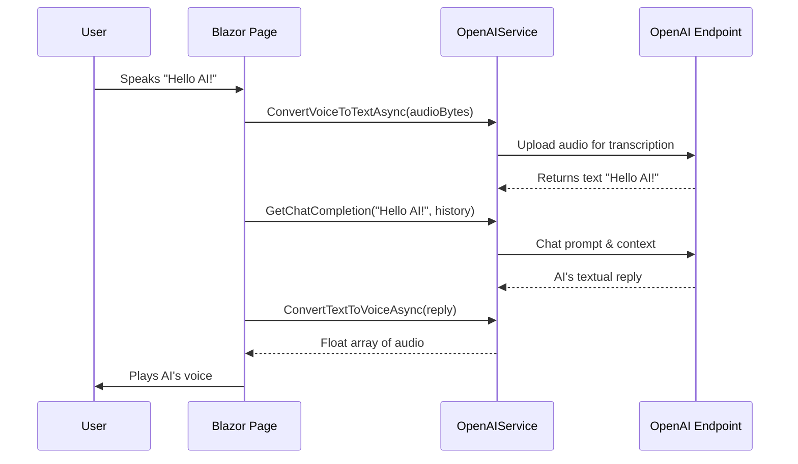

# Chapter 8: OpenAIService

In the [previous chapter](07_voicechatactor_.md), we introduced the VoiceChatActor — our “stage performer” that speaks AI-generated lines and maintains conversation flow. But how exactly does that performer get its lines? That’s where OpenAIService steps in.

Imagine OpenAIService as your backstage translator and narrator: 
• It takes your text, queries OpenAI (or other language models), and returns a suitable reply.  
• It can convert text to speech (so the VoiceChatActor can “talk”) and turn speech back to text (so we can understand microphones).

Below, we’ll explore how this service works, from the basic use case to its internal design.

---

## Why Do We Need OpenAIService?

Let’s imagine a concrete scenario:  
• A user wants to ask an AI a question (“How’s the weather tomorrow?”).  
• The user says this out loud (speech).  
• Our app records and sends the speech data to OpenAIService. The service transcribes it to text (“How’s the weather tomorrow?”).  
• We pass the text to OpenAI’s chatbot to get an answer.  
• OpenAIService then takes the chatbot’s reply and generates TTS audio, which the VoiceChatActor plays out loud.

All these transformations (speech → text → AI reply → speech) happen behind the scenes, smoothly integrated thanks to OpenAIService.

---

## Key Concepts

1. **Chat Completions (ChatGPT / GPT-4)  
   - OpenAIService can send text prompts to GPT APIs.  
   - It returns the AI’s textual reply.

2. **Speech-to-Text (STT)**  
   - The service can call OpenAI’s Whisper (or similar) to transcribe audio bytes into text.  
   - This is essential if you want to capture a user’s spoken question.

3. **Text-to-Speech (TTS)**  
   - Given some text (like the AI’s answer), OpenAIService can call a TTS endpoint to produce audio data.  
   - This data is returned as a float array that can be played by the browser.

4. **Audio Transformations with NAudio**  
   - OpenAIService uses NAudio libraries under the hood to handle MP3-to-PCM conversions  
   - This means the raw TTS audio is turned into a format that can seamlessly play in the browser.

---

## How to Use OpenAIService

At a high level:  
1. Create an instance of OpenAIService (usually dependency-injected).  
2. Call “GetChatCompletion” to get AI responses.  
3. Call “ConvertTextToVoiceAsync” to turn text into playable audio.  
4. Call “ConvertVoiceToTextAsync” to transcribe incoming user audio.

Below are quick examples of how you might use this in a Blazor component:

```csharp
@code {
    [Inject] OpenAIService AIService { get; set; }

    private async Task AskAI(string question)
    {
        string answer = await AIService.GetChatCompletion(question, new List<string>());
        Console.WriteLine($"AI said: {answer}");
    }
}
```
Explanation:
• We inject `OpenAIService` as `AIService`.  
• `AskAI` calls `GetChatCompletion` with a user’s question, logs the answer.

---

For TTS, you might do:

```csharp
private async Task Speak(string text)
{
    var audioFloats = await AIService.ConvertTextToVoiceAsync(text, "echo");
    // Send these audio floats to your JS for playback
}
```
Explanation:
• `ConvertTextToVoiceAsync` returns a float array for the audio.  
• You pass that audio data to your Blazor + JavaScript code to play it (similar to [webrtc.js](04_webrtc_js_.md)).

---

For STT, you could have:

```csharp
private async Task<string> Transcribe(byte[] audioBytes)
{
    string recognizedText = await AIService.ConvertVoiceToTextAsync(audioBytes);
    return recognizedText;
}
```
Explanation:
• Given recorded audio (`audioBytes`), we call `ConvertVoiceToTextAsync` to get text.  

---

## Under the Hood (Step-by-Step)

Here’s a simple sequence to demonstrate how OpenAIService might handle a user saying “Hello AI!”:



1. **User** talks; **Blazor** records the audio.  
2. **Blazor** calls `ConvertVoiceToTextAsync` on **OpenAIService**, which uploads the audio to **GPT** for transcription.  
3. **OpenAIService** returns the recognized text to **Blazor**.  
4. **Blazor** sends that text to `GetChatCompletion` for an AI textual answer.  
5. **OpenAIService** calls **GPT** again, gets a reply.  
6. **Blazor** calls `ConvertTextToVoiceAsync` with that reply.  
7. The service returns audio data so **Blazor** can play it.

---

## Internal Implementation Overview

In the file “Services/OpenAIService.cs,” you’ll see:

### 1) API Key Setup & Clients

```csharp
public OpenAIService()
{
    string apiKey = Environment.GetEnvironmentVariable("OPENAI_API_KEY");
    // ... checks & throws if missing
    _client = new ChatClient(model: "gpt-4o", apiKey: apiKey);
    _httpClient = new HttpClient
    {
        BaseAddress = new Uri("https://api.openai.com/v1/")
    };
    _httpClient.DefaultRequestHeaders.Authorization 
        = new AuthenticationHeaderValue("Bearer", apiKey);
}
```
Explanation:
• We read an environment variable to get the OpenAI API key.  
• We create a `ChatClient` (for GPT-based text).  
• We create a `HttpClient` for other endpoints (like TTS, STT).

---

### 2) Getting Chat Completion

```csharp
public async Task<string> GetChatCompletion(string message, List<string> assist)
{
    var completionResult = await _client.CompleteChatAsync(new ChatMessage[]
    {
        ChatMessage.CreateUserMessage(message),
        ChatMessage.CreateAssistantMessage(string.Join("\n", assist))
    });
    return completionResult.Value.Content.FirstOrDefault()?.Text ?? string.Empty;
}
```
Explanation:
• We pass the user’s message and a “context” list (assist).  
• The GPT-based “CompleteChatAsync” returns text. We extract and return it.

---

### 3) Text-to-Speech

```csharp
public async Task<float[]> ConvertTextToVoiceAsync(string text, string voice = "alloy")
{
    // 1) Construct body with text & voice
    // 2) Make POST request
    // 3) Convert MP3 response to float[]
    // 4) Return float array
}
```
Explanation:
• In the actual code, an HTTP POST is made to a TTS endpoint.  
• The response is MP3 data, which we convert to raw samples using NAudio.  
• The float array is easy to play in a Blazor app.

---

### 4) Speech-to-Text

```csharp
public async Task<string> ConvertVoiceToTextAsync(byte[] audioBytes, string fileName = "audio.wav")
{
    // 1) Build MultipartFormDataContent with audio
    // 2) Send POST to OpenAI's Whisper endpoint
    // 3) Extract "text" from JSON response
    // 4) Return transcribed text
}
```
Explanation:
• We create a multipart form upload with the audio data.  
• The service responds with the recognized text in JSON.

---

## Conclusion

By giving us safe, easy-to-use methods for text-to-speech, speech-to-text, and chat completions, OpenAIService acts like the backstage translator and narrator for our BlazorVoice application. The combined result is a seamless user experience: talk to the app, it transcribes your words, consults GPT, and speaks back in a natural voice.

This marks the end of our journey through the core components of BlazorVoice. We’ve gone from the initial app setup all the way to advanced AI-driven voice interaction. We hope these tutorials help you bring powerful, real-time voice experiences to your Blazor projects!

---

Generated by [AI Codebase Knowledge Builder](https://github.com/The-Pocket/Tutorial-Codebase-Knowledge)