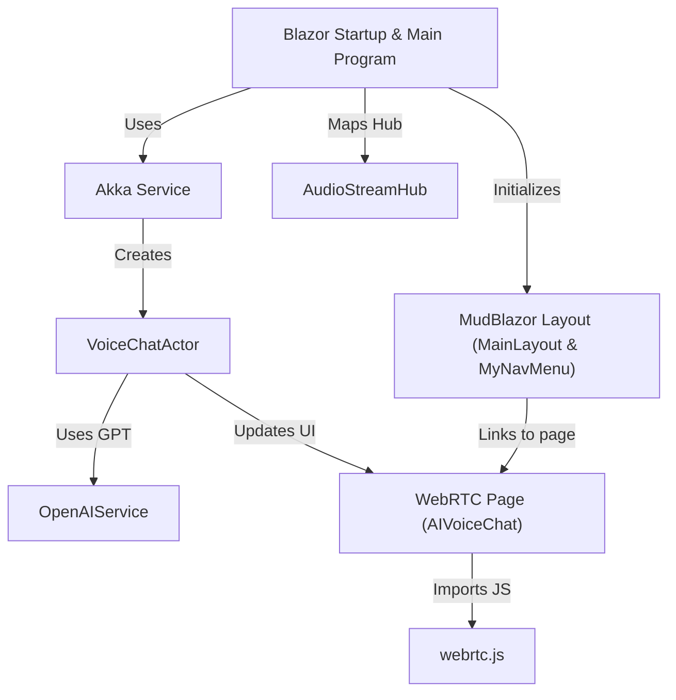

# Tutorial: BlazorVoice

**BlazorVoice** is a *real-time voice chatbot* application that blends Blazor server, WebRTC audio streaming,
and **Akka.NET actors**. The **OpenAIService** provides GPT-based text and speech generation, enabling users
to have interactive voice conversations with the AI. The app uses *MudBlazor* to maintain a clean UI layout,
while **webrtc.js** animates a fun AI face and handles browser audio logic.

**Source Repository:** [None](None)

## Chapters

1. [Blazor Startup & Main Program
](01_blazor_startup___main_program_.md)
2. [MudBlazor Layout (MainLayout & MyNavMenu)
](02_mudblazor_layout__mainlayout___mynavmenu__.md)
3. [WebRTC Page (AIVoiceChat)
](03_webrtc_page__aivoicechat__.md)
4. [webrtc.js
](04_webrtc_js_.md)
5. [AudioStreamHub
](05_audiostreamhub_.md)
6. [Akka Service
](06_akka_service_.md)
7. [VoiceChatActor
](07_voicechatactor_.md)
8. [OpenAIService
](08_openaiservice_.md)

---

Generated by [AI Codebase Knowledge Builder](https://github.com/The-Pocket/Tutorial-Codebase-Knowledge)