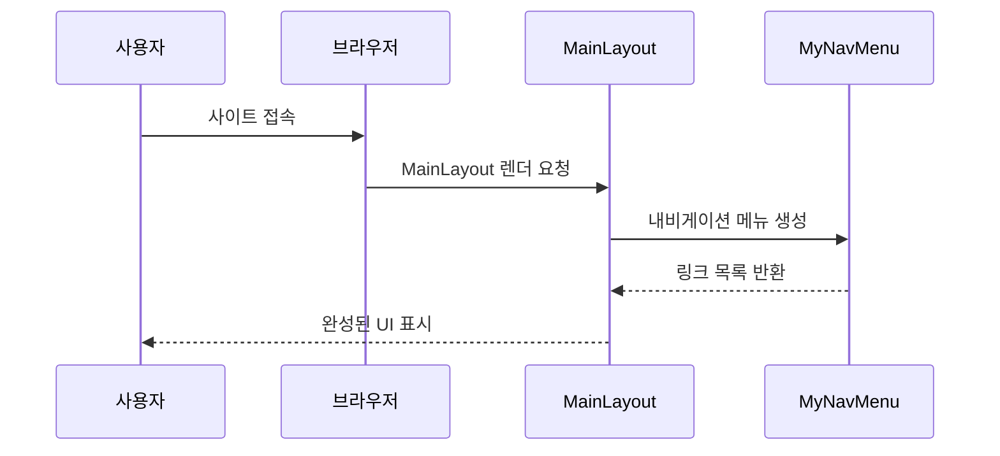

# Chapter 1: 전체 레이아웃과 내비게이션 구조

이 장에서는 BlazorVoice 프로젝트에서 가장 기본적인 레이아웃을 구성하고, 사용자가 페이지 간 내비게이션을 쉽게 할 수 있도록 돕는 방법을 알아봅니다. 처음 시작할 때 전체 화면의 구조가 어떠해야 하는지를 잘 잡아두면, 이후 다양한 페이지를 추가하거나 스타일을 변경할 때 훨씬 수월해집니다.

---
## 왜 전체 레이아웃과 내비게이션이 중요한가?
예를 들어, 블로그나 웹 애플리케이션을 만들 때 상단 바(MenuBar)와 사이드바, 그리고 메인 콘텐츠 영역이 따로 흩어져 있으면 각 화면마다 일일이 추가하기 번거롭습니다. 이 문제를 효율적으로 해결하기 위해 공통 레이아웃을 중앙에서 관리하고, 내비게이션 링크들을 한곳에 모아두어 재사용하려고 합니다. 이렇게 하면:
- 상단 메뉴나 로고같이 모든 페이지에 공통으로 들어가는 부분을 한 번에 관리할 수 있습니다.
- 사용자는 한눈에 내비게이션 메뉴를 보고, 다른 페이지로 쉽게 이동할 수 있습니다.

MudBlazor 라이브러리를 사용하면 이러한 레이아웃을 간편하게 구성할 수 있고, 내비게이션 구조를 깔끔하게 만들 수 있습니다.

---
## 핵심 개념 살펴보기

### 1) MainLayout
- 전체 페이지의 기본 골격을 잡아주는 컴포넌트입니다.
- 상단바(AppBar), 사이드바(Drawer), 메인 콘텐츠(Body) 영역을 정의합니다.
- MudBlazor의 다양한 Provider(Theme, Popover, Dialog, Snackbar)를 통해 유용한 UI 기능을 전역으로 활성화합니다.

### 2) MyNavMenu
- 실제 내비게이션 메뉴를 보여주는 컴포넌트입니다.
- 여러 페이지로 이동할 수 있는 링크들을 그룹으로 모아둡니다.
- 상단바나 사이드바 등 원하는 위치에 배치하여 사용자가 쉽게 접근할 수 있도록 합니다.

---
## 간단 예제: MainLayout.razor

아래 코드는 MainLayout.razor를 간단하게 나눈 예시입니다. 레이아웃 컴포넌트에 필요한 MudBlazor Provider들을 등록하고, 상단바와 사이드바, 본문을 배치합니다.

### MainLayout (1/3)
```razor
@inherits LayoutComponentBase

@* MudBlazor의 테마, 팝업 등을 제공 *@
<MudThemeProvider />
<MudPopoverProvider />
<MudDialogProvider />
<MudSnackbarProvider />
```
위 코드는 MudBlazor에서 제공하는 Theme, Popover, Dialog, Snackbar 등의 기능을 전체로 확장합니다. 한 번만 선언해 두면, 다른 페이지에서도 쉽게 이 기능들을 사용할 수 있게 됩니다.

### MainLayout (2/3)
```razor
<MudLayout>
    <MudAppBar>
        <MudIconButton Icon="@Icons.Material.Filled.Menu"
                       Color="Color.Inherit"
                       Edge="Edge.Start"
                       OnClick="DrawerToggle" />
        My Application
    </MudAppBar>
    
    <MudDrawer @bind-Open="@_drawerOpen">
        <MyNavMenu />
    </MudDrawer>
```
- `<MudLayout>`: 상단바와 사이드바, 본문을 감싸는 컨테이너 역할을 합니다.  
- `<MudAppBar>`: 화면 상단에 표시되는 바(Bar) 컴포넌트입니다. 왼쪽의 햄버거 메뉴 아이콘을 누르면 사이드바 열림/닫힘이 토글됩니다.  
- `<MudDrawer>`: 사이드바를 담당하는 컴포넌트입니다. `@bind-Open="@_drawerOpen"` 으로 열리고 닫히는 상태를 데이터 바인딩합니다. 내부에는 `<MyNavMenu />`를 배치하여 사용자가 볼 내비게이션 메뉴가 나타납니다.

### MainLayout (3/3)
```razor
    <MudMainContent MaxWidth="MaxWidth.Medium">
        @Body
    </MudMainContent>
</MudLayout>

@code {
    private bool _drawerOpen = true;

    private void DrawerToggle(MouseEventArgs e)
    {
        _drawerOpen = !_drawerOpen;
    }
}
```
- `<MudMainContent>`: 본문 영역을 담당합니다. `@Body`는 자식 페이지들의 콘텐츠가 표시되는 자리입니다.  
- `_drawerOpen`: 사이드바의 열림/닫힘 상태를 보관하는 필드입니다. `DrawerToggle` 메서드가 호출되면 값을 반전시켜 사이드바를 열거나 닫습니다.

이렇게 MainLayout은 전반적인 화면 배치를 하고, 우리가 나중에 다른 페이지를 추가하더라도 상단바와 사이드바는 그대로 유지되어 공통된 UI를 지속적으로 제공해줍니다.

---
## 내비게이션 메뉴: MyNavMenu
내비게이션 메뉴는 실제로 사용자가 클릭할 수 있는 링크들의 묶음입니다. 예를 들어 Home(대시보드)로 가거나, WebRTC 기능이 있는 페이지로 가고 싶을 때 메뉴를 클릭합니다.

### MyNavMenu.razor (1/2)
```razor
<MudNavMenu>
    <MudNavLink Href="/" Match="NavLinkMatch.All">
        Dashboard
    </MudNavLink>
    
    <MudNavGroup Title="TechDemo" Expanded="true">
        <MudNavLink Href="/web-rtc" Match="NavLinkMatch.Prefix">
            Voice LLM
        </MudNavLink>        
    </MudNavGroup>
```
- `<MudNavLink Href="/">Dashboard</MudNavLink>`: 첫 번째 링크입니다. `/` 경로를 매칭해 홈화면(대시보드)로 이동합니다.  
- `<MudNavGroup Title="TechDemo">`: 링크들을 그룹화하여 제목을 붙일 수 있습니다.  
- `<MudNavLink Href="/web-rtc">Voice LLM</MudNavLink>`: WebRTC 관련 페이지로 이동하는 링크입니다.

### MyNavMenu.razor (2/2)
```razor
    <MudNavGroup Title="TEST-UI" Expanded="false">
        <MudNavLink Href="/counter" Match="NavLinkMatch.Prefix">
            Counter
        </MudNavLink>
        <MudNavLink Href="/weather" Match="NavLinkMatch.Prefix">
            Weather
        </MudNavLink>
    </MudNavGroup>
</MudNavMenu>
```
- 또 다른 그룹인 `TEST-UI` 아래에 Counter, Weather 예제 페이지로 갈 수 있는 링크가 배치됩니다.  
- `<MudNavGroup>`의 `Expanded="false"`로 설정하면 처음에는 접힌 상태로 표시됩니다.

이렇게 MyNavMenu는 단순히 링크만 나열하는 컴포넌트지만, 사이드바나 상단바에서 재활용되어 페이지 간 이동을 한 번에 처리해 줍니다.

---
## 내부 구현은 어떻게 동작할까?

전체 구조를 간단히 그림으로 표현하면 다음과 같습니다:



1. 사용자가 사이트에 접속하면, 브라우저가 MainLayout을 불러옵니다.  
2. MainLayout 내부에서는 MyNavMenu를 포함해 상단바와 사이드바, 본문 등을 렌더링합니다.  
3. MyNavMenu는 자신이 가진 여러 링크들을 반환해주고, 이를 통해 사이드바(Menu)가 구성됩니다.  
4. 마지막에 완성된 UI(상단바 + 사이드바 + 본문)가 사용자에게 표시됩니다.

---
## 더 살펴보기: 내부 코드 구조

- 전체 레이아웃(MainLayout)은 "Components/Layout/MainLayout.razor" 파일에 있습니다.  
- 내비게이션 컴포넌트(MyNavMenu)는 "Components/Layout/MyNavMenu.razor" 파일에 정의되어 있습니다.  
- MudBlazor에서 제공하는 `MudLayout`, `MudDrawer`, `MudAppBar` 같은 컴포넌트를 조합해 화면 전체를 구성하였습니다.  
- 내비게이션은 `<MudNavMenu>`와 `<MudNavLink>`, `<MudNavGroup>`을 통해 페이지별 링크와 그룹을 설정할 수 있습니다.

개발자는 이 구조를 마음대로 확장하여 더 많은 링크나 그룹, 또는 스타일을 적용할 수 있습니다.

---
## 마무리 및 다음 챕터

이 장에서는 전체 레이아웃을 어떻게 구성하고, 내비게이션 메뉴를 통해 페이지를 이동할 수 있도록 하는지 살펴보았습니다. MudBlazor 컴포넌트를 활용해 상단바, 사이드바, 본문 영역을 한 곳에서 관리하니, 웹 애플리케이션의 확장성과 유지보수성이 한결 좋아집니다.

다음 장에서는 [WebRTC 페이지](02_webrtc_페이지_.md)를 살펴봅니다. 이 페이지에서는 실시간 음성 처리 및 LLM 기능에 대한 웹 실험을 진행할 예정이니 계속 이어서 확인해 보세요!

---

Generated by [AI Codebase Knowledge Builder](https://github.com/The-Pocket/Tutorial-Codebase-Knowledge)