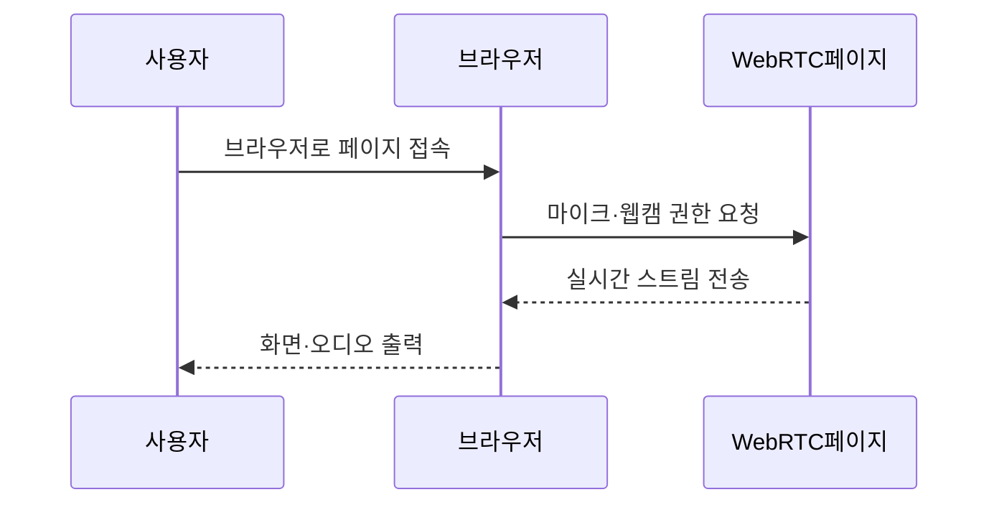
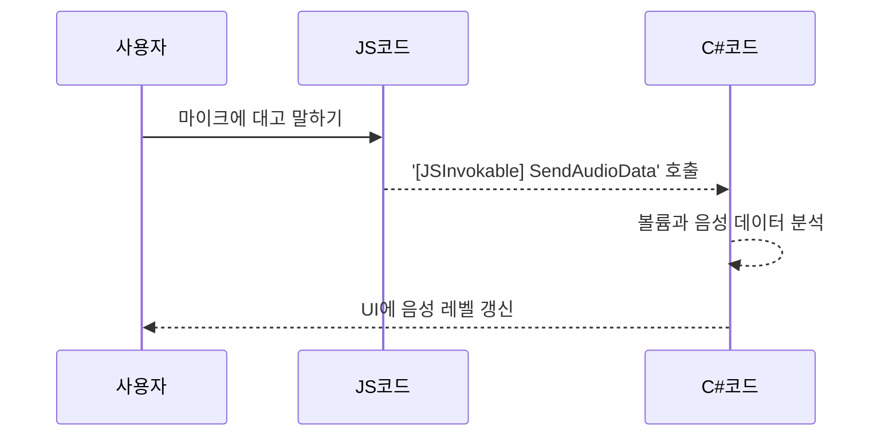

# Chapter 2: WebRTC 페이지

이 장에서는 [전체 레이아웃과 내비게이션 구조](01_전체_레이아웃과_내비게이션_구조_.md)에서 이어서, 실제로 웹캠과 마이크를 통해 오디오·비디오를 실시간으로 송수신해보는 WebRTC 페이지를 살펴보겠습니다. 이 페이지는 화상 채팅처럼 서로의 음성과 영상을 주고받고, 나아가 음성 인식이나 음성 합성 같은 작업도 가능하게끔 구성됩니다. 초보자 분들도 이 장을 통해 어떻게 Blazor와 JavaScript가 협력하여 웹에서 실시간 스트리밍을 할 수 있는지 쉽게 이해할 수 있을 것입니다.

---

## 왜 WebRTC 페이지가 필요할까?

예시로, 친구와 함께 웹에서 간단히 화상 전화를 하고 싶다고 해봅시다. 일반적으로 음성·영상 데이터를 전송하려면 여러 복잡한 단계를 거쳐야 합니다. WebRTC 페이지는 이런 과정을 **한곳**에 모아둔 핵심 UI로, 마이크와 웹캠을 이용해 실시간 데이터를 캡처하고, 상대방에게 전송하며 필요한 음성 처리를 내부에서 처리합니다.

- 화상 채팅에서 상대방 얼굴이 보이고, 음성이 들리는 과정을 떠올리면 쉽습니다.  
- Blazor(C#)와 JavaScript가 서로 함수를 호출하면서 마이크 볼륨 조절, 음성 분석, 음성 합성 등을 진행합니다.

---

## 핵심 개념 한눈에 살펴보기

### 1) 실시간 오디오·비디오 스트림
- 브라우저 내장 API(WebRTC)를 사용합니다.  
- 사용자의 마이크·웹캠 정보를 가져와서 JavaScript로 전송하고, 화면에 표시합니다.

### 2) Blazor와 JavaScript의 상호 작용
- Blazor(C#)에서 JS 함수를 부르고, JS 쪽에서 C# 메서드를 다시 호출 가능합니다.  
- 예: 음성 볼륨 데이터를 JS에서 감지해 C#으로 전달 → C#에서 분석 후 필요한 작업 실행.

### 3) 음성 레벨 모니터링·조정
- 마이크 입력 레벨을 실시간으로 시각화합니다.  
- 사용자가 슬라이더를 움직여 마이크 볼륨을 조절하도록 합니다.

### 4) 음성 활성 감지
- JS에서 녹음된 볼륨이 특정 기준치를 넘으면 ‘말하고 있다’고 판단합니다.  
- 잡음(Noise Floor)을 계산해 음성이 아닌 영역은 버리는 식으로 처리합니다.

---

## 기본 사용 흐름

간단한 흐름도는 이렇습니다.



1. 사용자는 WebRTC 페이지를 열어 마이크·웹캠 권한을 허용합니다.  
2. 페이지가 JavaScript로부터 오디오·비디오 데이터를 받아와, 화면에 표시합니다.  
3. 또한 C# 코드가 볼륨이나 음향 데이터를 분석하여, UI에 반영합니다.

---

## 작은 코드 예시 1: 페이지 구조

WebRTC 페이지(`WebRTC.razor`)는 크게 마이크·영상 영역과 채팅 영역, 그리고 하단의 오디오 컨트롤로 구성됩니다.

```razor
@page "/web-rtc"

<div>
    <!-- 웹캠 비디오 표시 영역 -->
    <video id="localVideo" autoplay muted></video>
    
    <!-- 채팅 표시 영역 -->
    <div>
        채팅 메시지 리스트...
    </div>

    <!-- 하단의 볼륨 조절 UI -->
    <div>
        마이크 볼륨 슬라이더...
    </div>
</div>
```

위처럼 페이지는 크게 세 부분을 가집니다.  
- `<video>`: 실제 웹캠 비디오를 브라우저에서 보여줍니다.  
- 채팅 영역: 대화 텍스트가 쌓이는 리스트를 표시합니다.  
- 볼륨 조절 영역: 마이크 음량을 조절하거나, 오디오 레벨을 시각화합니다.

---

## 작은 코드 예시 2: JS 호출로 WebRTC 시작하기

아래 코드는 “Start WebRTC” 버튼을 누르면 JavaScript 함수 `startWebRTC`를 호출해 실시간 스트림을 시작하는 예시입니다(설명용으로 최대한 단순화).

```razor
<button @onclick="StartWebRTC">
    Start WebRTC
</button>

@code {
    private async Task StartWebRTC()
    {
        await JSRuntime.InvokeVoidAsync("startWebRTC", "localVideo");
    }
}
```

- `@onclick="StartWebRTC"`: C# 메서드 `StartWebRTC`를 실행  
- `JSRuntime.InvokeVoidAsync`: JS 함수 `startWebRTC`를 불러 마이크·웹캠 스트림을 가져옴  
- `"localVideo"`: 스트림을 표시할 `<video>` 요소의 id

---

## 작은 코드 예시 3: 볼륨 조절 슬라이더

마이크 볼륨을 실시간으로 조절하는 슬라이더 예시입니다.

```razor
<MudSlider @bind-Value="MicrophoneVolume"
           Min="0" Max="100" Step="1" />

@code {
    private double MicrophoneVolume { get; set; } = 50;

    private async Task UpdateMicrophoneVolume()
    {
        await JSRuntime.InvokeVoidAsync("setMicrophoneVolume", MicrophoneVolume);
    }
}
```

- `@bind-Value="MicrophoneVolume"`: 사용자가 슬라이더를 움직이면 `MicrophoneVolume` 속성 값이 자동 업데이트됩니다.  
- `UpdateMicrophoneVolume()` 메서드를 통해 JS로 볼륨을 반영할 수 있습니다.

---

## 동작 과정 이해하기

이 페이지 내부에서는 다음과 같은 일이 일어납니다:

1. 사용자가 “Start WebRTC” 버튼을 누르면, JS 측에서 `getUserMedia()` API를 사용해 마이크·웹캠 스트림을 얻습니다.  
2. 스트림을 `<video>` 태그에 연결해 사용자 화면에 영상이 보입니다.  
3. 마이크 음성은 오디오 데이터로 이어지며, JS에서 볼륨을 측정해 C# 메서드(`[JSInvokable]`)로 호출합니다.  
4. C#에서 음성 데이터를 필요하다면 저장·분석하고, UI에 음성 레벨을 업데이트합니다.  

---

## 내부 코드: JavaScript와 C# 상호 호출

아래와 비슷한 JS 함수가 있다고 가정해봅시다. 실제 구현은 훨씬 길지만, 핵심만 살펴보겠습니다.

```js
// wwwroot/js/webrtc.js
async function startWebRTC(videoId) {
    const stream = await navigator.mediaDevices.getUserMedia({ audio: true, video: true });
    const video = document.getElementById(videoId);
    video.srcObject = stream;
    // 여기서 볼륨 분석, C# 메서드 호출 등이 추가됨
}
```

- `navigator.mediaDevices.getUserMedia`: 마이크·웹캠 권한을 요청하고, 스트림을 가져옵니다.  
- `video.srcObject = stream`: 가져온 스트림을 `<video>` 태그에 연결합니다.  
- 추후 오디오 처리와 관련된 로직(볼륨 측정, `[JSInvokable]` 호출)은 여기서 추가됩니다.

---

## 내부 구조 더 깊이 살펴보기

WebRTC 페이지의 구현 파일은 보통 다음 위치에 있습니다:

- `Components\Pages\WebRTC.razor`: 전체 UI 구조와, C# 로직(버튼 클릭, 슬라이더, 등)이 모여 있음  
- `wwwroot\js\webrtc.js`: JavaScript로 getUserMedia 호출, 오디오 데이터 분석, C# 메서드 호출 등

또한 BlazorVoice 프로젝트에서 제공하는 다음 요소들과도 연동이 가능합니다:

- [OpenAI 연동 서비스](06_openai_연동_서비스_.md)  
- [액터 시스템 관리자](04_액터_시스템_관리자_.md) (Akka를 활용해 음성 인식이나 TTS 등을 분산 처리)

---

## 간단 예시: 음성 레벨 데이터 처리 흐름



---

## 구현 시 주의사항

1. 브라우저 권한: 마이크/카메라 권한 요구 시 사용자에게 알맞은 안내를 제공해야 합니다.  
2. 네트워크 연결: WebRTC는 피어 간 연결 상태가 중요합니다. 방화벽, NAT 등 상황에 따라 세부 설정이 달라질 수 있습니다.  
3. 개인정보 보호: 녹음·영상 내용을 저장하거나 공유할 때는 반드시 사용자 동의를 받아야 합니다.

---

## 마무리 및 다음 단계

이로써 WebRTC 페이지가 어떻게 구성되고, 마이크와 웹캠 스트림을 받아오는지, 그리고 Blazor와 JavaScript가 오디오 데이터를 주고받으며 음성 볼륨을 표시하는 방법까지 살펴보았습니다. 간단히 말해, “실시간 화상/음성 데이터”를 한 페이지에서간 편리하게 처리하는 핵심이 바로 WebRTC 페이지입니다.

다음 장에서는 [프로그램 진입점](03_프로그램_진입점_.md)을 다룹니다. 여기서는 이 프로그램이 전체적으로 어떻게 시작되고, BlazorVoice의 주요 컴포넌트들이 어떤 식으로 연결되는지 볼 예정이니 계속 이어서 학습해보세요!

---

Generated by [AI Codebase Knowledge Builder](https://github.com/The-Pocket/Tutorial-Codebase-Knowledge)