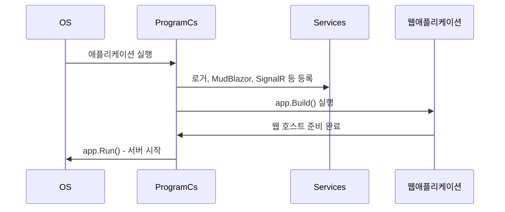

# Chapter 3: 프로그램 진입점

[WebRTC 페이지](02_webrtc_페이지_.md)에서 마이크와 웹캠을 활용해 실시간 통신을 구현했다면, 이제 실제 애플리케이션이 “처음” 실행되고 모든 기능을 쓸 준비를 마치는 과정을 살펴볼 차례입니다. 바로 이 시점이 ‘프로그램 진입점’입니다.  
이 “프로그램 진입점”에서는 웹 서버를 설정하고 로깅 기능과 UI 라이브러리(MudBlazor) 등을 초기화합니다. 또한 [액터 시스템 관리자](04_액터_시스템_관리자_.md), [오디오 스트림 허브](07_오디오_스트림_허브_.md)와 같은 핵심 요소들도 이 지점에서 준비를 마칩니다. 쉽게 말해 “애플리케이션 전체의 시작점”이라 할 수 있습니다.

---

## 왜 프로그램 진입점이 중요한가?

간단한 예시로, 극장이 첫 공연을 시작하기 전이라고 가정해 봅시다. 무대 세팅, 조명 연결, 배우들의 의상 준비 등 모든 요소가 제대로 갖춰져야 공연을 원활하게 진행할 수 있습니다. BlazorVoice 프로젝트에서도 마찬가지입니다. 프로그램이 실행됨과 동시에:

- 웹 서버를 구동해서 요청을 받을 준비를 해야 합니다.  
- 로깅이나 NLog 같은 진단 툴을 설정해 에러나 실행 흐름을 기록해야 합니다.  
- MudBlazor 등의 UI 라이브러리, SignalR 허브 등을 등록해 기능을 사용할 준비를 마쳐야 합니다.

만약 이 단계가 제대로 이루어지지 않으면, 이후 어떤 페이지를 띄우거나 음성 처리를 너무 복잡하게 진행하려 할 때 문제가 생길 수 있습니다.

---

## 프로그램 진입점의 기본 구조

대부분 .NET 6 이상의 Blazor Server 프로젝트에서는 `Program.cs`가 이 역할을 맡습니다. 코드 흐름은 대략 다음과 같습니다:

1. Logger(NLog) 설정  
2. `WebApplicationBuilder` 생성 (`builder`)  
3. Blazor, MudBlazor, SignalR 등 서비스 등록  
4. ActorSystem과 같은 핵심 서비스 초기화  
5. 웹 앱 생성(`builder.Build()`)  
6. 에러 처리, 정적 파일 설정, 라우트 매핑  
7. `app.Run()`으로 서버 실행

아래 간단 예시에 단계별 코드를 나누어 살펴보겠습니다.

---

## 단계별 코드 예시 1: 로거(logger) 및 빌더 설정

아래 코드는 `Program.cs` 초반부를 대표적으로 보여줍니다(실제 프로젝트에서는 더 많은 설정이 있을 수 있습니다).

```csharp
// Program.cs (부분 1)
using NLog;
using NLog.Web;

var logger = LogManager.Setup().LoadConfigurationFromAppSettings().GetCurrentClassLogger();
logger.Debug("init main");

var builder = WebApplication.CreateBuilder(args);
```

- `NLog`: 로깅 라이브러리입니다. `LoadConfigurationFromAppSettings()`로 설정 파일을 가져와 초기화합니다.  
- `WebApplication.CreateBuilder(args)`: .NET Core에서 웹 서버(호스팅) 관련된 각종 설정을 할 수 있는 빌더를 생성합니다.

---

## 단계별 코드 예시 2: 서비스 등록 (Blazor, MudBlazor, SignalR 등)

`builder.Services`를 통해 프로젝트에서 필요한 기능들을 한 곳에 모아서 초기화합니다.

```csharp
// Program.cs (부분 2)
builder.Services.AddRazorComponents()
    .AddInteractiveServerComponents();

builder.Services.AddMudServices(); // MudBlazor 등록

builder.Services.AddSignalR(options =>
{
    options.MaximumReceiveMessageSize = 1024 * 1024; // 1MB
});
```

- `AddRazorComponents()`: Blazor Server의 Razor 컴포넌트를 사용할 수 있도록 등록합니다.  
- `AddMudServices()`: MudBlazor 기능(테마, 컴포넌트 등)을 사용할 수 있도록 해줍니다.  
- `AddSignalR(...)`: 실시간 통신에 필요한 SignalR 허브를 설정합니다. 여기서는 메시지 최대 크기를 1MB로 제한하는 예시를 보여줍니다.

---

## 단계별 코드 예시 3: DI(Dependency Injection)와 액터 시스템 준비

BlazorVoice에서 중요한 서비스들은 DI로 등록해두고, 필요할 때마다 가져다 씁니다.

```csharp
// Program.cs (부분 3)
builder.Services.AddSingleton<AkkaService>();
builder.Services.AddScoped<OpenAIService>();

var app = builder.Build();
var akkaService = app.Services.GetRequiredService<AkkaService>();
var actorSystem = akkaService.CreateActorSystem("default");
```

- `AddSingleton<AkkaService>()`: 싱글톤 범위로 Akka 관련 서비스를 등록합니다.  
- `AddScoped<OpenAIService>()`: OpenAI 연동 서비스를 스코프 범위로 등록합니다.  
- `app.Build()`: 실제로 웹 애플리케이션 객체를 만듭니다.  
- `actorSystem`: AkkaService 내에서 액터 시스템을 생성해 다양한 액터(음성 처리 담당 등)들이 동작할 준비를 마칩니다.

---

## 단계별 코드 예시 4: 파이프라인 구성과 서버 실행

마지막으로, 에러 처리, 정적 파일, 라우팅 등을 설정하고 서버를 실행합니다.

```csharp
// Program.cs (부분 4)
if (!app.Environment.IsDevelopment())
{
    app.UseExceptionHandler("/Error");
}

app.UseStaticFiles();
app.UseAntiforgery();

app.MapRazorComponents<App>()
    .AddInteractiveServerRenderMode();

app.MapHub<AudioStreamHub>("/audiostream");

app.Run();
```

- `app.UseExceptionHandler("/Error")`: 개발 환경이 아닌 경우 에러 페이지로 라우팅합니다.  
- `app.UseStaticFiles()`: `wwwroot` 폴더의 정적 파일을 서빙합니다(이미지, CSS 등).  
- `app.MapRazorComponents<App>()`: Blazor Razor 페이지들을 라우팅합니다.  
- `app.MapHub<AudioStreamHub>("/audiostream")`: SignalR 허브를 특정 경로(“/audiostream”)로 매핑합니다.  
- `app.Run()`: 웹 앱을 실제로 실행합니다.

---

## 동작 과정 시퀀스 다이어그램

프로그램 진입점이 실제로 실행되면, 다음과 같은 흐름이 발생합니다:



1. 운영체제(OS)가 `Program.cs`를 통해 애플리케이션을 실행합니다.  
2. `Program.cs`는 각종 서비스(MudBlazor, SignalR, 액터 시스템 등)를 등록합니다.  
3. 빌더(`builder.Build()`)가 웹 애플리케이션 객체를 생성합니다.  
4. 준비가 끝나면 `app.Run()`으로 서버를 가동해 클라이언트 요청을 받을 수 있게 됩니다.

---

## 내부 구현 시 유의사항

- 로그 설정: NLog를 사용할 경우, 개발 환경별(예: Development, Local, Production)로 다른 설정 파일(`NLog.Development.config`, `NLog.config` 등)을 적용할 수 있습니다.  
- MudBlazor 외 타 라이브러리를 사용할 때도 비슷하게 `builder.Services.Add~` 형태로 추가하면 됩니다.  
- SignalR 허브나 기타 API 엔드포인트는 `app.Map~` 계열 메서드를 통해 라우트로 등록합니다.  
- 액터 시스템이나 타 서비스도 DI로 등록하여 필요 시 의존성 주입(Dependency Injection)을 받도록 하면 전체 구조가 깔끔해집니다.

---

## 마무리: 모든 준비가 끝난 메인 무대

이처럼 프로그램 진입점에서는 로깅, UI 라이브러리, 액터 시스템 준비, SignalR 등록 등 한꺼번에 중요한 초기화를 진행합니다. 이 단계가 제대로 완성되어야, [WebRTC 페이지](02_webrtc_페이지_.md)나 [OpenAI 연동 서비스](06_openai_연동_서비스_.md) 등이 에러 없이 동작할 수 있습니다.

다음 장인 [액터 시스템 관리자](04_액터_시스템_관리자_.md)에서는 액터들이 구체적으로 어떻게 메시지를 주고받고, 음성 데이터를 처리하는지 살펴봅니다. 계속 이어서 확인해 보세요!

---

Generated by [AI Codebase Knowledge Builder](https://github.com/The-Pocket/Tutorial-Codebase-Knowledge)