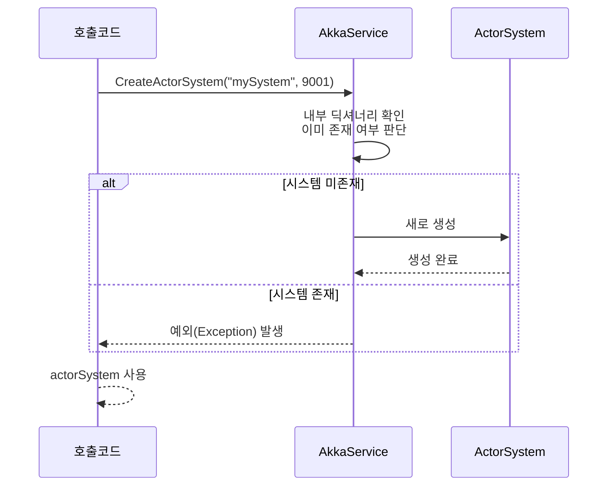

# Chapter 4: 액터 시스템 관리자

[프로그램 진입점](03_프로그램_진입점_.md)에서 서버와 각종 서비스를 초기화했다면, 이제는 여러 액터(Actor)들을 효율적으로 관리해주는 “액터 시스템 관리자”를 살펴볼 차례입니다. BlazorVoice 프로젝트에서는 Akka.NET을 이용해 액터 시스템을 만들어 오디오·음성 처리부터 다양한 메시징 기능까지 확장성 있게 구축하려고 합니다.

---

## 왜 액터 시스템 관리자가 필요한가?

예를 들어, 커다란 공장에 로봇(액터)이 수십 대 이상 있다고 상상해 봅시다. 이 로봇들끼리 부딪히지 않고 협력하려면 “본부” 역할을 하는 자리에서 전력 공급, 네트워크 유지, 메시지 전달 규칙 등을 책임져야 합니다. 여기서 액터 시스템 관리자는:

- 새 액터 시스템이 필요할 때 리모트 설정(포트, 호스트네임 등)이나 로깅 설정 같은 세부사항을 조정해줍니다.  
- 이미 존재하는 시스템 이름으로 다시 만들라고 하면 예외를 발생시켜 충돌을 방지합니다.  
- 여러 액터(로봇)들을 한곳에 보관해 필요할 때 곧바로 검색해 쓸 수 있게 도와줍니다.  
- 액터 시스템 전체가 원활히 돌아가도록 메시지를 주고받는 환경을 제공합니다.

---

## 핵심 개념 살펴보기

1. ActorSystem 생성  
   - 원하는 이름으로 새 액터 시스템을 생성합니다(포트 설정 가능).  
   - 이미 같은 이름이 존재하면 예외를 던져 충돌을 막습니다.

2. 액터 등록/검색  
   - 서비스를 통해 만든 액터 레퍼런스(IActorRef)를 이름과 함께 저장합니다.  
   - 나중에 필요할 때 액터 이름으로 빠르게 가져올 수 있습니다.

3. 리모트 구성  
   - 포트가 지정되면 네트워크 상에서 액터들이 서로 통신할 수 있게 합니다.  
   - 내부적으로 Akka.NET의 설정(`provider = remote`) 등을 활용합니다.

4. 단일 진입점  
   - 다른 클래스에서 굳이 `ActorSystem.Create()`를 매번 직접 호출할 필요 없이,  
   - “액터 시스템 관리자”만 정확히 호출하면 모든 생성/설정이 자동화됩니다.

---

## 간단 사용 예시

아래는 BlazorVoice에서 제공하는 “AkkaService” 클래스를 활용해 액터 시스템을 생성하는 단순 코드 사례입니다.

```csharp
@code {
    // 이미 DI(Dependency Injection)로 주입받는다고 가정
    [Inject]
    private AkkaService AkkaSvc { get; set; }

    private void CreateMyActorSystem()
    {
        // "mySystem"이라는 이름으로 새 ActorSystem 생성
        var actorSystem = AkkaSvc.CreateActorSystem("mySystem", 9001);
    }
}
```
위 예시는:
- “mySystem”이라는 이름과 포트 “9001”을 지정하여 시스템을 엽니다.  
- 만약 이미 “mySystem”이 존재한다면 예외가 발생해 중복 생성을 방지합니다.

---

## 내부 동작 이해하기

액터 시스템 관리자가 어떤 식으로 동작하는지 매우 간단하게 시퀀스 다이어그램을 그려보면 아래와 같습니다.



1. 호출 코드가 “mySystem”을 만들라고 요청하면, `AkkaService`가 내부에서(Dictionary) 해당 이름이 이미 있는지 본다.  
2. 없으면 실제 `ActorSystem.Create`를 통해 만들어 저장하고, 호출 코드에 반환한다.  
3. 있으면 충돌을 막기 위해 예외를 던진다.

---

## 내부 구현 살펴보기 (간단 코드 블록)

아래 코드는 `AkkaService`에서 액터 시스템을 생성, 보관, 검색하는 핵심 부분 일부를 추려서 보여줍니다.

### (1) 배우 시스템 딕셔너리
```csharp
// 액터 시스템들을 이름별로 보관
private Dictionary<string, ActorSystem> actorSystems = new Dictionary<string, ActorSystem>();
```
- `actorSystems`에 “이름:ActorSystem” 형태로 저장합니다.  
- 같은 이름을 다시 넣으려 하면 충돌이 발생합니다.

### (2) CreateActorSystem 메서드
```csharp
public ActorSystem CreateActorSystem(string name, int port = 0)
{
    if (!actorSystems.ContainsKey(name))
    {
        // (포트=0)시 기본 설정
        // (포트>0)시 리모트 구성
        ...
        actorSystems[name] = ActorSystem.Create(name, config);
    }
    else
    {
        throw new Exception($"{name} actorsystem has already been created.");
    }

    return actorSystems[name];
}
```
- 포트가 0이 아니면 Akka.NET의 `remote` 설정을 추가로 켜줍니다.  
- 포트가 0이면 단순한 내부 ActorSystem만 생성합니다.

### (3) 액터 등록/가져오기
```csharp
public void AddActor(string name, IActorRef actor)
{
    if (!actors.ContainsKey(name))
    {
        actors[name] = actor;
    }
}

public IActorRef GetActor(string name)
{
    return actors.ContainsKey(name) ? actors[name] : null;
}
```
- 액터를 등록할 때도 “이름”을 key로 저장합니다.  
- 이미 등록된 이름이면 덮어쓰지 않도록 간단히 체크합니다.

---

## 실제 활용: 음성 처리 액터 연결

[음성 대화 담당 액터](05_음성_대화_담당_액터_.md)나 다른 음성 인식 액터를 만들 때, 아래처럼 `AddActor()`를 통해 보관할 수 있습니다.

```csharp
var system = akkaService.GetActorSystem("mySystem");
var myActor = system.ActorOf(Props.Create(() => new VoiceActor()), "voiceActor");

// 액터를 "voiceActorRef"라는 이름으로 보관
akkaService.AddActor("voiceActorRef", myActor);
```
이제 프로젝트 어디서든 “voiceActorRef”라는 이름으로 액터를 다시 가져올 수 있어, 메시지를 쉽게 보낼 수 있습니다.

---

## 한 단계 더 이해하기

1. **액터 시스템 생성**: 앱 시작 시(또는 필요 시) 하나의 ActorSystem을 만듭니다.  
2. **액터 등록**: 해당 시스템 안에서 여러 액터(음성 분석, 텍스트 생성 등)를 만들고, `AkkaService`에 등록해 둡니다.  
3. **메시지 교환**: 등록된 액터들끼리는 Akka.NET 내부 메시지를 통해 서로 데이터를 주고받습니다.  
4. **확장성**: 규모가 커지면 더 많은 액터 시스템(네임으로 구분)을 만들거나, 리모트 설정을 통해 여러 서버 간 협업도 가능합니다.

---

## 주의사항

- ActorSystem 이름은 중복 불가능합니다. 반드시 고유해야 충돌을 피할 수 있습니다.  
- 리모트 모드(포트 지정) 사용 시, 네트워크 방화벽 설정 등을 유념해야 합니다.  
- 액터를 등록할 때도 이름 충돌이 없도록 신중하게 다뤄야 합니다.

---

## 마무리 및 다음 단계

이로써 “액터 시스템 관리자”가 어떻게 액터 시스템을 생성하고, 액터들을 모아서 관리할 수 있는지 알아보았습니다. 한마디로 “여러 액터가 협업하는 무대”를 마련하고 유지하는 중요한 역할이라 할 수 있습니다.

다음 장에서 살펴볼 [음성 대화 담당 액터](05_음성_대화_담당_액터_.md)는 실제로 이 시스템에 등록되어 화자 인식 또는 음성 합성을 담당합니다. 계속해서 함께 살펴보세요!

---

Generated by [AI Codebase Knowledge Builder](https://github.com/The-Pocket/Tutorial-Codebase-Knowledge)