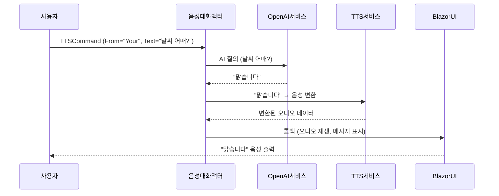

# Chapter 5: 음성 대화 담당 액터

[액터 시스템 관리자](04_액터_시스템_관리자_.md)에서 액터들을 한 곳에서 생성하고 관리하는 방법을 배웠다면, 이번 장에서는 실제로 사용자와의 음성 대화를 담당하는 핵심 액터를 살펴보겠습니다. **음성 대화 담당 액터**는 사용자가 말한 내용(음성 입력)을 AI에게 보내 답변을 받고, 다시 이 답변을 TTS를 통해 음성으로 출력해 주는 ‘실시간 음성 대화’의 중심에 있습니다.

---

## 왜 음성 대화 담당 액터가 필요한가?

예시로, “스마트 스피커” 시나리오를 생각해 봅시다. 사용자가 “내일 날씨 어때?”라고 말하면, 이 소리를 인식하고 AI에게 텍스트로 전달해야 합니다. 그리고 AI가 “내일은 맑아요”라고 답하면, 그것을 다시 음성으로 재생해야 하죠. 이러한 과정을 모두 한 군데에서 조율해주는 것이 바로 **음성 대화 담당 액터**입니다.

- 사용자의 음성 입력 → AI 질의 → AI 응답 → 음성 변환(TTS) → 스피커 출력  
- 중간에 대화 내역(Chat History)을 쌓아서 대화를 “맥락” 있게 유지  
- 일정 시간이 지나면 내용을 자동 업데이트(타이머)하거나, Blazor UI에 상태를 콜백해주는 작업도 가능  

---

## 주요 개념

### 1) 사용자 발화 처리
- 사용자가 보이스 마이크를 통해 전송한 문장을 ChatGPT 같은 AI 모델에게 보냅니다.  
- AI가 답변을 생성하면, 그 결과를 액터 내부 변수를 통해 보관할 수 있습니다.

### 2) TTS(Text-To-Speech) 연동
- AI가 준 텍스트 답변을 TTS 서비스(예: Azure TTS, OpenAI TTS 등)로 변환해 음성을 얻습니다.  
- 음성 데이터를 다시 브라우저 쪽으로 전달, 재생하여 “말하는 느낌”을 구현합니다.

### 3) 타이머 기반 상태 점검
- 액터 내부에서 정기적으로(ContentAutoUpdateCommand 등) 타이머를 작동시켜, 대화 흐름을 점검합니다.  
- 필요하다면 일정 주기마다 AI에게 “추가 안내”를 요청하거나, 뒷정리를 수행할 수 있습니다.

### 4) Blazor 콜백
- C# 서버 쪽 액터가 대화 내용을 업데이트하면, Blazor UI에 알려서 화면 텍스트를 갱신하거나 음성을 재생하도록 호출합니다.

---

## 어떻게 사용하는가?

사용방법은 크게 두 단계로 나눌 수 있습니다:

1. [액터 시스템 관리자](04_액터_시스템_관리자_.md)를 통해 “음성 대화 담당 액터”를 생성하고, 식별자를 등록합니다.  
2. 필요할 때(예: 사용자 발화가 인식되었을 때) 해당 액터에게 메시지(명령)를 보내서 AI 질의, TTS 변환 등 과정을 진행합니다.

아래는 간단한 사용 예시 코드입니다.

```csharp
@code {
    [Inject]
    private AkkaService AkkaSvc { get; set; }

    private IActorRef _voiceActor;

    protected override void OnInitialized()
    {
        // 이미 'mySystem'을 만들어둔 상태라고 가정
        var actorSystem = AkkaSvc.GetActorSystem("mySystem");

        // 음성 대화 담당 액터 생성 (만약 미리 등록해둔 장치가 없다면 직접 생성)
        _voiceActor = actorSystem.ActorOf(
            Props.Create(() => new VoiceChatActor(null)), 
            "voiceChatActor"
        );
    }

    private void UserSaidSomething(string userText)
    {
        // TTSCommand를 보냄 (From="Your" => 내 발화)
        _voiceActor.Tell(new TTSCommand
        {
            From = "Your",
            Text = userText,
            Voice = "alloy"
        });
    }
}
```

위 코드에서 “UserSaidSomething” 메서드는 사용자가 어떤 문장을 말했을 때 그 텍스트를 액터에게 전달하는 흐름입니다. 액터는 AI 질의, 음성 변환까지 담당하고, 콜백을 통해 Blazor UI를 갱신하거나 음성을 재생할 수 있습니다.

---

## 동작 흐름 살펴보기

다음 시퀀스 다이어그램은 사용자의 음성이 AI 대답으로 돌아오고, 다시 음성으로 재생되는 과정을 단순화해 표현합니다.



---

## 내부 구현 간단 살펴보기

여기서는 “VoiceChatActor” 클래스의 일부 코드를 짧게 나누어 보겠습니다. (파일: BlazorVoice.Akka.Actor.VoiceChatActor.cs)

### (1) 생성자와 타이머 설정

```csharp
public class VoiceChatActor : ReceiveActor, IWithTimers
{
    private readonly ILoggingAdapter logger = Context.GetLogger();
    public ITimerScheduler Timers { get; set; } = null!;

    public VoiceChatActor(IServiceProvider serviceProvider)
    {
        logger.Info("VoiceChatActor 생성자 호출");

        // 타이머를 이용한 주기적 점검
        Timers.StartPeriodicTimer(
            key: TimerKey.Instance,
            msg: new ContentAutoUpdateCommand(),
            initialDelay: TimeSpan.FromSeconds(10),
            interval: TimeSpan.FromSeconds(30)
        );

        // 메시지(커맨드) 수신 설정
        Receive<ContentAutoUpdateCommand>(command =>
        {
            logger.Info("정기 업데이트 커맨드 수신");
            // 여기서 대화 흐름 점검 등 필요한 작업 수행
        });
    }
}
```

- 이 액터는 `ReceiveActor`를 상속하고, `IWithTimers`를 통해 타이머 기능을 사용합니다.  
- 초기화 시 **StartPeriodicTimer**를 호출해 일정 간격으로 `ContentAutoUpdateCommand`를 스스로 받도록 설정합니다.

### (2) TTSCommand 처리

```csharp
Receive<TTSCommand>(command =>
{
    logger.Info($"TTSCommand: {command.From}");

    switch (command.From)
    {
        case "Your":
            // 사용자 발화 → AI 응답 & TTS
            _ = Task.Run(() => GetChatCompletion(command.Text));
            // 실제 TTS 변환(예: OpenAI TTS)
            ...
            break;

        case "AI":
            // AI 발화 → 곧바로 TTS
            ...
            break;
    }
});
```

- `Receive<TTSCommand>`는 “음성 대화”의 핵심 로직입니다.  
- `From="Your"`일 때는 사용자가 말한 텍스트 → AI에게 질의 → 받은 답변을 재생.  
- `From="AI"`일 때는 내부에 저장된 AI 답변을 다시 TTS로 변환하여 재생.

### (3) Blazor 콜백에 결과 전달

```csharp
private Action<string, object[]> _blazorCallback;

Receive<Action<string, object[]>>(callback =>
{
    _blazorCallback = callback;
    // 초기 메세지나 TTS 테스트
    ...
});

public async Task<string> GetChatCompletion(string text)
{
    // AI 질의 후 응답
    var aiResponse = await _openAIService.GetChatCompletion(text, ...);

    // 이후 _blazorCallback?.Invoke(...)로 UI에 알림
    return aiResponse;
}
```

- “Blazor 콜백”을 액터가 받아서, 이후 TTS나 메시지 처리가 끝났을 때 UI에 알려줄 수 있습니다.  
- `GetChatCompletion` 메서드는 OpenAI와 실제 대화를 주고받은 뒤, 결과를 반환합니다.

---

## 정리 및 다음 장 예고

이번 장에서는 **음성 대화 담당 액터**가 어떻게 사용자 발화를 AI에 전달하고, TTS로 바꿔주는지를 살펴보았습니다. 이 액터는 일종의 “스마트 타워” 역할로, Blazor 앱과 AI, TTS 간의 흐름을 유연하게 연결하는 중요한 축입니다.

다음 장인 [OpenAI 연동 서비스](06_openai_연동_서비스_.md)에서는 AI 모델에게 텍스트를 보내고, 응답을 받아오는 과정을 좀 더 자세히 다룹니다. 어떤 방식으로 ChatGPT나 유사 모델을 호출하는지 궁금하시다면 이어서 확인해 보세요!

---

Generated by [AI Codebase Knowledge Builder](https://github.com/The-Pocket/Tutorial-Codebase-Knowledge)