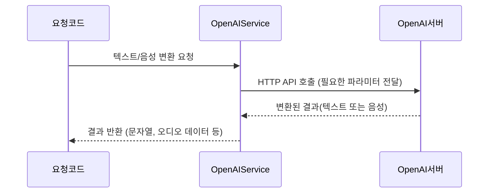

# Chapter 6: OpenAI 연동 서비스

이전 장인 [음성 대화 담당 액터](05_음성_대화_담당_액터_.md)에서 사용자 발화를 AI와 주고받고, 음성으로 재생하는 흐름을 살펴봤습니다. 이번 장에서는 이러한 과정을 뒷받침하는 “OpenAI 연동 서비스”를 소개합니다. 이 서비스는 ChatGPT 같은 언어 모델에 텍스트를 보내거나, TTS(Text-To-Speech)와 STT(Speech-To-Text)를 통해 음성을 처리할 때 사용됩니다.

---

## 왜 OpenAI 연동 서비스가 필요한가?

예를 들어, “비서에게 회의 일정을 물어보고, 음성으로 답을 듣고 싶다”라는 상황을 생각해 봅시다. 음성 대화 담당 액터가 “오전 10시에 회의가 있다”라는 문장을 얻으려면, 내부적으로는 OpenAI API를 호출해 답변을 받아와야 합니다. 또 이 텍스트를 음성으로 재생하려면, TTS가 필요합니다.

- “회의 일정 알려줘” → STT를 통해 음성을 텍스트로 변환  
- 변환된 텍스트를 AI(ChatGPT 등)에 전송하여 답변 받기  
- AI의 답변을 다시 TTS로 음성으로 만들기  
- 브라우저나 스피커에서 최종 음성 재생  

이 과정을 한 곳에서 맡아주는 핵심 축이 바로 “OpenAI 연동 서비스”입니다.

---

## 핵심 개념 살펴보기

1. 텍스트 대화 (Chat)  
   - ChatGPT 등과 텍스트로 주고받는 대화를 처리합니다.  
   - “질문”을 보내면 “답변”을 받아오는 구조입니다.

2. STT(Speech-To-Text)  
   - 음성 파일(또는 실시간 스트림)을 텍스트로 변환합니다.  
   - 예: “안녕하세요”라는 목소리를 “안녕하세요” 문자열로 반환해줍니다.

3. TTS(Text-To-Speech)  
   - AI가 생성한 텍스트 답변을 음성으로 바꿔줍니다.  
   - 브라우저나 오디오 플레이어에서 재생할 수 있는 형태(PCM, MP3 등)로 제공합니다.

4. API 연동 방식  
   - 기본적으로 HTTP 요청을 통해 OpenAI에 데이터를 전송하고, 응답을 받습니다.  
   - API 키 관리를 통해 인증을 진행합니다.

---

## 사용 방법 (간단 예시)

OpenAI 연동 서비스는 보통 DI(의존성 주입)로 주입받아 간단히 호출합니다. 예를 들어, 사용자가 “내일 날씨”라는 문장을 말했을 때, TTS를 써보고 싶다면:

```csharp
@code {
    [Inject]
    private OpenAIService _openAI { get; set; }

    private async Task ConvertTextToSpeech()
    {
        string text = "내일은 맑고 따뜻합니다.";
        float[] audioData = await _openAI.ConvertTextToVoiceAsync(text, "alloy");
        // 이제 audioData를 재생하면 음성 출력 가능
    }
}
```
- 위 코드에서는 `"내일은 맑고 따뜻합니다."`라는 문장을 TTS 요청 → `audioData`로 PCM 형식의 샘플을 얻어옵니다.  
- 이 데이터는 [음성 대화 담당 액터](05_음성_대화_담당_액터_.md)에서 재생 처리하거나, 다른 오디오 플레이어를 사용해 재생할 수 있습니다.

---

## 내부 동작 시나리오

간단히 말해서, OpenAI 연동 서비스가 호출될 때 다음과 같은 일이 일어납니다:



---

## 내부 구현 간단 살펴보기

이 서비스는 다음과 같은 주요 메서드를 가집니다. (코드는 예시 목적이므로 간단화했습니다.)

### 1) AI 대화 메서드 (Chat)

```csharp
public async Task<string> GetChatCompletion(string message)
{
    // AI 모델에 질문하기
    var result = await _httpClient.PostAsJsonAsync("completion", new { input = message });
    // 응답 텍스트 파싱
    var responseText = await result.Content.ReadAsStringAsync();
    return responseText;
}
```

- “message”를 AI에게 보내고, 결과 텍스트를 문자열 형태로 받습니다.

### 2) TTS 메서드

```csharp
public async Task<float[]> ConvertTextToVoiceAsync(string text, string voice)
{
    // TTS API 호출
    var response = await _httpClient.PostAsJsonAsync("audio/speech", new { input = text, voice });
    var audioBytes = await response.Content.ReadAsByteArrayAsync();
    // MP3 → PCM 변환 후 반환
    return ConvertMp3ToFloatArray(audioBytes);
}
```

- 특정 “voice” 스타일로 텍스트를 음성 변환.  
- 결과를 float 배열(Pulse-code modulation)로 반환해 즉시 재생 가능.

### 3) STT 메서드

```csharp
public async Task<string> ConvertVoiceToTextAsync(byte[] audioBytes)
{
    // 음성 파일 업로드
    var content = new MultipartFormDataContent();
    content.Add(new ByteArrayContent(audioBytes), "file", "audio.wav");

    var response = await _httpClient.PostAsync("audio/transcriptions", content);
    var json = await response.Content.ReadAsStringAsync();
    // JSON 파싱 후 "text"만 추출
    return ExtractTextFromJson(json);
}
```

- WAV(또는 MP3) 형태의 오디오를 STT API에 보내 텍스트로 받아옵니다.  
- 내부적으로 JSON 응답을 간단히 파싱해 문자열만 추출합니다.

---

## 어디에서 활용하는가?

- [음성 대화 담당 액터](05_음성_대화_담당_액터_.md)에서 사용자 음성을 STT로 변환해 AI 모델에게 전달할 때  
- AI 답변을 다시 TTS로 변환해 브라우저나 스피커에서 재생할 때  
- Appointment Bot, 스마트 스피커, 각종 음성 안내 시스템 등 다양한 음성 인터페이스 적용 가능  

---

## 주의사항

1. API 키 보안  
   - OpenAI API 키를 환경 변수나 안전한 방법으로 관리해야 합니다.  
   - 깃허브 등 외부에 노출되지 않도록 주의합니다.

2. 요금(Quota) 관리  
   - OpenAI 호출은 무료가 아닐 수 있습니다. 사용량이 너무 많으면 청구 비용이 올라갈 수 있으므로 모니터링이 필요합니다.

3. 속도·지연  
   - 음성 변환이나 AI 응답에 시간이 걸릴 수 있습니다. 사용자에게 진행 상황을 알리거나, 비동기로 처리하는 방식을 권장합니다.

4. 응답 품질  
   - 언어 모델 특성상, 때로는 예기치 못한 답변이 반환될 수 있습니다. 사용자는 이를 고려해 결과를 검증할 필요가 있습니다.

---

## 결론 및 다음 단계

이상으로 “OpenAI 연동 서비스”가 어떻게 AI 대화, TTS, STT 기능을 한꺼번에 제공하는지 알아봤습니다. 이 서비스를 적절히 활용하면, 음성 대화 담당 액터나 Blazor 페이지에서 간단히 API를 호출하여 풍부한 음성 인터페이스를 구축할 수 있습니다.

다음 장인 [오디오 스트림 허브](07_오디오_스트림_허브_.md)에서는 SignalR을 이용해 실시간 오디오 스트림을 전송·제어하는 방법을 다룹니다. 이 기능과 OpenAI 연동 서비스를 결합하면, 더욱 실감 나는 음성 대화 환경을 만들 수 있으니 꼭 확인해 보세요!

---

Generated by [AI Codebase Knowledge Builder](https://github.com/The-Pocket/Tutorial-Codebase-Knowledge)