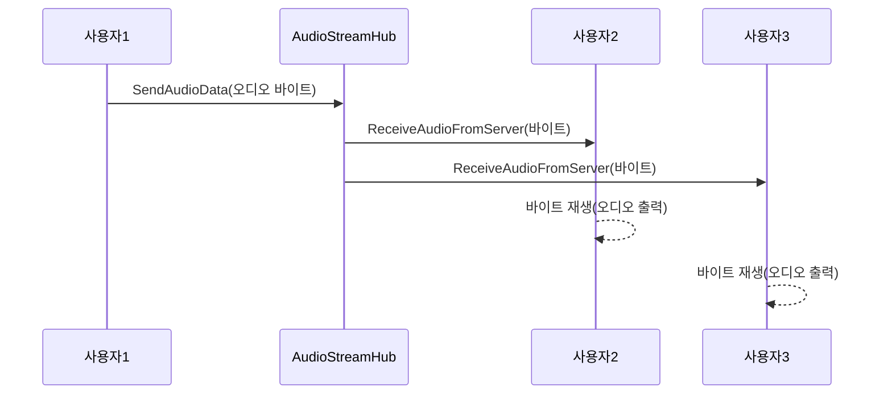

# Chapter 7: 오디오 스트림 허브

이전 장인 [OpenAI 연동 서비스](06_openai_연동_서비스_.md)에서 AI와 실시간 대화를 주고받으며 음성 데이터를 어떻게 처리할 수 있는지 살펴보았습니다. 이제는 실제 오디오를 여러 클라이언트가 서로에게 전달하고 중계할 수 있는 “오디오 스트림 허브”를 알아보겠습니다. 이 허브는 SignalR을 통해 음성 데이터를 실시간으로 주고받는 통로이며, 여러 사용자가 동시에 연결되어도 확장성 있게 소통할 수 있도록 돕는 핵심 요소입니다.

---

## 왜 오디오 스트림 허브가 필요한가?

상상해 봅시다. 화상 회의나 음성 채팅 앱에서 여러 사람이 동시에 대화하는 상황입니다. 한 사용자가 말하면, 그 음성 데이터를 중앙에서 받아서 다른 사람들에게 동시 전달해야 합니다. 바로 이 역할을 ‘DJ’처럼 하는 중개가 “오디오 스트림 허브”입니다.

- 하나의 허브에 여러 클라이언트(WebRTC·브라우저)가 연결됨  
- 어떤 클라이언트가 보낸 음성 데이터를 다른 클라이언트에게 전달  
- 필요한 경우, 특정 사용자에게만 음성 전송  
- 실시간 퍼포먼스 요구사항을 충족하기 위해 SignalR 사용

---

## 주요 개념 살펴보기

1. SignalR Hub  
   - 실시간 통신을 지원하는 ASP.NET Core 구성 요소입니다.  
   - 서버에서 클라이언트로, 클라이언트에서 서버로 감각적으로 메시지를 주고받을 수 있게 해줍니다.

2. audioData(바이트 배열)  
   - 마이크로 녹음된 오디오가 실제로 전송될 때, 유사 PCM(또는 Encoding) 형태의 바이트 배열을 사용합니다.  
   - 허브는 이 바이트 배열을 받아 다른 쪽으로 중계합니다.

3. 확장성  
   - 다수의 클라이언트가 접속해도 안정적으로 작업이 이뤄지도록 설계합니다.  
   - 때로는 메시지 크기(오디오 길이)에 대한 제한이 필요합니다.

4. 중계 vs 브로드캐스트  
   - 중계(Relay): 특정 사용자 또는 그룹에게만 선택적으로 데이터를 전달  
   - 브로드캐스트(Broadcast): 모든 연결된 사용자에게 동일한 데이터를 전송

---

## 간단 사용 예시

예를 들어, 사용자가 마이크를 통해 녹음된 음성을 허브로 보낸다고 해봅시다. 아래 코드는 Blazor 페이지에서 허브로 바이트 배열을 보낼 때의 예시(간소화 버전)입니다:

```razor
<button @onclick="SendAudio">Send Audio</button>

@code {
    private async Task SendAudio()
    {
        // 가정: audioData가 이미 녹음되어 있음
        byte[] audioData = new byte[1024]; 
        await hubConnection.SendAsync("SendAudioData", audioData);
    }
}
```
- “SendAudio” 메서드는 `audioData`를 허브에 전송하는 간단한 로직입니다.  
- `hubConnection`은 SignalR Hub와 연결돼 있으며, “SendAudioData” 라는 서버 메서드를 호출합니다.

---

## 내부 구현 예시 (코드 1/2)

“오디오 스트림 허브” 자체는 크게 복잡하지 않습니다. 아래는 매우 간단히 요약한 모습입니다.  
(파일 위치 예: Services\AudioStreamHub.cs)

```csharp
using Microsoft.AspNetCore.SignalR;

namespace BlazorVoice.Services
{
    public class AudioStreamHub : Hub
    {
        public async Task SendAudioData(byte[] audioData)
        {
            Console.WriteLine($"Received {audioData.Length} bytes");
        }
    }
}
```

- `SendAudioData` 메서드는 클라이언트에서 받은 음성 데이터를 우선 서버 로그에 출력합니다.  
- 실제로는 이 데이터를 다른 클라이언트에게 재전송(`Clients.Others.SendAsync(...)`)하거나, 액터 시스템과 연동해 추가 분석에 넘길 수 있습니다.

---

## 데이터 브로드캐스트 예시 (코드 2/2)

만약 모든 연결된 사용자에게 동시에 오디오를 전송하고 싶다면, `SendAudioData` 안에 아래처럼 작성할 수 있습니다:

```csharp
public async Task SendAudioData(byte[] audioData)
{
    Console.WriteLine($"Received {audioData.Length} bytes");

    // 전체에게 다시 브로드캐스트
    await Clients.Others.SendAsync("ReceiveAudioFromServer", audioData);
}
```

- `Clients.Others`는 “나를 제외한 모든 연결 클라이언트”를 의미합니다.  
- 클라이언트 쪽에서는 “ReceiveAudioFromServer” 메서드를 구현해 이 오디오를 받아 재생합니다.

---

## 작동 흐름 시각화

아래 시퀀스 다이어그램은 한 사용자가 오디오를 전송한 뒤, 다른 사용자들이 받아 재생하는 과정을 단순화한 예시입니다:



1. 사용자1이 허브로 자신의 음성을 전송  
2. 허브는 해당 데이터를 사용자2, 사용자3에게 브로드캐스트  
3. 각 클라이언트가 수신한 오디오 바이트를 재생 장치로 출력

---

## 내부 동작 이해하기

1. SignalR 허브 클래스  
   - ASP.NET Core 프레임워크가 허브 인스턴스를 만들어, 연결된 클라이언트와 직접 통신합니다.  
   - “메서드 이름”을 기준으로 클라이언트가 호출할 수 있는 서버 함수(`SendAudioData`)가 결정됩니다.

2. 클라이언트 측 HubConnection  
   - Blazor나 JavaScript에서 “hubConnection” 객체를 만들어 서버 허브에 접속합니다.  
   - “SendAudioData”처럼 서버 메서드를 호출하거나, “ReceiveAudioFromServer” 같은 메서드로부터 알림을 받습니다.

3. 대역폭 및 최적화  
   - 오디오 데이터는 용량이 크기 때문에 전송 시 적절한 버퍼링이나 압축이 필요할 수 있습니다.  
   - SignalR의 “MaximumReceiveMessageSize” 등을 조정해 안정성을 확보할 수 있습니다.

4. 액터 시스템과 연동  
   - 허브에서 받은 오디오 데이터를 [액터 시스템 관리자](04_액터_시스템_관리자_.md)에 등록된 액터에게 보내어 음성 인식, 대화 처리, TTS로 재변환하는 등 확장 가능합니다.

---

## 더 나아가서 할 수 있는 것들

1. 특정 사용자만 대상으로 전송 (그룹, Connections)  
2. 오디오 말고도 텍스트·메타데이터 동시 전송  
3. 자동 녹음 시스템: 허브에서 서버에 저장, AI 처리 후 결과 리턴  
4. 사용자 음성 품질 조정: (볼륨, 샘플레이트 변환 등)

---

## 마무리

이로써 “오디오 스트림 허브”가 어떤 원리로 작동하고, 어떻게 음성 데이터를 각 클라이언트 간에 실시간으로 주고받는지 살펴보았습니다. 이 허브는 BlazorVoice 프로젝트에서 사용자들이 서로 말하고 듣는 기반을 만들어 주는 중추라 할 수 있습니다. [OpenAI 연동 서비스](06_openai_연동_서비스_.md)나 [음성 대화 담당 액터](05_음성_대화_담당_액터_.md)와 결합하면, 실시간 음성 상호 작용과 AI 대화까지 더욱 다채로운 기능을 구현할 수 있습니다.

이로써 BlazorVoice의 핵심 구성 요소를 모두 살펴보았습니다. 이제 직접 음성 대화 시스템을 만들어보면서, 필요에 따라 자신만의 커스터마이징을 시도해 보세요.  
모든 챕터를 학습하시느라 수고 많으셨습니다!  

---

Generated by [AI Codebase Knowledge Builder](https://github.com/The-Pocket/Tutorial-Codebase-Knowledge)