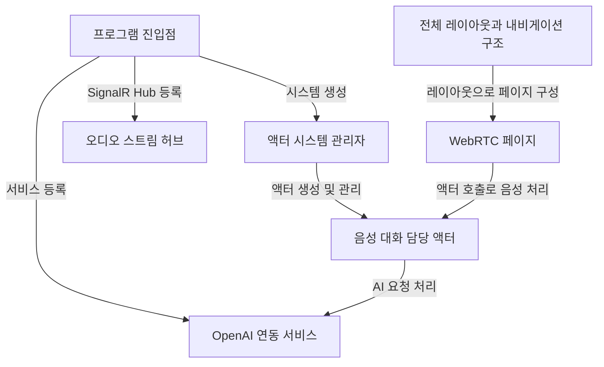

# Tutorial: BlazorVoice

이 프로젝트는 **Blazor**와 *Akka.NET*을 사용하여 음성 기반의 AI 대화를 지원하는 웹 애플리케이션입니다.  
사용자의 음성 입력을 받아 *ChatGPT*와 같은 모델로부터 적절한 답변을 생성하고,  
**TTS**를 통해 음성으로 재생하는 흐름이 구성되어 있습니다.  
또한 *WebRTC*와 *SignalR*을 통해 실시간 음성 송수신이 가능하며,  
전체 페이지 레이아웃은 **MudBlazor** 컴포넌트를 이용해 간편하게 구성되었습니다.

**Source Repository:** [None](None)

## Chapters

1. [전체 레이아웃과 내비게이션 구조
](01_전체_레이아웃과_내비게이션_구조_.md)
2. [WebRTC 페이지
](02_webrtc_페이지_.md)
3. [프로그램 진입점
](03_프로그램_진입점_.md)
4. [액터 시스템 관리자
](04_액터_시스템_관리자_.md)
5. [음성 대화 담당 액터
](05_음성_대화_담당_액터_.md)
6. [OpenAI 연동 서비스
](06_openai_연동_서비스_.md)
7. [오디오 스트림 허브
](07_오디오_스트림_허브_.md)

---

Generated by [AI Codebase Knowledge Builder](https://github.com/The-Pocket/Tutorial-Codebase-Knowledge)