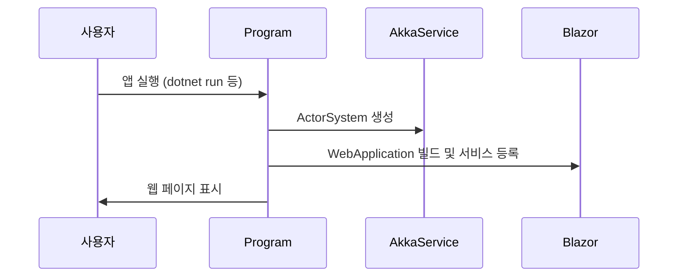

# Chapter 1: 전체 앱 구동 지점 (Program.cs)

## 들어가며
BlazorVoice 프로젝트를 처음 접하면, 가장 먼저 눈에 띄는 파일이 바로 `Program.cs`입니다. 이 파일은 웹 애플리케이션이 시작되는 진입점으로, 공연을 올리기 전 무대를 준비하고 무대 위에 필요한 사람들과 장비를 모두 세팅해 두는 “무대감독” 역할을 합니다. 이번 장에서는 `Program.cs`가 어떤 기능을 하는지, 어떻게 성장해 나가면서 다양한 서비스와 연동하고 있는지 매우 기초적인 관점에서 살펴보겠습니다.

---

## 왜 `Program.cs`가 중요한가?

초보자 입장에서 웹 애플리케이션을 실행할 때 어떤 일이 일어나는지를 알기란 쉽지 않습니다. 그러나 `Program.cs`는 다음과 같은 중요한 작업을 수행합니다:

1. 웹 서버를 설정하고 구동 (ASP.NET Core 호스팅)
2. 필요한 라이브러리(MudBlazor, SignalR 등) 등록
3. 로깅 도구(NLog) 설정
4. Akka 시스템을 생성하여 “배우(Actor)”를 무대에 올릴 준비

이를 통해 앱이 문제없이 시작되고, 다양한 기능을 수행할 수 있도록 기반을 마련합니다.

---

## 핵심 개념 살펴보기

아래는 `Program.cs`에서 자주 등장하는 핵심 개념들입니다:

### 1. 호스팅 빌더 (WebApplication.CreateBuilder)
ASP.NET Core 프로젝트가 실행될 때 가장 먼저 “호스팅”이라는 과정을 거칩니다. 쉽게 말해, “이 앱이 어떤 서버에서 어떤 설정으로 동작할지” 결정하는 단계입니다.

### 2. 서비스 등록 (Add 서비스들...)
프로젝트가 돌아가려면 프로젝트 내, 혹은 외부 라이브러리들과 연동이 필요합니다. 예를 들어 MudBlazor UI, SignalR, AkkaService 등이 있습니다. 이들을 “서비스”로 등록해서 앱 어디서든 쉽게 가져다 쓸 수 있게 준비해둡니다.

### 3. NLog 로깅 설정
문제가 생겼을 때 빠르게 찾아내기 위해서는 로그가 매우 중요합니다. `NLog`를 통해 파일 및 콘솔 등에 로그를 남기도록 설정합니다.

### 4. Akka Actor 시스템 생성
배우(Actor)들이 특정 일을 분산해서 처리하는 역할을 맡습니다. BlazorVoice 프로젝트에서는 목소리 전달, 채팅 등 다양한 작업에서 Actor 기반으로 동작합니다. 이 시스템을 “무대에 준비”하는 과정입니다.

### 5. 앱 실행 (app.Run())
마지막으로 “실제로 무대를 올리는” 단계입니다. 앱을 빌드하고, Endpoints(예: 라우팅)나 Hub 등을 연결한 뒤 서버를 구동합니다.

---

## 예시 코드로 살펴보기

실제 `Program.cs` 파일 코드는 많지만, 우선 중요한 부분만 쪼개서 살펴보겠습니다.

아래 코드 스니펫에서는 웹 앱을 만들고 로그를 초기화하는 가장 기초적인 과정을 보여줍니다:

```csharp
// 로거(Logger) 준비
var logger = LogManager.Setup().LoadConfigurationFromAppSettings().GetCurrentClassLogger();
logger.Debug("init main");

// 웹 앱 빌더(hosting) 생성
var builder = WebApplication.CreateBuilder(args);
```

- `LogManager`를 통해 NLog 설정을 불러옵니다.  
- `WebApplication.CreateBuilder(args)`를 통해 호스팅 빌더를 준비합니다.

여기서 로그 설정을 먼저 해주는 이유는, 이 시점부터 발생하는 문제를 빠르게 파악하기 위함입니다.

다음으로, NLog가 환경(Development/Local/Production 등)에 따라 다른 설정 파일을 사용하도록 만든 예시입니다:

```csharp
// NLog 설정 파일 분기
var env = builder.Environment.EnvironmentName;
var nlogConfigFile = env switch
{
    "Development" => "NLog.Development.config",
    "Local" => "NLog.Local.config",
    _ => "NLog.config"
};
builder.Logging.ClearProviders();
LogManager.Configuration = new XmlLoggingConfiguration(nlogConfigFile);
builder.Host.UseNLog();
```

- 환경 변수(`env`) 값에 따라 서로 다른 `NLog.config` 파일을 불러옵니다.  
- `builder.Logging.ClearProviders()`로 기존 로깅 제공자를 지우고, NLog만 사용하도록 설정합니다.

이제 MudBlazor나 SignalR 같은 필요한 서비스를 추가 등록합니다:

```csharp
// 서비스 등록
builder.Services.AddRazorComponents()
    .AddInteractiveServerComponents();

builder.Services.AddMudServices(); // MudBlazor UI 서비스 등록

builder.Services.AddSignalR(options =>
{
    options.MaximumReceiveMessageSize = 1024 * 1024; // 1MB
});
```

- Blazor 컴포넌트를 사용할 수 있도록 설정  
- MudBlazor UI를 손쉽게 쓸 수 있도록 서비스 등록  
- SignalR 허브에서 주고받는 메시지 최대 크기를 설정  

마지막으로 AkkaService를 등록하여 Actor 시스템 사용을 준비하고, 앱을 빌드한 후 실제로 실행합니다:

```csharp
// DI 등록
builder.Services.AddSingleton<AkkaService>(); // Akka 시스템
builder.Services.AddScoped<OpenAIService>(); // OpenAI 서비스

var app = builder.Build(); // 앱 빌드

// Akka 시스템 생성
var akkaService = app.Services.GetRequiredService<AkkaService>();
var actorSystem = akkaService.CreateActorSystem("default");

// 실제 앱 실행
app.Run();
```

- `AddSingleton<AkkaService>()`로 하나의 AkkaService 인스턴스를 앱 전체에서 사용  
- `AddScoped<OpenAIService>()`로 각 요청(Request)마다 새로운 OpenAIService 인스턴스를 사용  
- `CreateActorSystem("default")`로 Actor들이 활동할 무대를 준비  
- `app.Run()`으로 정말 웹 서버가 켜져서 요청을 받을 수 있게 됩니다.

---

## 내부 동작 흐름 알아보기

사용자가 앱을 실행하면, 다음과 같은 흐름으로 진행됩니다:



1. 사용자가 콘솔(또는 다른 환경)에서 앱을 실행합니다.  
2. `Program`(즉 `Program.cs`)이 실행되며 NLog 설정, Service 등록, Build 작업을 순서대로 수행합니다.  
3. `AkkaService`를 이용해 ActorSystem을 준비합니다.  
4. 모든 설정이 끝나면 `app.Run()`을 통해 블레이저(Blazor) 기반 웹 앱이 사용자에게 표시됩니다.

---

## 내부 구현 더 자세히 보기

`Program.cs` 구현은 크게 세 단계로 나눌 수 있습니다:

1. 초기화(로거 설정, 호스팅 빌더 생성)  
2. 서비스 등록(MudBlazor, SignalR, AkkaService, OpenAIService 등)  
3. 앱 빌드 및 실행(ActorSystem 생성, `app.MapHub` 등 라우트 설정 후 `app.Run()`)

구체적으로 어떤 시점에 어떤 파일이 불려오는지는 아래와 같이 정리할 수 있습니다:

- 초기화 과정:  
  - `NLog.config`(또는 환경 설정에 맞는 config 파일)  
  - `WebApplication.CreateBuilder(args)`로부터 `builder` 생성  

- 서비스 등록 과정:  
  - `builder.Services.AddRazorComponents()`  
  - `builder.Services.AddMudServices()`  
  - `builder.Services.AddSignalR(...)`  
  - `builder.Services.AddSingleton<AkkaService>()`  
  - `builder.Services.AddScoped<OpenAIService>()`  

- 빌드 및 실행:  
  - `var app = builder.Build()`  
  - `app.Services.GetRequiredService<AkkaService>()`  
  - `CreateActorSystem("default")` 호출  
  - `app.MapHub<AudioStreamHub>("/audiostream")` SignalR 허브 라우팅  
  - `app.Run()`  

또한 앱이 실행되면, 추후 [AudioStreamHub (SignalR 허브)](05_audiostreamhub__signalr_허브__.md)나 [AkkaService](06_akkaservice_.md) 같은 다른 핵심 요소들이 함께 동작하기 시작합니다. 이 부분들은 이후 장에서 더 자세히 살펴보겠습니다.

---

## 정리 및 다음 단계

이번 장에서는 `Program.cs`가 어떤 역할을 하는지, 그리고 앱이 어떻게 시작되는지에 대해 기초를 배웠습니다. “무대감독”이 무대를 어떻게 준비하는지 살펴보니, 프로젝트 전반을 파악하는 데 큰 도움이 되었을 것입니다.

이제 기초적인 앱 구동 과정을 알았으니, 다음 장에서는 실제 화면이 그려지는 과정, 즉 [Blazor 컴포넌트 구조 (App.razor와 레이아웃)](02_blazor_컴포넌트_구조__app_razor와_레이아웃__.md)을 살펴보겠습니다.  
다음 장에서 뵙겠습니다!  

---

Generated by [AI Codebase Knowledge Builder](https://github.com/The-Pocket/Tutorial-Codebase-Knowledge)