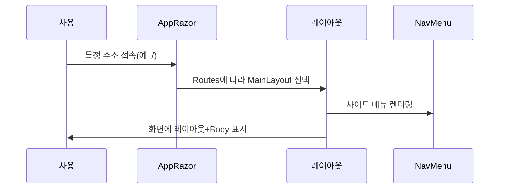

# Chapter 2: Blazor 컴포넌트 구조 (App.razor와 레이아웃)

이전 장 [전체 앱 구동 지점 (Program.cs)](01_전체_앱_구동_지점__program_cs__.md)에서는 BlazorVoice 앱이 어떻게 시작되고 필요한 서비스가 어떤 식으로 등록되는지 살펴보았습니다. 이제는 본격적으로 “화면이 어떻게 구성되고 사용자에게 보여지는지” 알아보겠습니다. 이 장에서는 Blazor 컴포넌트 구조 중 가장 중요한 두 축, 즉 `App.razor`와 레이아웃(`MainLayout.razor`)을 살펴봅니다.

---

## 왜 App.razor와 레이아웃이 중요한가?

실제 웹사이트를 보면, 공통으로 들어가는 머리글(헤더)나 메뉴, 바닥글(푸터) 등이 있습니다. 이를 일일이 각 페이지에 작성하면 번거롭고, 유지 보수하기도 힘듭니다. 그래서 Blazor에서는 한 번에 페이지의 기본 골격을 잡아주는 “레이아웃” 기능을 제공합니다.

- `App.razor`: 블레이저(Blazor) 앱에서 가장 기본이 되는 루트 컴포넌트입니다. 여기서 라우팅(Route)의 설정과 기본 HTML 구조가 정의됩니다. 마치 건물의 “기초 뼈대”같은 역할입니다.
- `MainLayout.razor`: 사이트의 상단 바(AppBar)나 사이드 메뉴 등을 배치해, 실제 화면의 전반적인 모양을 결정합니다. 건물로 비유하면 “로비와 층별 구조”를 설계하는 도면입니다.

이 구조를 이해하면, 여러 페이지에서 공통으로 쓰이는 영역을 쉽게 유지 관리하고, 새로운 페이지를 추가할 때도 레이아웃을 그대로 재사용할 수 있습니다.

---

## 기본 사용 예시 시나리오

가장 간단한 예로, “내비게이션 메뉴와 함께 간단한 페이지를 보여주고 싶다”라는 상황을 생각해 봅시다. 사용자가 브라우저에서 “/” 경로로 접속하면:

1. `App.razor`가 먼저 HTML의 기본 구조와 라우팅 설정을 맡습니다.  
2. 해당 페이지(루트 “/”)는 `MainLayout.razor`를 통해 상단 메뉴, 사이드 메뉴(내비게이션)를 보여줍니다.  
3. 뼈대가 잡힌 뒤, 페이지 본문(Body) 영역에 실제 콘텐츠가 렌더링됩니다.

이렇게 공통 레이아웃을 한 번 설정해 두면, 매번 페이지마다 헤더나 사이드 메뉴를 다시 작성할 필요가 없습니다.

---

## 핵심 개념 나누어 살펴보기

### 1) App.razor
`App.razor`는 HTML `<head>` 태그와 `<body>` 태그 사이를 어떻게 구성할지 정의합니다. 동시에 어떤 라우트(주소)에 어떤 컴포넌트를 표시할지도 결정합니다.

아래 예시는 `App.razor` 파일에서 핵심만 발췌한 것입니다:

```html
<!DOCTYPE html>
<html lang="en">
<head>
    <meta charset="utf-8" />
    <base href="/" />
    <link rel="stylesheet" href="bootstrap/bootstrap.min.css" />
    <HeadOutlet />
</head>
<body>
    <Routes @rendermode="RenderMode.InteractiveServer" />
    <script src="_framework/blazor.web.js"></script>
</body>
</html>
```

- `<html lang="en">`: HTML 문서 언어 설정(이 부분은 필요한 경우 변경 가능)  
- `<head>` 안에서 CSS, 폰트 등 여러 리소스를 불러옴  
- `<base href="/">`를 통해 상대 경로를 기반으로 라우팅 처리  
- `<Routes @rendermode="RenderMode.InteractiveServer" />`: Blazor의 라우트 컴포넌트가 들어가는 부분  
- `<script src="_framework/blazor.web.js"></script>`: Blazor 실행을 위한 기본 스크립트  

이러한 구조 덕분에, 앱 전반에서 같은 HTML 문서 뼈대를 공유합니다.

---

### 2) MainLayout.razor
레이아웃은 페이지가 실제로 어떻게 배치되는지 결정합니다. `MainLayout.razor` 안에서는 상단 바(AppBar)나 사이드 바(Drawer) 등을 설정할 수 있습니다.

다음은 `MainLayout.razor`에서 가장 핵심이 되는 부분입니다:

```razor
<MudLayout>
    <MudAppBar>
        <MudIconButton Icon="@Icons.Material.Filled.Menu" OnClick="DrawerToggle" />
        My Application
    </MudAppBar>
    
    <MudDrawer @bind-Open="@_drawerOpen">
        <MyNavMenu />
    </MudDrawer>

    <MudMainContent>
        @Body
    </MudMainContent>
</MudLayout>
```

- `<MudAppBar>`: 화면 상단의 “앱 바(헤더)” 구역  
- `<MudDrawer>`: 화면 왼쪽(또는 오른쪽)에 열리는 사이드 바(내비게이션 메뉴)  
- `<MyNavMenu />`: 실제 내비게이션 링크들을 모아둔 컴포넌트  
- `@Body`: 현재 라우트에 해당하는 페이지 내용이 들어오는 자리  

`@Body`는 라우터가 결정한 실제 페이지 컴포넌트를 렌더링하는 곳입니다. 즉, “해당 주소(예: /counter)로 들어오면 Counter.razor를 @Body에 렌더링한다”는 식으로 동작합니다.

---

### 3) MyNavMenu.razor
이 컴포넌트는 사이드 메뉴(내비게이션)를 구성하는 목록입니다. 예시로 보면:

```razor
<MudNavMenu>
    <MudNavLink Href="/" Match="NavLinkMatch.All">
        Dashboard
    </MudNavLink>

    <MudNavGroup Title="TechDemo">
        <MudNavLink Href="/web-rtc">Voice LLM</MudNavLink>
    </MudNavGroup>
</MudNavMenu>
```

- `<MudNavLink Href="/">Dashboard</MudNavLink>`: 루트 경로(“/”)로 이동하는 링크  
- `<MudNavGroup Title="TechDemo">`: 여러 링크를 묶어 그룹으로 관리  

이렇게 레이아웃 안 사이드 메뉴에 링크를 모아두면, 사용자가 편리하게 원하는 기능(페이지)으로 이동할 수 있습니다.

---

## 간단한 코드 동작 예시

우리가 `MainLayout.razor`를 통해 레이아웃을 설정하고, `MyNavMenu.razor` 안에 내비게이션 링크를 넣으면, 실제로는 다음과 같은 흐름으로 동작합니다:



1. 사용자가 “/”와 같은 경로로 접속하면 `App.razor`에 있는 `<Routes>`가 주소를 분석합니다.  
2. 해당 경로를 처리할 페이지가 `MainLayout.razor`를 레이아웃으로 사용하도록 지정되어 있다면, 레이아웃이 먼저 렌더링됩니다.  
3. 레이아웃이 열리면서, `<MudDrawer>` 내부의 `<MyNavMenu />`도 함께 렌더링됩니다.  
4. 그 뒤, `@Body` 자리에 해당 페이지(예: Dashboard.razor 등)가 표현됩니다.

---

## 내부 구현 알아보기

### App.razor 렌더링 과정
1. 사용자가 웹 앱에 접속하면 가장 먼저 `App.razor`가 HTML 뼈대를 펼칩니다.  
2. `<HeadOutlet />`으로 추가적인 `<head>` 요소(메타정보, 스타일시트, 스크립트 등)를 주입합니다.  
3. `<Routes />`를 통해 주소에 맞는 페이지 컴포넌트가 어떤 레이아웃을 쓸지 결정합니다.

### MainLayout.razor 동작
1. Blazor가 “레이아웃으로 MainLayout.razor를 사용하라”고 하면, `MainLayout.razor`의 `<MudLayout>`부터 렌더링을 시작합니다.  
2. `<MudAppBar>`로 상단 헤더(앱 이름, 버튼 등)를 배치합니다.  
3. `<MudDrawer>`로 열고 닫을 수 있는 사이드 메뉴를 생성합니다.  
4. `<MyNavMenu />`로 실제 메뉴 항목을 보여주며, 사용자가 링크를 클릭할 수 있게 합니다.  
5. `@Body` 위치에 해당 페이지의 콘텐츠가 표시됩니다.

### 내부 코드 구조
조금 더 단순화해서 보면:

```csharp
// App.razor(생략 가능성)
// 라우팅과 기본 HTML 설정
// Routes -> Layout -> Page
```

```csharp
// MainLayout.razor(핵심 부분)
@inherits LayoutComponentBase

<MudLayout>
    <MudAppBar> ... </MudAppBar>
    <MudDrawer> ... </MudDrawer>
    <MudMainContent>
        @Body
    </MudMainContent>
</MudLayout>
```

코드 상에서 `@inherits LayoutComponentBase`라고 적혀 있는데, 이는 “이 파일이 레이아웃으로 동작한다”는 것을 의미합니다.

---

## 요약 및 다음 단계

이 장에서는 Blazor 컴포넌트 구조에서 앱의 뼈대를 이루는 `App.razor`와 실제 화면 레이아웃을 담당하는 `MainLayout.razor`, 그리고 사이드 메뉴를 구성하는 `MyNavMenu.razor`를 알아보았습니다.  
- `App.razor`는 라우팅과 HTML 기본 구조를 담당합니다.  
- `MainLayout.razor`는 사이트의 전반적 레이아웃을 결정합니다.  
- `MyNavMenu.razor`는 사이드 메뉴(내비게이션) 구성을 맡습니다.

이러한 구조 덕분에, 한 번 레이아웃을 정의해두면 모든 페이지에서 반복되는 부분을 재사용하면서도, 페이지 본문만 깔끔하게 관리할 수 있습니다.

다음 장 [MudBlazor UI](03_mudblazor_ui_.md)에서는 이 레이아웃을 더욱 예쁘고 편리하게 꾸며줄 수 있는 MudBlazor 컴포넌트들을 자세히 살펴보겠습니다.  

---

Generated by [AI Codebase Knowledge Builder](https://github.com/The-Pocket/Tutorial-Codebase-Knowledge)