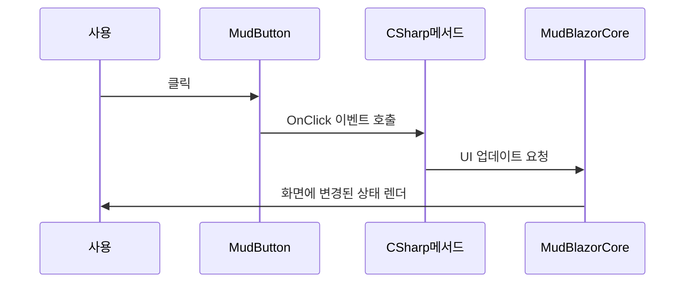

# Chapter 3: MudBlazor UI

이전 장 [Blazor 컴포넌트 구조 (App.razor와 레이아웃)](02_blazor_컴포넌트_구조__app_razor와_레이아웃__.md)에서 화면 구성의 뼈대를 어떻게 잡는지 배웠습니다. 이번 장에서는 “MudBlazor UI”를 사용해 그 뼈대를 더 매력적이고 편리하게 꾸며보겠습니다. MudBlazor는 단추, 네비게이션 바, 다이얼로그, 슬라이더, 배치(Layout) 등을 간편히 사용할 수 있도록 제공해 주는 Blazor 전용 UI 프레임워크입니다.

---

## MudBlazor UI를 사용하는 이유

MudBlazor를 간단히 설명하면 “UI를 빠르고 간단하게 꾸밀 수 있는 도구 상자”입니다. 예를 들어 작은 버튼 하나만 추가하고 싶을 때도, 기본 HTML/CSS만으로는 설정해야 할 항목이 꽤 많습니다. 반면 MudBlazor 버튼(`<MudButton>`) 하나면 색상, 모양, 클릭 이벤트 등을 간단히 설정 가능하죠.

초보자 입장에서 MudBlazor를 사용하면:
1. 복잡한 CSS/JS 없이도 현대적인 UI를 쉽게 구현  
2. 다양한 컴포넌트(`<MudDialog>`, `<MudNavMenu>`, `<MudTable>` 등)를 조합해 재빠르게 완성  
3. Blazor와 자연스럽게 연동하여 C#만으로 UI를 제어  

이 장에서는 아주 기초적인 컴포넌트 예시를 살펴보면서, 어떻게 적용하는지 하나씩 알아보겠습니다.

---

## 주요 개념

### 1) MudBlazor 설치 및 등록
MudBlazor를 사용하기 위해서는 먼저 NuGet 패키지를 설치해야 합니다.  
• 이미 템플릿에 포함되어 있다면 별도 설치 없이 진행 가능  
• 직접 설치 시에는 Visual Studio의 NuGet 패키지 관리자에서 “MudBlazor”를 검색하여 설치  

그 후 `Program.cs`에서 다음과 같이 서비스를 등록합니다:
```csharp
builder.Services.AddMudServices(); // MudBlazor UI 서비스 등록
```
위와 같은 코드는 1줄이지만, 내부적으로 MudBlazor에서 필요한 DI(종속성 주입) 기본 설정들을 자동으로 해줍니다.

---

### 2) 기본 스타일 적용 (MudThemeProvider)
MudBlazor 컴포넌트를 사용하기 전, 보통 레이아웃 최상단에 `<MudThemeProvider>`를 배치해 둡니다. 이 컴포넌트는 사이트 전체에 적용될 MudBlazor 테마(색상, 글꼴 등)를 결정합니다.

아래는 `MainLayout.razor`에서 자주 볼 수 있는 예시입니다:
```razor
<MudThemeProvider />
<MudLayout>
    <MudAppBar> ... </MudAppBar>
    <MudDrawer> ... </MudDrawer>
    <MudMainContent>
        @Body
    </MudMainContent>
</MudLayout>
```
- `<MudThemeProvider />`: 전역으로 테마를 적용  
- `<MudLayout>`: 본문 배치 구조  

만약 테마 색상을 바꾸고 싶다면, `<MudThemeProvider>` 속성에 다양한 값을 지정해줄 수 있습니다.

---

### 3) 자주 쓰는 컴포넌트 맛보기

#### (1) 버튼 (MudButton)
버튼은 보통 클릭 이벤트를 처리해야 하므로, C# 코드를 연결하는 경우가 많습니다.

아래는 간단한 MudButton 사용 예시입니다:
```razor
<MudButton Color="Color.Primary" Variant="Variant.Filled" OnClick="HandleClick">
    클릭하세요
</MudButton>

@code {
    private void HandleClick()
    {
        // 누르면 어떤 동작을 할지
    }
}
```

- `Color="Color.Primary"`: 테마에서 지정된 주 색상(Primary)으로 버튼 표시  
- `OnClick="HandleClick"`: C# 메서드(`HandleClick`)를 연결  

버튼을 클릭하면 `HandleClick()` 메서드가 실행되어 로직을 처리합니다.

#### (2) 텍스트 (MudText)
텍스트를 조금 더 예쁘게 표현하기 위해 `<MudText>`를 씁니다:
```razor
<MudText Typo="Typo.h6" Color="Color.Secondary">
    안내 문구를 출력합니다.
</MudText>
```
- `Typo="Typo.h6"`: 글자 크기를 h6 수준으로  
- `Color="Color.Secondary"`: 테마의 보조 색상 사용  

#### (3) 대화상자 (MudDialog)
대화상자는 사용자에게 알림을 띄우거나 입력을 받는 데 유용합니다.  
사용할 때는 우선 `<MudDialogProvider />`를 레이아웃에 배치해야 합니다:
```razor
<MudThemeProvider />
<MudDialogProvider />
<MudLayout>
    ...
</MudLayout>
```

그 후 특정 페이지나 컴포넌트에서 스니펫처럼 대화상자를 띄울 수 있습니다:
```razor
<MudButton OnClick="OpenDialog">다이얼로그 열기</MudButton>

@code {
    [Inject] IDialogService DialogService { get; set; } = default!;

    void OpenDialog()
    {
        DialogService.Show<MyCustomDialog>("제목");
    }
}
```
- `DialogService.Show<MyCustomDialog>("제목")`: `MyCustomDialog` 컴포넌트를 대화상자로 표시  
- "제목"이라는 문자열이 대화상자의 상단 타이틀로 표시  

---

## MudBlazor 적용 예시

이제 간단한 페이지 예시를 하나 만들어, MudBlazor 컴포넌트들을 조금씩 배치해 보겠습니다. 다음 코드는 “단순 버튼-텍스트-대화상자”를 포함한 짧은 예시입니다.

```razor
@page "/mud-demo"

<PageTitle>Mud Demo</PageTitle>

<MudText Typo="Typo.h5">
    MudBlazor 데모 페이지
</MudText>

<MudButton Color="Color.Primary" Variant="Variant.Filled" OnClick="ShowMessage">
    메세지 띄우기
</MudButton>

@code {
    [Inject] ISnackbar Snackbar { get; set; } = default!;

    private void ShowMessage()
    {
        Snackbar.Add("안녕하세요! MudBlazor 메시지입니다.", Severity.Info);
    }
}
```
1. 경로(`/mud-demo`)에 접속하면 페이지가 열림  
2. `<MudText>`를 통해 “MudBlazor 데모 페이지”라는 제목을 h5 크기로 표시  
3. `<MudButton>` 클릭 시 `ShowMessage()` 메서드가 실행되어 Snackbar(작은 알림 창)에 메시지를 띄움  

메서드가 짧아서 이해하기 쉽습니다. 실제로 스낵바(small notification) 창이 화면 하단이나 상단에 맨 잠깐 뜨는 모습으로 표현됩니다.

---

## 내부 동작 흐름 이해하기

MudBlazor 컴포넌트를 쓰면 내부적으로 이렇게 동작합니다:



1. 사용자가 MudBlazor 버튼을 클릭  
2. 버튼(C# 코드)에서 OnClick 이벤트가 트리거  
3. C# 메서드(`ShowMessage()` 등)가 실행되면서 MudBlazorCore에게 UI 변경(혹은 Snackbar 표시)을 요청  
4. Blazor(Renderer)가 다시 화면을 렌더링하여 최종 UI를 표현  

이처럼 MudBlazor가 Blazor의 이벤트와 UI 업데이트 과정을 간결하게 추상화합니다.

---

## 내부 구현 더 자세히 살펴보기

MudBlazor는 다음과 같은 구조로 유기적으로 동작합니다:

1. 사용자가 `builder.Services.AddMudServices()`를 통해 MudBlazor 관련 서비스 등록  
2. 레이아웃(예: `MainLayout.razor`)에서 `<MudThemeProvider>`, `<MudDialogProvider>`, `<MudPopoverProvider>` 등을 추가해 필요 기능 활성화  
3. 각 컴포넌트(`<MudAppBar>`, `<MudButton>`, `<MudDrawer>` 등)는 Blazor의 Razor 파일로 구현되어, 속성(Props)과 이벤트(OnClick 등)를 C# 코드와 연결  
4. 컴포넌트가 상태(State)를 변경하면 Blazor 프레임워크가 다시 렌더링  

예를 들어 “버튼이 클릭되면 Snackbar를 띄우는 과정”을 약간의 코드로 보면:

```csharp
// 내부적으로 Snackbar 호출 예시 (단순화)
public void ShowMessage(string msg, Severity severity)
{
    // SnackbarService라는 내부 객체를 통해 메시지 요청
    SnackbarService.Add(msg, severity);
}
```
- 사용자가 `ISnackbar`를 주입받아 `ShowMessage("...", Severity.Info)`와 같이 호출  
- 내부적으로는 SnackbarService가 “어떤 메시지를 어떻게 보여줄지”를 관리  
- Blazor가 다시 렌더링해 실제 화면에 알림이 나타남  

---

## 마무리 및 다음 장 예고

이번 장에서는 MudBlazor UI를 통해 BlazorVoice 프로젝트의 UI를 어떻게 예쁘고 편리하게 꾸밀 수 있는지 알아봤습니다.  
- MudBlazor를 쓰면 버튼, 대화상자, 내비게이션 등을 빠르게 구성할 수 있음  
- DI로 등록된 MudBlazor 서비스들을 통해 테마, Snackbar 등 다양한 기능 활용  

다음 장 [WebRTC 기능 (WebRTC.razor와 webrtc.js)](04_webrtc_기능__webrtc_razor와_webrtc_js__.md)에서는 오디오·영상 통신을 가능하게 하는 WebRTC 구현 방식을 살펴보겠습니다. Blazor UI 환경에서 실시간 음성·화상 기능을 어떻게 결합하는지 배워보겠습니다.  

---

Generated by [AI Codebase Knowledge Builder](https://github.com/The-Pocket/Tutorial-Codebase-Knowledge)