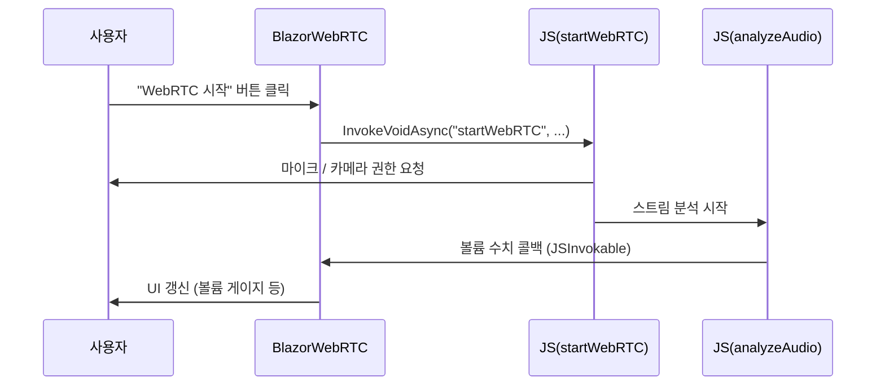

# Chapter 4: WebRTC 기능 (WebRTC.razor와 webrtc.js)

이전 장 [MudBlazor UI](03_mudblazor_ui_.md)에서 UI를 보다 편하게 구성하는 방법을 살펴보았습니다. 이번 장에서는 보다 실감 나는 기능인 “오디오·비디오 실시간 스트리밍”을 구현하는 WebRTC 부분을 다뤄보겠습니다. 즉, Blazor 페이지(`WebRTC.razor`)와 자바스크립트 코드(`webrtc.js`)를 활용해 화상 채팅, 음성 스트리밍, 마이크 볼륨 측정 등을 가능하게 해봅시다.

---

## 왜 WebRTC가 필요한가?

예를 들어, 간단한 음성 채팅 앱을 만들고 싶다고 해봅시다. 한 명이 마이크를 켜고 이야기하면, 상대방이 실시간으로 이를 듣거나 볼 수 있어야 합니다. 여기에 더해, 음성 볼륨을 시각적으로 표시하거나, 특정 이벤트가 발생하면 TTS(Text-To-Speech)로 응답을 줄 수도 있습니다.

이 모든 과정을 브라우저에서 직접 처리하려면:
1. 마이크·카메라 접근 권한이 필요  
2. 실시간 스트리밍을 위한 P2P 연결(또는 서버 중계)이 필요  
3. Blazor와 JS 간 상호작용(Interop)을 통해 오디오 분석 결과를 UI에 표시  

WebRTC는 이러한 실시간 미디어(오디오·비디오) 전송을 브라우저 수준에서 지원해 주기 때문에, 완전히 새로운 시스템을 만들지 않고도 쉽고 빠르게 화상·음성 기능을 구현할 수 있습니다.

---

## 핵심 개념 살펴보기

### 1) WebRTC.razor (Blazor 컴포넌트)
이 컴포넌트는 다음과 같은 일을 담당합니다:
- 실시간 화상·음성 스트리밍을 시작·중지하는 UI 버튼 제공  
- 채팅 기능 구현 (예: 텍스트 메세지 전송)  
- 오디오 볼륨 게이지 표시  

Blazor 쪽에서는 UI 렌더링과, 자바스크립트에서 넘어오는 콜백(마이크 볼륨, 음성 데이터)을 처리합니다.

### 2) webrtc.js (JavaScript 모듈)
이 스크립트는 브라우저의 MediaDevices, AudioContext, RTCPeerConnection 등을 활용해:
- 사용자의 마이크·카메라 스트림 획득 (getUserMedia)  
- 분석(볼륨 측정, AudioBuffer 생성 등)  
- 원격 사용자와의 연결(Offer/Answer, ICE 후보 교환 등)  
- 마이크 출력 볼륨 조절  

Blazor가 JS 함수를 호출하면, JS에서 오디오·비디오 스트림을 시작하거나 분석하고, 결과(볼륨, 오디오 데이터)를 다시 Blazor에 전달합니다.

---

## WebRTC 사용 예시

아주 간단한 시작 버튼과 비디오 영역을 만들어, WebRTC를 실행해봅시다.

아래 코드는 `WebRTC.razor`의 일부입니다(필요 없는 부분은 생략).  
(코드 블록 1/4)
```razor
@page "/web-rtc"
@inject IJSRuntime JSRuntime

<h3>WebRTC 데모</h3>

<MudButton OnClick="StartWebRTC">WebRTC 시작</MudButton>

<video id="localVideo" autoplay muted 
       style="width:200px;border:1px solid black"></video>
<video id="remoteVideo" autoplay 
       style="width:200px;border:1px solid black"></video>
```
- “WebRTC 시작” 버튼: 클릭 시 브라우저 카메라·마이크 권한을 요청하고, 연결 설정 진행  
- `<video>` 태그 2개: 하나는 내 카메라 화면(“localVideo”), 다른 하나는 상대 화면(“remoteVideo”)  

버튼 클릭 이벤트는 Blazor C# 메서드 `StartWebRTC()`를 호출합니다.

(코드 블록 2/4)
```razor
@code {
    private async Task StartWebRTC()
    {
        await JSRuntime.InvokeVoidAsync("startWebRTC",
            "localVideo",
            "remoteVideo",
            null);
    }
}
```
- `JSRuntime.InvokeVoidAsync("startWebRTC", ...)`로 webrtc.js 쪽의 `startWebRTC()` 함수를 호출  
- 파라미터로 localVideo, remoteVideo의 HTML ID를 전달  

이제 JS 코드 쪽 `webrtc.js`에서 이 함수를 구현해야 합니다.

(코드 블록 3/4)
```javascript
// webrtc.js (일부만 발췌)
async function startWebRTC(localVideoId, remoteVideoId) {
    const localVideo = document.getElementById(localVideoId);
    const remoteVideo = document.getElementById(remoteVideoId);

    // 카메라+마이크 스트림 얻기
    const stream = await navigator.mediaDevices.getUserMedia(
        { video: true, audio: true }
    );
    // 내 비디오에 스트림 연결
    localVideo.srcObject = stream; 
    localVideo.play();
}
```
- `navigator.mediaDevices.getUserMedia(...)`로 사용자 장치 권한 요청  
- 승인되면 `localVideo`에 해당 스트림 출력  

이렇게 하면 “내 화면”은 이미 볼 수 있습니다. “상대 화면”을 보기 위해서는 RTCPeerConnection을 이어야 하지만, 가장 기본적인 부분은 이런 식으로 시작됩니다.

---

## 채팅 기능과 오디오 분석

“화상+채팅”을 한 콘솔에서 처리하려면, 다음과 같은 추가 기능이 필요합니다.

1) Blazor에서 메시지를 입력하고 버튼 클릭  
2) JS측에서 별도 웹소켓 또는 SignalR(Hub)를 활용해 메시지를 상대방에게 전달  
3) 결과를 다시 Blazor UI에 실시간 반영  

마찬가지로, 오디오 볼륨을 표시하려면 AudioContext의 `AnalyserNode`를 활용할 수 있습니다.

(코드 블록 4/4)
```javascript
function analyzeAudio(stream, callback) {
    const audioContext = new AudioContext();
    const source = audioContext.createMediaStreamSource(stream);
    const analyser = audioContext.createAnalyser();
    source.connect(analyser);

    const dataArray = new Uint8Array(analyser.frequencyBinCount);
    
    function tick() {
        analyser.getByteFrequencyData(dataArray);
        let volume = 0;
        for(const val of dataArray) volume += val;
        volume = volume / dataArray.length;

        callback(volume);
        requestAnimationFrame(tick);
    }
    tick();
}
```
- `analyzeAudio()` 함수: 스트림을 받고, 계속해서 `volume` 값을 계산  
- `callback(volume)`: 그 값을 Blazor 쪽으로 넘길 수 있도록 구조화  

Blazor에서는 `DotNetObjectReference`나 `JSInvokable` 속성 등을 통해 이 데이터를 수신받은 뒤, MudBlazor UI(예: <MudProgressLinear>)에 표시합니다.

---

## 전체 동작 흐름

간단하게 흐름을 요약해 보겠습니다.



---

## 내부 구현 더 자세히 보기

우리가 실제 프로젝트에서 사용하는 `WebRTC.razor`와 `webrtc.js`는 다음과 같은 확장 기능들을 포함합니다:

1. Mic 볼륨 조절(gainNode)  
2. SignalR를 통한 액터 시스템(다른 장에서 자세히 소개)  
3. 오디오 데이터 배열을 Blazor로 전달해 TTS와 연계  

예를 들어 “마이크 볼륨 조절” 부분은 JS에서 `gainNode.gain.value`를 설정해 음량을 낮추거나 높이는 식으로 처리합니다. Blazor 쪽에서는 `JSRuntime.InvokeVoidAsync("setMicrophoneVolume", MicrophoneVolume)` 형태로 간단히 호출해줄 수 있습니다.

아래는 “마이크 볼륨 조절”의 일부분 예시입니다:

```csharp
private double MicrophoneVolume { get; set; } = 50;

private async Task UpdateVolume()
{
    await JSRuntime.InvokeVoidAsync("setMicrophoneVolume", MicrophoneVolume);
}
```

```javascript
// webrtc.js
let gainNode;
function setMicrophoneVolume(vol) {
    if(gainNode){
        gainNode.gain.value = vol / 100;
    }
}
```
- C# `UpdateVolume()` 메서드가 호출되면 `setMicrophoneVolume()`를 실행  
- JS 내에서 `gainNode` 노드의 이득값(gain)을 조절  

---

## 요약 및 다음 단계

이번 장에서는 WebRTC를 활용해:
1. 오디오·비디오 스트림을 열고,  
2. 마이크 볼륨이나 오디오 데이터를 측정·분석하고,  
3. Blazor와 상호작용하여 UI를 실시간으로 업데이트  

하는 전반적인 구조를 살펴봤습니다.  
• `WebRTC.razor`: Blazor 컴포넌트로서 UI와 이벤트를 담당  
• `webrtc.js`: 브라우저 APIs를 직접 호출해 미디어 스트림을 관리  

이제 WebRTC로부터 얻은 오디오 데이터를 서버 쪽으로 보내거나, 여러 사용자 간 실시간 통신을 하기 위해서는 ‘SignalR 허브’가 필요합니다. 다음 장 [AudioStreamHub (SignalR 허브)](05_audiostreamhub__signalr_허브__.md)에서 이 허브를 어떻게 구성하고 연동하는지 살펴보겠습니다.  

---

Generated by [AI Codebase Knowledge Builder](https://github.com/The-Pocket/Tutorial-Codebase-Knowledge)