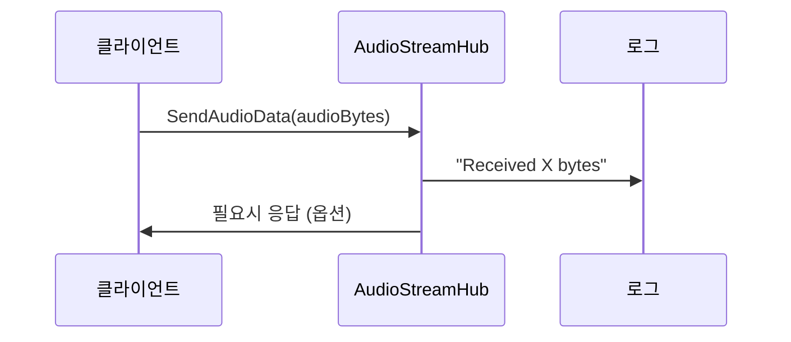

# Chapter 5: AudioStreamHub (SignalR 허브)

이전 장 [WebRTC 기능 (WebRTC.razor와 webrtc.js)](04_webrtc_기능__webrtc_razor와_webrtc_js__.md)에서 브라우저 간 실시간 오디오·비디오를 다루는 방법을 살펴보았습니다. 이제 그 오디오 데이터를 서버 측에 전달하고, 여러 사람과 교환하기 위해 “AudioStreamHub (SignalR 허브)”를 알아보겠습니다.

---

## 왜 AudioStreamHub가 필요한가?

웹 브라우저에서 얻은 음성 데이터를 단순히 내 화면에만 표시한다면 WebRTC만으로도 충분합니다. 하지만 여러 사용자가 동시에 음성 데이터를 교환하고 싶다면, 중간에 전달자(허브) 역할을 해 줄 무언가가 필요합니다. 마치 무전기에서 “중계소”가 중요한 것처럼, 여기서는 SignalR 허브(AudioStreamHub)가 그 역할을 합니다.

예를 들어, 3명이 동시에 대화하는 음성 채팅을 생각해 봅시다:
1. A 사용자가 말하면 B와 C도 해당 음성을 들어야 함  
2. B가 말하면 A와 C 역시 실시간으로 전달받아야 함  
3. C가 합류·퇴장할 때도 자연스럽게 음성 흐름을 관리

AudioStreamHub는 이러한 오디오 흐름을 서버에서 처리하고, 종료나 오류가 발생했을 때도 로그를 남겨 문제가 쉽게 파악되도록 돕습니다.

---

## 핵심 개념

1. 허브(Hub)  
   SignalR에서 “허브”는 웹소켓 등의 실시간 연결을 관리하는 중심점입니다. AudioStreamHub는 음성 데이터를 받을 때마다 로그를 남기고, 필요한 경우 다른 클라이언트로 브로드캐스팅도 할 수 있게 만듭니다.

2. 메서드 호출  
   클라이언트(브라우저)에서 “SendAudioData” 같은 메서드를 호출하면, 허브가 그 요청을 받아들여 내부 로직을 처리하고, 필요한 곳에 데이터를 전송할 수도 있습니다.

3. 로그 기록  
   음성 데이터가 정상적으로 들어오거나, 예외가 발생했는지 기록합니다. 이는 추후 문제 점검에 큰 도움이 됩니다.

---

## 사용 예시 (기본 오디오 데이터 전송)

아래 예시는 AudioStreamHub가 어떻게 음성 데이터를 받고 로그를 남기는지 보여줍니다. 실제로는 여기서 받은 데이터를 다시 다른 클라이언트에게 보내거나, Akka Actor로도 넘길 수 있습니다.

### 1) Blazor(클라이언트)에서 허브 호출

예를 들어, WebRTC에서 얻은 오디오를 바이트 배열로 만들어 허브에 전송할 수 있습니다. (C# 호출 예시)

```csharp
// Blazor 측 예시 (간단화)
await hubConnection.SendAsync("SendAudioData", audioBuffer);
```

• `audioBuffer`는 마이크에서 추출한 음성 데이터 바이트 배열  
• “SendAudioData”는 허브 메서드 이름  

이렇게 허브를 호출하면 서버의 AudioStreamHub가 요청을 받습니다.

---

### 2) AudioStreamHub 코드(서버)

이제 서버 측 “Services\AudioStreamHub.cs”를 간단히 나누어 살펴봅시다.

```csharp
using Microsoft.AspNetCore.SignalR;

namespace BlazorVoice.Services
{
    public class AudioStreamHub : Hub
    {
        // 메서드 1
        public async Task SendAudioData(byte[] audioData)
        {
            // ...
        }
    }
}
```
• `public class AudioStreamHub : Hub`  
  → SignalR에 필요한 허브 기능을 상속받아 구현

이제 메서드 내부를 더 자세히 보겠습니다.

```csharp
public async Task SendAudioData(byte[] audioData)
{
    try
    {
        Console.WriteLine($"Received audio data of size: {audioData.Length} bytes");
    }
    catch (Exception ex)
    {
        Console.WriteLine($"Error in SendAudioData: {ex.Message}");
        throw;
    }
}
```
- `Console.WriteLine(...)`: 들어온 바이트 길이를 로그에 남김  
- 예외 발생 시 `Console.WriteLine`으로 오류 표시 후 `throw;`  

현재는 단순히 “오디오 데이터가 들어왔음”을 보여주지만, 실전에서는 여기서 다른 클라이언트에게 재전송하거나, [VoiceChatActor](07_voicechatactor_.md)에 넘겨 음성 처리를 진행할 수 있습니다.

---

## 내부 동작 흐름

오디오를 전송하는 시점을 예로 들어, 전체 흐름을 간단히 살펴봅시다.



1. 클라이언트(Blazor)에서 허브의 `SendAudioData` 메서드 호출  
2. `AudioStreamHub`가 바이트 배열 크기를 로그에 남김  
3. 추가 작업(브로드캐스트, 액터에게 메시지 전달 등)을 수행할 수도 있음  

---

## 더 깊이 살펴보기

1. 클라이언트가 마이크 데이터를 가져옴  
2. WebRTC 차원에서 브라우저에서 PCM 등으로 변환한 데이터를 바이트 배열(또는 Blob) 형태로 관리  
3. `hubConnection.SendAsync("SendAudioData", audioData)`로 허브 메서드를 호출  
4. 서버의 `AudioStreamHub`가 이 메서드를 받아 “데이터를 확인, 로그 남기기” 등의 로직 처리  
5. 필요하면 `await Clients.All.SendAsync("ReceiveAudioData", audioData)`를 호출해 모든 클라이언트에게 재전송 가능  

이처럼 AudioStreamHub는 기본적으로 “연결 관리 + 메서드 중계” 역할을 합니다.

---

## 정리 및 다음 단계

이번 장에서는 AudioStreamHub가 어떤 역할을 하고, 어떻게 오디오 데이터를 주고받는지 간략히 살펴보았습니다.  
• 오디오 데이터를 허브에 전송하면, 로그를 남기고 다른 유저에게 전달할 수도 있음  
• 예외 시 서버 콘솔에 바로 출력하여 문제 파악을 돕는 구조  

실제 프로젝트에서 이 허브는 여러 사용자 간 음성 교류의 중심축이 됩니다. 다음 장 [AkkaService](06_akkaservice_.md)에서 허브에서 받은 데이터를 Actor 시스템과 연동해 좀 더 복잡한 시나리오를 구현하는 방법을 알아보겠습니다.  

---

Generated by [AI Codebase Knowledge Builder](https://github.com/The-Pocket/Tutorial-Codebase-Knowledge)