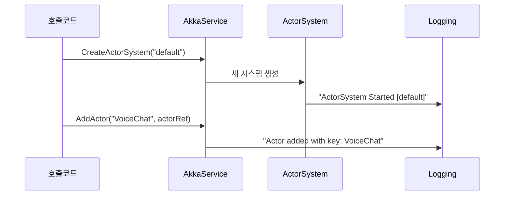

# Chapter 6: AkkaService

이전 장 [AudioStreamHub (SignalR 허브)](05_audiostreamhub__signalr_허브__.md)에서 브라우저에서 전송된 오디오 데이터를 서버 허브가 어떻게 주고받는지 살펴보았습니다. 이제 그 오디오 데이터, 그리고 다양한 메시지를 더 체계적으로 관리하고 처리하기 위해 필요한 “액터 시스템” 관리자, 즉 AkkaService를 알아보겠습니다.

---

## 왜 AkkaService가 필요한가?

프로젝트가 커지다 보면 다음과 같은 상황이 발생합니다:
1. 여러 종류의 작업(예: 음성 송수신, 텍스트 처리, 로그 모니터링)이 동시다발적으로 진행  
2. 특정 로직(배우, Actor)을 새로 만들거나, 이미 존재하는 배우를 찾아서 메시지를 보내야 함  
3. 분산(멀티 포트) 환경에서 액터 시스템을 여러 개 운영해야 하는 요구사항 발생  

이때 “모든 액터(배우)들을 한 곳에서 편리하게 등록·관리”하고, “필요하면 새 공연장(ActorSystem)을 척척 열어줄 수 있는” 관리자가 필요합니다. AkkaService는 이 역할을 맡아, 마치 극장 매니저처럼 여러 공연장의 배우들을 손쉽게 조율할 수 있게 해줍니다.

---

## 핵심 개념 살펴보기

### 1) 액터 시스템(ActorSystem) 관리
AkkaService는 내부적으로 액터 시스템을 “키-값(Dictionary)” 형태로 저장합니다.  
- 하나의 앱 안에 여러 ActorSystem을 만들 수도 있음  
- “default”라는 이름을 시작(default)으로 부여해, 대부분은 이 시스템을 사용  

### 2) 액터(Actor) 등록 및 조회
ActorSystem이 생성되면, 그 안에 다양한 액터들을 생성·등록할 수 있습니다.  
- 예: “VoiceChatActor” 같은 음성 채팅 담당 배역  
- AkkaService에서 이름을 키로 저장하고, 필요 시 “GetActor(이름)”으로 가져옴  

### 3) 분산 포트 설정
특정 포트를 지정하면, 액터 시스템이 원격(Remote)으로 동작할 수 있습니다.  
- 향후 여러 서버가 서로 메시지를 주고받는 분산 시스템으로 확장 가능  
- 포트를 0으로 하면 로컬(기본) 모드로 실행  

---

## 실제 사용 예시

예를 들어, AudioStreamHub가 들어온 오디오 데이터를 특정 액터에게 전달하도록 만들고 싶다고 합시다. 이럴 땐:

1. AkkaService를 통해 “default” ActorSystem(또는 새 ActorSystem)을 생성  
2. VoiceChatActor라는 액터를 등록  
3. AudioStreamHub가 오디오 데이터를 받으면 해당 액터에게 메시지를 전송  

이렇게 하면 액터가 “오디오 처리”를 전담하고, 다른 액터는 “채팅 메시지 관리”만 하는 식으로 역할을 분리할 수 있습니다.

---

## 코드로 살펴보기

아래 코드는 AkkaService의 일부를 발췌해, 핵심 메서드가 어떤 식으로 작동하는지 간단히 보여줍니다.

```csharp
// AkkaService.cs (일부)
public class AkkaService
{
    private Dictionary<string, ActorSystem> actorSystems = new();
    private Dictionary<string, IActorRef> actors = new();

    public ActorSystem CreateActorSystem(string name, int port = 0)
    {
        // (디테일 생략) 포트가 0이면 기본 모드, 아니면 분산(Remote) 모드
        // 새 ActorSystem 생성 후 Dictionary에 저장
        // 이미 같은 이름이 있으면 예외 발생
        return actorSystems[name];
    }
}
```

위 메서드를 호출하면, “name” 키를 가진 ActorSystem이 없을 경우 새로 만들고, 이미 존재하면 예외를 던집니다.

```csharp
public void AddActor(string name, IActorRef actor)
{
    // 액터를 Dictionary에 등록
    if (!actors.ContainsKey(name))
    {
        actors[name] = actor;
    }
}
```

여기서는 액터도 같은 방식으로 “키-값” 형태로 관리합니다. 이름이 중복되지 않도록 유의합니다.

---

### 예시 사용 흐름

아래 예시는 BlazorVoice 프로젝트에서 AkkaService를 어떻게 사용해 새 배우(Actor)를 만들고 메시지를 보내는지 간단히 보여줍니다.

```csharp
// 액터 시스템 생성
var system = akkaService.CreateActorSystem("default");

// 액터 생성 (예: VoiceChatActor)
var voiceChatActor = system.ActorOf(Props.Create(() => new VoiceChatActor()), "VoiceChatActor");

//액터 등록
akkaService.AddActor("VoiceChat", voiceChatActor);

// 다른 곳에서 메시지 보내기
var actorRef = akkaService.GetActor("VoiceChat");
actorRef.Tell(new AudioMessage(...)); 
```

1. “default”라는 이름으로 ActorSystem을 생성  
2. VoiceChatActor를 ActorSystem에 등록  
3. 등록된 액터에 AudioMessage를 전송(Tell)  

이 과정을 통해, AudioStreamHub가 받은 데이터를 액터에게 넘기게 만들 수도 있습니다.

---

## 내부 동작 흐름 알아보기

AkkaService를 호출해 액터 시스템을 생성하고, 액터를 등록하는 과정을 시퀀스 다이어그램으로 표현하면 다음과 같습니다:



1. 외부 코드(“호출코드”)가 AkkaService에 “default” 시스템 생성을 요청  
2. 내부에서 ActorSystem을 만들고 로그에 기록  
3. 해당 ActorSystem에 Actor를 등록하고, 등록 사실을 로그에 남김  

---

## 내부 구현 더 자세히 살펴보기

조금 더 구체적인 코드들은 다음과 같은 흐름을 가집니다. (주요 부분만 발췌)

1) CreateActorSystem  
   - 포트가 0이면 기본 설정(Local), 포트가 있으면 분산(Remote) 설정   
   - ConfigurationFactory.ParseString(...): 문자열 기반 Akka 설정   
   - ActorSystem.Create(...)로 실제 시스템 객체 생성

2) AddActor / GetActor  
   - (Dictionary<string, IActorRef>)에 액터 보관  
   - 필요 시 key(이름)로 액터 참조를 가져와 “.Tell()”로 메시지를 보냄  

이 로직을 통해, [VoiceChatActor](07_voicechatactor_.md)나 [OpenAIService](08_openaiservice_.md) 관련 액터도 쉽게 등록·호출할 수 있게 됩니다.

---

## 정리 및 다음 단계

이번 장에서는 “여러 공연장(ActorSystem)을 만들고, 다양한 배우(Actor)를 손쉽게 등록·관리하는” AkkaService의 구조와 사용법을 배웠습니다.  
- “이름”으로 ActorSystem과 Actor를 구분  
- 포트 설정을 통해 빠르게 분산 환경으로 확장 가능  
- AudioStreamHub 등에서 들어온 데이터를 각 Actor에게 전달하기 편리  

이제 이 액터 시스템 위에서 실제 음성 채팅 로직을 담당하는 [VoiceChatActor](07_voicechatactor_.md)를 살펴볼 차례입니다. 다음 장에서 VoiceChatActor가 어떻게 실제 음성 메시지를 받고 처리하는지 함께 확인해 보겠습니다!  

---

Generated by [AI Codebase Knowledge Builder](https://github.com/The-Pocket/Tutorial-Codebase-Knowledge)