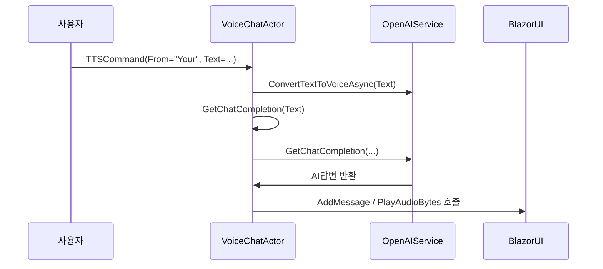

# Chapter 7: VoiceChatActor

이전 장 [AkkaService](06_akkaservice_.md)에서 한꺼번에 여러 배우(Actor)들을 등록하고 관리하는 방법을 배웠습니다. 이제 실제로 “음성 채팅 기능”을 담당하는 배우인 VoiceChatActor가 무엇을 하고, 어떻게 AI(Text to Speech, ChatGPT 등)와 연계되는지 살펴보겠습니다.

VoiceChatActor는 쉽게 말해, “라디오 DJ” 역할을 하는 액터입니다.  
• 사용자(청취자)의 사연(텍스트 메시지)을 받고  
• AI DJ(챗봇)에게 넘겨 답변을 생성한 뒤  
• 필요한 경우 음성(TTS)으로 변환하여 사용자에게 들려줍니다.  

마치 라디오 DJ가 실시간으로 사연을 읽고, 음악을 틀어주는 것과 같습니다.

---

## 핵심 개념 미리 보기

1. 음성 채팅 연계  
   - VoiceChatActor는 사용자의 메시지를 받아 AI 응답을 생성하고, 그 응답을 음성으로 만들어줍니다.  

2. 주기 업데이트(ContentAutoUpdateCommand)  
   - 정해진 시간마다 자동으로 상태를 갱신하거나 “방송” 업데이트를 진행할 수 있습니다.  

3. TTSCommand 처리  
   - TTSCommand라고 하는 단순한 명령 객체를 받아, 내부 로직(TTS 변환, AI 대화 기록 등)을 수행합니다.  

4. Blazor 콜백(Delegates)  
   - 액터 내부에서 UI에 뭔가를 표시하거나 음성 재생을 시키려면 C# 쪽 메서드(Invoke)로 정보를 넘겨줘야 합니다.  
   - VoiceChatActor는 _blazorCallback이라는 델리게이트를 기억해 두었다가, 필요할 때 실행합니다.  

---

## 사용 예시 시나리오

“AI 라디오 DJ”를 예로 들어 보겠습니다.  
• 사용자가 “안녕하세요, 오늘 날씨가 어떤가요?”라고 말한다(또는 텍스트 입력).  
• VoiceChatActor가 이 메시지를 OpenAI(챗봇)에게 보내 답변을 받음.  
• 답변을 음성(TTS)으로 변환한 뒤, 사용자에게 재생하도록 지시.  

이렇게 하면 사용자 입장에서는 “내가 말하는 것에 AI가 곧바로 음성으로 응답해주는” 채팅 경험을 누릴 수 있습니다.

---

## 코드 구조 간단 살펴보기

VoiceChatActor는 다음과 같은 주요 요소로 구성됩니다:

1) 생성자(VoiceChatActor)  
2) 명령(Commands): ContentAutoUpdateCommand, TTSCommand 등  
3) OpenAIService 연동: GetChatCompletion 메서드를 호출해 AI 응답 생성  
4) TTS 변환: ConvertTextToVoiceAsync 메서드를 통해 음성 생성  
5) Blazor 콜백: AddMessage, PlayAudioBytes 등 UI 업데이트를 위한 메서드 호출  

아래에서 실제 코드를 작게 나누어 살펴보겠습니다. (파일: VoiceChatActor.cs)

---

### 1) 클래스 선언과 생성자

아래 코드에서는 VoiceChatActor가 ReceiveActor를 상속받으며, IWithTimers 인터페이스도 구현한다는 점을 볼 수 있습니다. 타이머(일정 주기로 동작)를 활용하기 위해서입니다.

```csharp
public class VoiceChatActor : ReceiveActor, IWithTimers
{
    private readonly ILoggingAdapter logger = Context.GetLogger();
    public ITimerScheduler Timers { get; set; } = null!;
    
    public VoiceChatActor(IServiceProvider serviceProvider)
    {
        logger.Info($"VoiceChatActor : Constructor - {Self.Path}");
        // ...
    }
}
```

- IWithTimers: 일정 시간마다 자동으로 메시지를 보내줄 수 있는 기능  
- logger: 콘솔 등에 로그를 찍기 위한 Akka 로거  

---

### 2) 초기화와 타이머

생성자 내부에서는 OpenAIService를 준비하고, Timers를 통해 일정 주기로 ContentAutoUpdateCommand를 보내도록 설정할 수 있습니다.

```csharp
// 생성자 내부(일부)
_openAIService = new OpenAIService();

Timers.StartPeriodicTimer(
    key: TimerKey.Instance,
    msg: new ContentAutoUpdateCommand(),
    initialDelay: TimeSpan.FromSeconds(10),
    interval: TimeSpan.FromSeconds(RefreshTimeSecForContentAutoUpdate));
```

- _openAIService: AI와의 연동을 위한 서비스 객체  
- StartPeriodicTimer: 10초 후에 첫 메시지를, 그 후 매간격(RefreshTimeSecForContentAutoUpdate)마다 반복 전송  

---

### 3) ContentAutoUpdateCommand 처리

이 명령은 단순히 “주기적으로 실행되는” 자동 업데이트 요청입니다. 예시로 아래 처리를 합니다.

```csharp
Receive<ContentAutoUpdateCommand>(command =>
{
    logger.Info("VoiceChatActor : ContentAutoUpdateCommand");
    // 필요하다면 여기서 대기열 갱신 등 수행
});
```

- “Receive<T>”는 특정 타입(T)의 메시지를 받았을 때 처리할 로직을 등록합니다.  
- 여기서는 로그만 찍고 있지만 실전에서는 대화 상황에 따라 자동 응답을 보낼 수도 있습니다.

---

### 4) TTSCommand 처리

TTSCommand를 받으면, 해당 메시지를 음성으로 바꾸고 AI에게 후속 질의도 보낼 수 있습니다.

```csharp
Receive<TTSCommand>(command =>
{
    logger.Info($"VoiceChatActor : Received Command - {command.GetType().Name}");
    if (command.From == "Your")
    {
        var recVoice = _openAIService.ConvertTextToVoiceAsync(command.Text, command.Voice).Result;
        _ = Task.Run(() => GetChatCompletion(command.Text));

        _blazorCallback?.Invoke("AddMessage", new object[] { command.From, command.Text });
        _blazorCallback?.Invoke("PlayAudioBytes", new object[] { recVoice, 0.5f, 1 });
    }
    else if (command.From == "AI")
    {
        var msg = lastAiMessage;
        var recVoice = _openAIService.ConvertTextToVoiceAsync(msg, command.Voice).Result;

        _blazorCallback?.Invoke("AddMessage", new object[] { command.From, msg });
        _blazorCallback?.Invoke("PlayAudioBytes", new object[] { recVoice, 0.5f, 2 });
    }
});
```

1. command.Text를 TTS로 변환(“ConvertTextToVoiceAsync”)  
2. AI 응답이 필요할 경우 GetChatCompletion 호출  
3. Blazor UI에 메시지를 추가(“AddMessage”)  
4. 음성 데이터를 재생(“PlayAudioBytes”)  

---

### 5) Blazor 콜백 등록

이 액터가 Blazor 화면에 뭔가 표시하려면, 콜백 메서드를 알고 있어야 합니다. 그래서 아래처럼 Action<string, object[]>를 전달받아 보관합니다.

```csharp
Receive<Action<string, object[]>>( command =>
{
    _blazorCallback = command;
    var msg = "웹컴 TTS AI서비스입니다.";                
    var recVoice = _openAIService.ConvertTextToVoiceAsync(msg, "alloy").Result;

    _blazorCallback?.Invoke("AddMessage", new object[] { "AI", msg });
    _blazorCallback?.Invoke("PlayAudioBytes", new object[] { recVoice, 0.5f, 2 });
});
```

- 이 코드를 실행하면, 액터는 초기 인사말(“웹컴 TTS AI서비스입니다.”)도 재생합니다.  
- 이후에는 동일한 콜백을 이용해 대화를 주고받을 수 있죠.

---

### 6) GetChatCompletion으로 AI 응답 생성

마지막으로, 사용자 메시지에 반응해 AI 답변을 얻는 로직입니다.

```csharp
public async Task<string> GetChatCompletion(string message)
{
    _conversationHistory.Add($"User:{message}");
    var recentHistory = _conversationHistory.Skip(Math.Max(0, _conversationHistory.Count - 20)).ToList();

    var aiResponse = await _openAIService.GetChatCompletion(
        $"요청메시지는 : {message} ...",
        recentHistory
    );
    _conversationHistory.Add($"AI:{aiResponse}");
    lastAiMessage = aiResponse;
    return aiResponse;
}
```

- _conversationHistory에 사용자 메시지를 저장  
- AI 서비스에 질문(“message”)과 최근 대화 내용을 함께 전달  
- 응답(aiResponse)을 다시 기록하고 반환  
- VoiceChatActor가 이 결과를 이용해 다음 발화(TTS)도 진행  

---

## 내부 동작 순서 이해하기

사용자가 문자 메시지를 보냈을 때 일어나는 대략적 흐름을 정리하면 다음과 같습니다:



1. 사용자(“Your”)가 메시지를 보냄  
2. VoiceChatActor가 즉시 TTS로 변환해 사용자의 발화를 재생(라디오처럼)  
3. 동시에 AI에게 GetChatCompletion을 요청해 답변 생성  
4. AI 답변을 받아 다시 TTS로 변환 및 BlazorUI에 출력  

---

## 요약 및 다음 단계

정리하자면, VoiceChatActor는 음성과 텍스트 사이의 “실시간 DJ” 역할을 합니다.  
- 사용자 메시지를 받아 AI에 보내고,  
- AI의 답변을 다시 음성으로 전달해주며,  
- 주기적으로 자동 갱신(ContentAutoUpdateCommand) 등도 지원합니다.  

이를 통해 BlazorVoice 앱은 “음성 대화”를 손쉽게 처리하도록 구조가 잡혀 있습니다.  

다음 장 [OpenAIService](08_openaiservice_.md)에서는 이 VoiceChatActor가 의존하는 핵심 AI 부분, 즉 ChatGPT와 TTS 기능을 어떻게 호출하고 결합하는지 상세히 살펴보겠습니다.  

---

Generated by [AI Codebase Knowledge Builder](https://github.com/The-Pocket/Tutorial-Codebase-Knowledge)