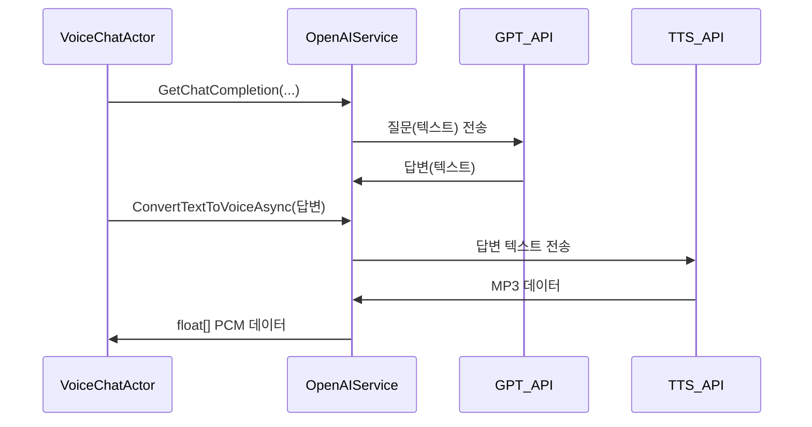

# Chapter 8: OpenAIService

이전 장 [VoiceChatActor](07_voicechatactor_.md)에서 액터(Actor)가 사용자 메시지를 AI와 연동하여 음성으로 응답하는 과정을 살펴보았습니다. 이제 그 핵심이 되는 “OpenAIService”를 알아보겠습니다. OpenAIService는 GPT 모델과 TTS(Text-To-Speech) 기능을 연결하는 일종의 “통역사 + 음향 엔지니어” 역할입니다. 즉, 사용자가 보낸 텍스트를 챗봇에게 전달하고, 거기서 나온 답변을 다시 음성 데이터로 만들어주는 과정을 손쉽게 처리해 줍니다.

---

## 왜 OpenAIService가 필요한가?

가장 단순한 예로, “사용자가 텍스트로 물어보면 AI가 바로 대답하고, 그 대답을 실시간 음성으로 전송해주고 싶다”라고 해봅시다.  
- GPT 모델에게 질문을 던져 답변을 얻어야 함  
- 그 텍스트 답변을 MP3 또는 PCM으로 변환해야 함  
- Blazor 쪽에서 이 음성 데이터를 재생할 수 있는 형식으로 가공  

OpenAIService가 이 일련의 과정을 모두 담당합니다. VoiceChatActor와 함께 작동하면서, “질문 → AI응답 → 음성변환” 과정을 단순화해주는 중요한 모듈입니다.

---

## 핵심 개념 살펴보기

1. ChatCompletion  
   - OpenAI의 GPT 모델에 텍스트로 질문을 보내고 답변을 받습니다.  
   - 내부적으로 HttpClient를 통해 OpenAI API를 호출하며, 대화 이력을 일부 전달해 자연스러운 대화 형태를 유지합니다.

2. TTS(Text-To-Speech)  
   - AI가 생성한 텍스트를 다시 음성으로 변환하는 기능입니다.  
   - 변환된 MP3 형식 파일을 PCM(float[]) 배열로 바꾸어 Blazor 클라이언트에서 재생할 수 있도록 준비해 둡니다.

3. 내부 구조  
   - HttpClient, ClientWebSocket 등을 이용해 OpenAI 서버와 연결  
   - NAudio 라이브러리를 활용하여 MP3 → PCM 변환  
   - API 키를 환경 변수(OPENAI_API_KEY)로 관리

---

## 간단한 사용 예시

VoiceChatActor가 OpenAIService를 사용해 “간단한 질문과 답변”을 처리한다고 가정해 봅시다. 예를 들어 다음과 같은 흐름입니다:

1) “사용자”가 “오늘 날씨 어때?”라는 텍스트를 보냄  
2) VoiceChatActor가 OpenAIService.GetChatCompletion(...)을 호출  
3) AI 응답(“오늘 맑고, 기온은 25도입니다.”)을 받아옴  
4) ConvertTextToVoiceAsync(...)를 통해 PCM(float[]) 형태의 음성 데이터로 변환  
5) 클라이언트에서 이 PCM 데이터를 재생  

아래처럼 Blazor 액터 코드에서 호출할 수 있습니다:

```csharp
// VoiceChatActor 내부 (간단 예시)
var answer = await _openAIService.GetChatCompletion(userMessage, conversationHistory);
var voiceData = await _openAIService.ConvertTextToVoiceAsync(answer, "alloy");
```

- 첫 줄: “userMessage”와 기존 대화(“conversationHistory”)를 기반으로 OpenAI에게 질의  
- 둘째 줄: AI 답변을 음성(PCM)으로 변환  

이제 이 “voiceData”는 float 배열이며, 사용 측(Blazor UI)에서 필요에 따라 재생할 수 있습니다.

---

## 내부 동작 흐름

다음 시퀀스 다이어그램은 OpenAIService가 질문과 음성 변환을 한꺼번에 처리하는 대략적인 상황을 보여줍니다:



1. VoiceChatActor가 “GetChatCompletion” 호출  
2. OpenAIService는 GPT_API(즉 OpenAI GPT 모델)에 텍스트를 보내 답변을 받음  
3. VoiceChatActor가 다시 “ConvertTextToVoiceAsync”로 텍스트를 음성화 요청  
4. OpenAIService는 TTS_API(오디오 변환 API)로 MP3를 받아오고, NAudio 등을 이용해 float 배열로 바꾼 뒤 반환  

---

## 코드 예시 (단순화)

아래는 OpenAIService.cs에서 핵심 부분만 뽑은 예시 코드입니다.

### ChatCompletion 부분 (코드 1/2)

```csharp
public async Task<string> GetChatCompletion(string message, List<string> assist)
{
    // GPT-4 모델에 텍스트 전송
    var result = await _client.CompleteChatAsync(new ChatMessage[]
    {
        ChatMessage.CreateUserMessage(message),
        ChatMessage.CreateAssistantMessage(string.Join("\n", assist))
    });

    // 첫 번째 응답 텍스트만 추출
    string aiResponse = result.Value.Content
        .FirstOrDefault()?.Text ?? string.Empty;

    return aiResponse;
}
```

- “message”는 사용자 질문  
- “assist”는 최근 대화 내역  
- GPT 모델에서 나온 답변이 여러 개일 수도 있지만, 여기서는 첫 번째만 사용  

(설명): 이것으로 간단히 AI 답변 텍스트를 얻을 수 있습니다.

### TTS 변환 (코드 2/2)

```csharp
public async Task<float[]> ConvertTextToVoiceAsync(string text, string voice = "alloy")
{
    var requestBody = new
    {
        model = "gpt-4o-mini-tts",
        input = text,
        voice
    };
    
    var response = await _httpClient.PostAsJsonAsync("audio/speech", requestBody);
    var mp3Bytes = await response.Content.ReadAsByteArrayAsync();

    // MP3 → PCM(float[]) 변환
    return ConvertMp3ToFloatArray(mp3Bytes);
}
```

- TTS API에 텍스트와 원하는 목소리(voice) 스타일 전송  
- 받은 MP3 바이너리를 PCM(float[])로 변환한 뒤 반환  

(설명): Blazor에서는 float 배열을 재생하기 편하도록 SignalR 등의 방식을 통해 전송할 수 있습니다.

---

## 내부 구현 더 자세히 파보기

OpenAIService는 다음과 같은 요소들을 함께 활용합니다:

1. HttpClient  
   - OpenAI Chat API, TTS API에 POST 요청을 보냄  
   - Authorization 헤더에 Bearer 토큰(OPENAI_API_KEY) 사용  

2. NAudio Mp3FileReader  
   - MP3 바이트 배열을 바로 “PCM 샘플”로 바꿔주는 핵심 라이브러리  
   - 샘플 레이트와 채널 정보에 따라 float[] 배열 크기가 결정됨  

3. WebSocket (선택적)  
   - 텍스트 스트리밍이나 이벤트 스트리밍을 구현할 때 사용할 수 있음  
   - 현재 프로젝트에서는 주로 HttpClient 기반으로 동작  

이 과정을 통해 “텍스트↔음성” 변환이 매끄럽게 이어집니다.

---

## 요약 및 마무리

OpenAIService는 BlazorVoice 프로젝트에서 AI 대화와 음성 합성을 긴밀히 연결해주는 중요한 다리입니다.  
- “GetChatCompletion” 메서드로 사용자의 질문을 GPT에게 보내고,  
- “ConvertTextToVoiceAsync”로 받은 답변을 즉시 음성으로 변경해 토해낼 수 있죠.

결과적으로 “음성 대화”를 제공하는 VoiceChatActor가 이 서비스를 편하게 호출하여, “라디오 DJ 같은 AI 챗봇” 경험을 구현합니다.

이로써 BlazorVoice의 핵심 구성 요소를 모두 살펴보았습니다. 이제 여러분은 프로그램 시작(Program.cs)부터 Blazor 컴포넌트(App.razor), UI 프레임워크(MudBlazor), WebRTC, SignalR 허브(AudioStreamHub), 배우 시스템(AkkaService), VoiceChatActor, 그리고 AI/TTS(OpenAIService)에 이르는 전체 흐름을 이해하게 되었습니다.  
모두 수고 많으셨습니다! Blazor와 음성 채팅, 그리고 AI 기능을 융합해 멋진 프로젝트로 확장해보시길 바랍니다.  

---

Generated by [AI Codebase Knowledge Builder](https://github.com/The-Pocket/Tutorial-Codebase-Knowledge)