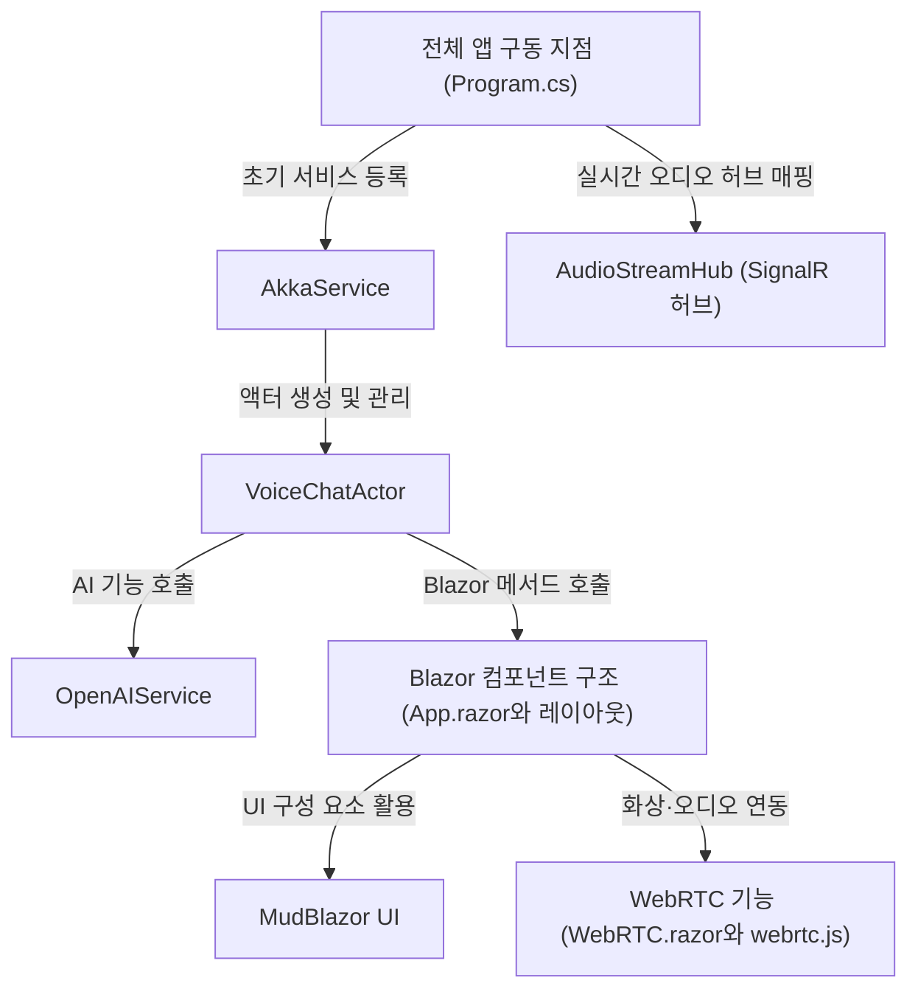

# Tutorial: BlazorVoice

**BlazorVoice** 프로젝트는 *음성 채팅*과 **AI** 기능(TTS, ChatGPT 등)을 통합하여 
웹 환경에서 실시간으로 대화하고 음성 재생을 할 수 있도록 만들어졌습니다. 
또한, *WebRTC*를 사용해 화상이나 오디오 스트리밍을 구현하고, 
**MudBlazor** UI 컴포넌트로 세련된 인터페이스를 제공합니다.

**Source Repository:** [None](None)

## Chapters

1. [전체 앱 구동 지점 (Program.cs)
](01_전체_앱_구동_지점__program_cs__.md)
2. [Blazor 컴포넌트 구조 (App.razor와 레이아웃)
](02_blazor_컴포넌트_구조__app_razor와_레이아웃__.md)
3. [MudBlazor UI
](03_mudblazor_ui_.md)
4. [WebRTC 기능 (WebRTC.razor와 webrtc.js)
](04_webrtc_기능__webrtc_razor와_webrtc_js__.md)
5. [AudioStreamHub (SignalR 허브)
](05_audiostreamhub__signalr_허브__.md)
6. [AkkaService
](06_akkaservice_.md)
7. [VoiceChatActor
](07_voicechatactor_.md)
8. [OpenAIService
](08_openaiservice_.md)

---

Generated by [AI Codebase Knowledge Builder](https://github.com/The-Pocket/Tutorial-Codebase-Knowledge)