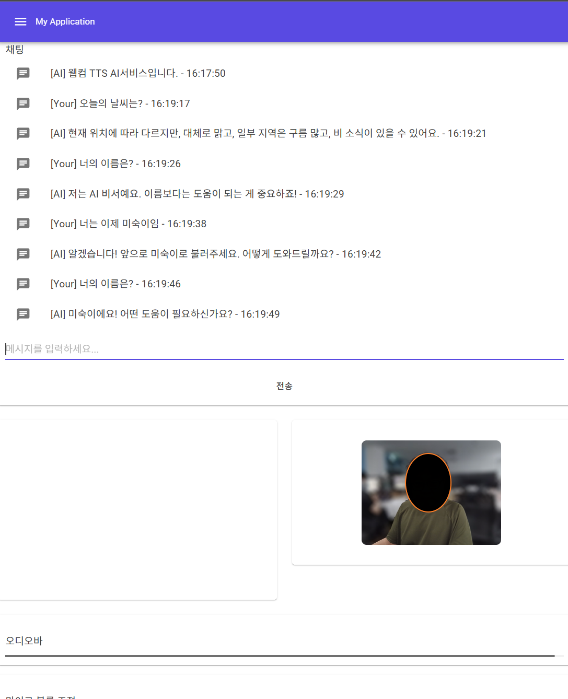
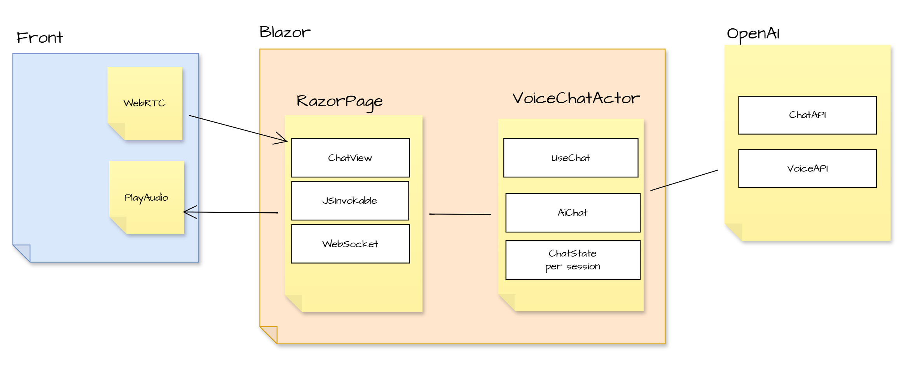

# BlazorVoice

**BlazorVoice** 프로젝트는 *음성 채팅*과 **AI** 기능(TTS, ChatGPT 등)을 통합하여 
웹 환경에서 실시간으로 대화하고 음성 재생을 할 수 있도록 만들어졌습니다. 
또한, *WebRTC*를 사용해 화상이나 오디오 스트리밍을 제어할수 있습니다.

**Blazor.net** 와 **Actor모델** 특성을 이용해 단일어플리케이션에서 프로그래밍하여
다양한 AI API와 연계해 비디오/오디오스 채팅기능을 확장해 나갈수 있습니다.

## Documentation

- [한국어 문서](./ko/index.md)
- [English Documentation](./en/index.md)

